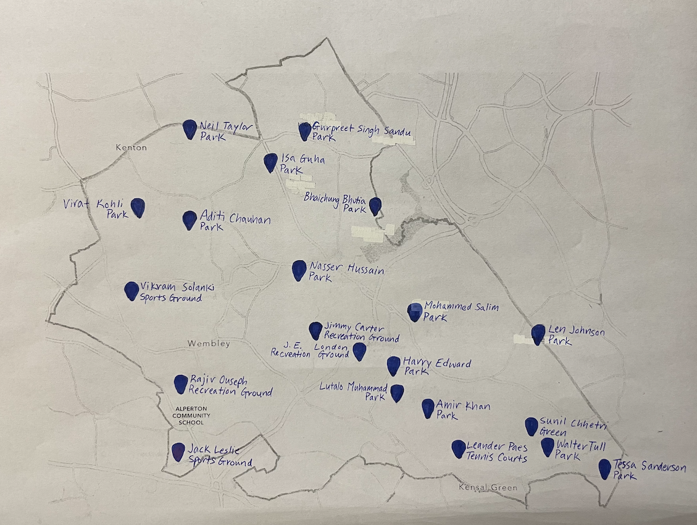
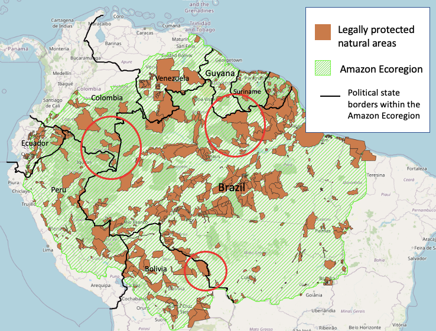
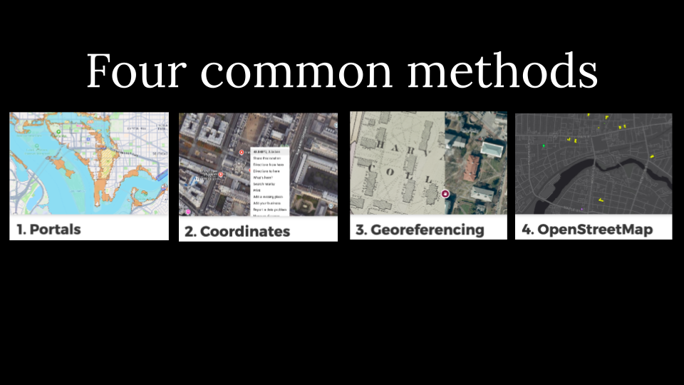
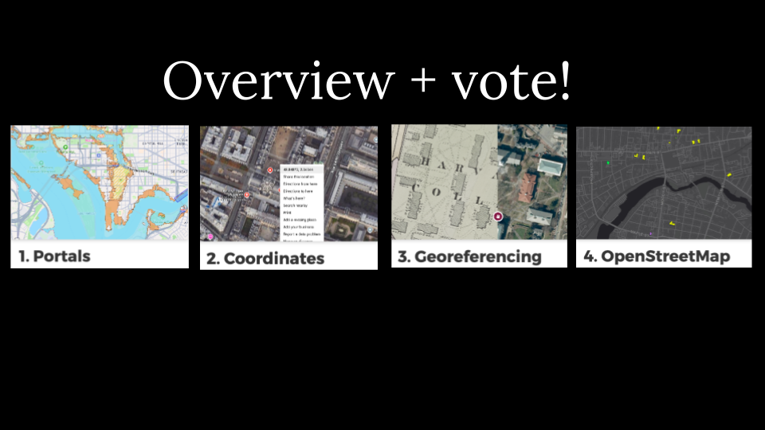

Get here quickly: 
`https://bit.ly/gis-find-data`

## Harvard Map Collection

[Map Collection website](https://library.harvard.edu/libraries/harvard-map-collection). 

<h2>Scope</h2>

 🚨 This is not a workshop on how to use GIS mapping software. Please consider referring to our other in-person <a href="https://libcal.library.harvard.edu/calendar/main?t=d&q=gis&cid=15049&cal=15049&inc=0">learning opportunities</a> or <a href = "https://mapping.share.library.harvard.edu/resources/workshops">follow-along materials</a> from previous events. 

🚨 Today will focus on how to find relevant <em>source data</em> for a GIS project. 

> ## Goals
>
> 1. Understand the value of a few common GIS data approaches.
> 2. Get a feel for the flow and pace of working with GIS data.
> 3. Leave knowing which resources you can rely on for your project.

## What is the benefit of using GIS layers?

<table>
  <tr>
    <th>Hand-drawn</th>
    <th>Canva-style</th>
    <th>GIS layers</th>
  </tr>
  <tr>
    <td></td>
    <td></td>
    <td></td>
  </tr>
</table>

*Credit: Hannah Ahn '24*

*Credit: Amisha Kambath '22*

*Credit: Luisa Shida '25*

## How we will approach learning how to search for GIS layers

<table>
  <tr>
    <th>In class activity</th>
    <th>Demo and explore more</th>
  </tr>
  <tr>
    <td></td>
    <td></td>
  </tr>
</table>

### Sample data
You can download and explore sample datasets related to this activity from the workshop data homepage, hosted on the Open Science Framework (OSF.io)
> 1. Visit the [workshop data homepage](https://osf.io/exnyg). 

> 2. Click the three vertical dots icon and select `Download`.

> 3. The folder that downloads to your computer contains sample data from all the workshop activities. It is a zipped or compressed file. In order to use it, you will have to `double-click` it on Mac or `right-click` → `Extract` or `Uncompress` on a PC. 

> To follow-along in class, or explore the sample data at home, [download QGIS](https://mapping.share.library.harvard.edu/tutorials/census-data-primer/download-software/), a free tool. Note, if you have a Mac, you will have to `right-click` the green Q desktop icon and select `Open` the first time you use it, since is not available from the App Store.

- Vote
- Group work 
- GIS journals
- Share + overview with demos

## Wrapping up

- [Map Collection website reprise](https://library.harvard.edu/libraries/harvard-map-collection).
- [Belle Lipton staff page](https://library.harvard.edu/staff/belle-lipton)

Help improve this workshop by giving us suggestions in the [survey](https://harvard.az1.qualtrics.com/jfe/form/SV_7aK1ea31ufbdR4O).

## Credits

*Many thanks to our cross-institutional colleagues for providing feedback and expertise on search strategies: Tara Anthony (Penn State), Jessica Benner (Carnegie Mellon), John Clark (Lafayette College), Meagan Duever (Georgia State), Todd Quinn (University of New Mexico), Chris Thiry (Colorado School of Mines), Amy Work (UC San Diego). Thanks to Kevin Holden and Christine D'Auria from the Harvard Bok Center Learning Lab for workshop support.*
