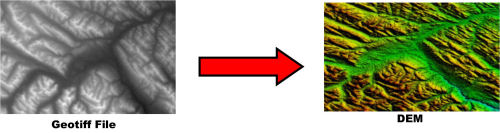
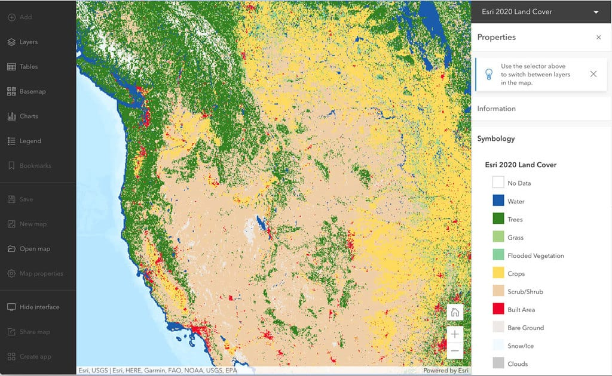

In this tutorial, which exists as part of the [GIS Mapping Quickstart](https://mapping.share.library.harvard.edu/resources/workshops/workshop-4/), we will practice obtaining a georeferenced historical map from the [Harvard Geospatial Library (HGL)](https://library.harvard.edu/services-tools/harvard-geospatial-library), and uploading that map to a shareable map using the web mapping tool, [Felt.com](https://felt.com/) . You can read this guide to generally learn more about the Harvard Map Collection's georeferenced collections, or follow along step by step by [signing up for a Felt.com](https://felt.com/) and making a web map.

## Finding a historical map to use

Depending on your project topic, it may be useful to be able to compare information from historic maps against the modern layers you are working with. 

Many map library special collections allow you to download versions of their maps in formats that are already spatial data, and will be compatible with GIS mapping. 

### How does it work?

#### Paper maps!

In the Harvard Map Collection, there are thousands of drawers of flat filing cabinets that contain hundreds of thousands of maps.

Here is one of these drawers open to find a folder full of maps of Cambridge, MA. Pictured here is a map from 1865 in one of the Harvard Map Collection's flat filing cabinet drawers.

#### Library catalog

If you visit the Harvard Library catalog, [HOLLIS](https://hollis.harvard.edu/primo-explore/search?query=any,contains,map%20cambridge&tab=books&search_scope=default_scope&vid=HVD2&facet=library,include,map&lang=en_US&offset=0), you can:

- Change the initial search drop-down from `Catalog & Articles` to `Library Catalog` to show only items held by the library, and exclude journal articles.
- Scroll down to the `Location` filter on the right, and filter by `Harvard Map Collection`

You'll notice that some of the maps from the Harvard Map Collection have been scanned and added to the catalog record, so that you can view the map in high-resolution online from a link in the catalog that says `ONLINE ACCESS`.

On the other hand, many of the maps in the Harvard Map Collection do not have online access links, and they are listed in the catalog as records only; the records are there simply to let you know you can request to come see these items if you visit the map collection.

If you find a map in the HOLLIS catalog that does *not* have online access, from the HOLLIS catalog record, you can request this item. Then, you can [make an appointment](https://outlook.office365.com/book/HarvardMapCollection1@HU.onmicrosoft.com/) with the Harvard Map Collection to come see the map. If you think it would work for your project, you can request a scanned copy, and use that image file to perform [georeferencing](https://mapping.share.library.harvard.edu/tutorials/georeferencing/qgis/). 

*Georeferencing*

This process will result in a file in `.TIF` or `.geoTIFF` format that you can layer along with your other map layers.

*Cambridge map from 1865 added to a GIS project after georeferencing.*

You can obtain `.TIF`, `.JPEG`, or `.PNG` images of maps anywhere to georeference. Archival map collections are a great source, because:
- Special map collections have a lot of maps
- Special map collections scan and preserve maps with a high degree of image resolution, which results in clear and legible versions of the maps once they become a GIS layers
- Sourcing maps from special collections will ensure you are able to cite your map data

Once the Harvard Map Collection has scanned a map (for a patron request, for an exhibition, etc.), we add that image to the HOLLIS catalog record. Here is an example of the map of Cambridge's HOLLIS record, denoting `ONLINE ACCESS`. 

And here is an embedded version of the online access viewer. Note how you can zoom in and pan around with a high degree of image resolution.

<iframe width="100%" height="700" src="https://iiif.lib.harvard.edu/manifests/view/ids:2568928" title="Map of the city of Cambridge for 1865" ></iframe>
<figcaption class="append"><a href="https://curiosity.lib.harvard.edu/scanned-maps/catalog/44-990094789400203941">Map of the city of Cambridge for 1865, Harvard Map Collection.</a></figcaption>

If a map has already been scanned and is available to view from HOLLIS, you can georeference the map following this [step-by-step tutorial](https://mapping.share.library.harvard.edu/tutorials/georeferencing/allmaps/). 

#### Harvard Geospatial Library

In addition to a catalog of our map holdings, the Harvard Map Collection also maintains an [online repository for spatial data](https://hgl.harvard.edu/). This includes point, line, and polygon data such as the census and infrastructure data we have been working with so far. It also includes, however, pre-georeferenced versions of many of the maps in our archival special collections.

Before you decide to georeference a map on your own, you may want to check to see if we already have one that could work for your project!

## Search for georeferenced maps

1. Visit the Harvard Geospatial Library (HGL), [https://hgl.harvard.edu/](https://hgl.harvard.edu/).

2. Type in `Manhattan` and click `Search`.

3. Under the `Institution` filter, choose `Harvard`. Under `Data Type` choose `Raster`.
*There are currently only raster options available for this search term, but the data type filter allows you to differentiate between results of scanned maps (raster) and modern GIS data (points, lines, and polygons).*

4. Click on the result from 1817.

5. You can preview the georeferenced map by clicking `CLICK TO WAKE` in the map interface.

6. Download a copy of the georeferenced map by scrolling down beneath the map preview and clicking `DOWNLOAD GEOTIFF` under `Tools and Related Links`.

7. This will add a compressed copy of the map and the map metadata to your downloads folder. In order to upload this to Felt, you will need to `extract` or `unzip` this folder in your downloads. Double-click on a Mac or right-click and extract on a PC.

8. From Felt, choose the `Upload Anything` button, and pick `From File`. Upload the file ending in `.tif`.

> If you are having trouble with the HGL download, there is also a copy of the `.tif` file in the [workshop downloads from OSF](https://osf.io/nuwqs/files/osfstorage), in the folder titled `archival_maps`.

9. It will likely take a few moments for the layer to upload and show up on the map. There will be a status bar indicating what percentage complete the process is.

While we wait, we can discuss raster formats, in general. 

## What is raster data?

So far in this workshop, we have been working with vector data, which abstracts features of the world into point, line, and polygon representations of geography, each of which has a tabular coorelate with attribute feature information.

### Remember vector?

Remember the file formats for vector can be:
- shapefiles (`.shp`)
- geojsons (`.geoJSON`)
- geopackage (`.gpkg`)

### Raster is formatted differently

Raster data is structured completely differently. We have images containing grids of pixels. Each pixel represents some unit of measurement on the earth and will often have a value. 

Raster imagery is often collected by satellite.

A common example of raster data are digital elevation models (DEMs). Each pixel in the grid has a value about how high or low the surface of the earth is. 

These values can be used to symbolize elevation or perform different kinds of terrain analysis.

Another popular type of raster data is land use data. Each pixel has a categorical value which indicates what type of land use any given area pertains to.

#### Quiz!

  
What do <strong>vector</strong> and <strong>raster</strong> data have in common?

  They are both spatial data! Even though these differet types of GIS data are structured differently, they share that they are both encoded with location metadata, which lets GIS software place them in relationship with real geography.

 
 

Georeferenced maps are raster data, because they are images organized as grids of pixels. In the case of georeferenced maps, however, the value represented by each pixel is usually just the RGB color code to tell the program which colors to display the map as.

### Raster formats

- The file format for a georeferenced map is typically a `.geoTIFF`.

## Tutorial steps resumed

10. Now that your map has uploaded, compare it with the other layers by clicking on the map layer in the `Legend`. In the resulting pop-up on the right-hand side, under `Raster`, there will be an `Opacity` slider. You can adjust the degree of transparency of the raster layer.

<h2>Georeferencing</h2>
  
Georeferencing historic maps is somewhat more of an art than a science, and the tools can be sensitive. Budget time for troubleshooting. You can use the resources linked in this guide to get started. If you run into hurdles, you can reach out to Harvard Maps for troubleshooting help. 

## Next steps

If you've successfully georeferenced a map, and would like to learn how to extract data for analysis, check out our tutorial, [vectorize maps into data; polygon area calculations](https://mapping.share.library.harvard.edu/tutorials/qgis/adler/).

