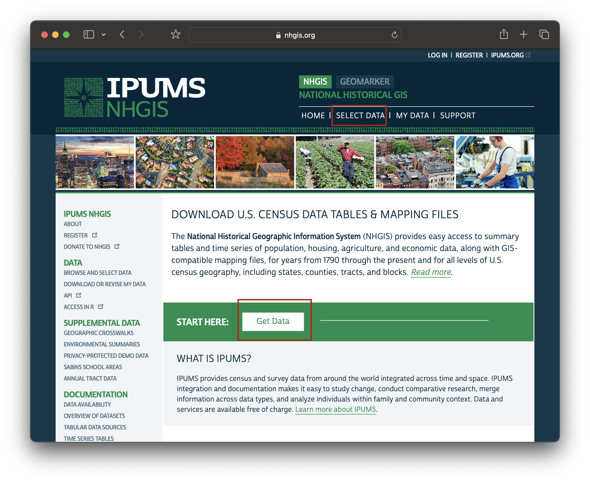
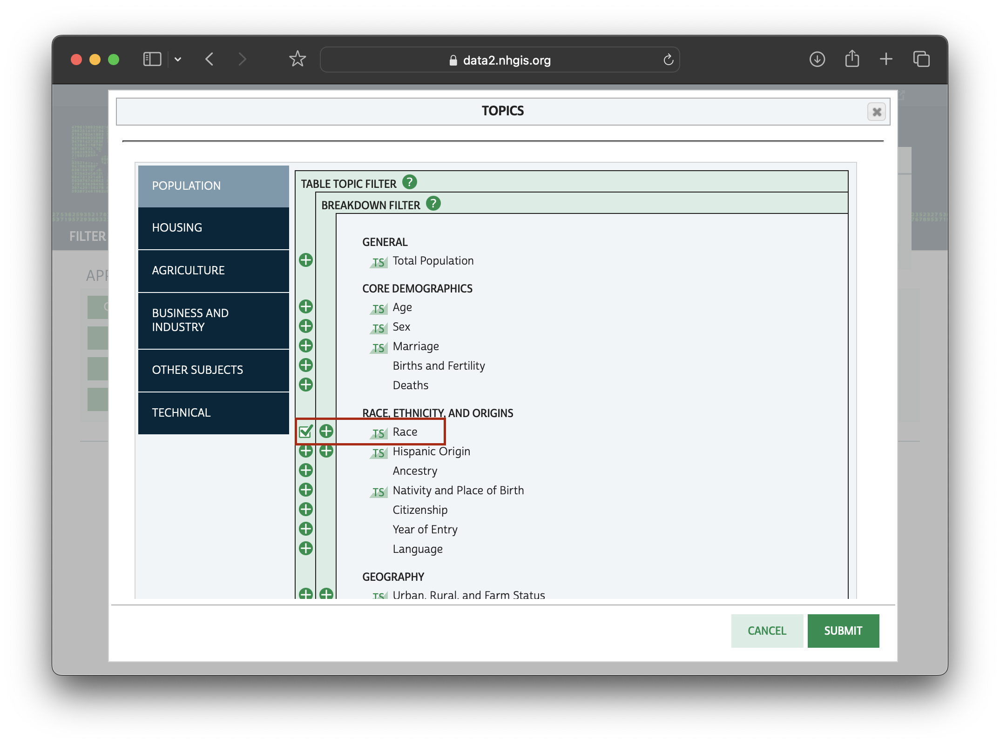
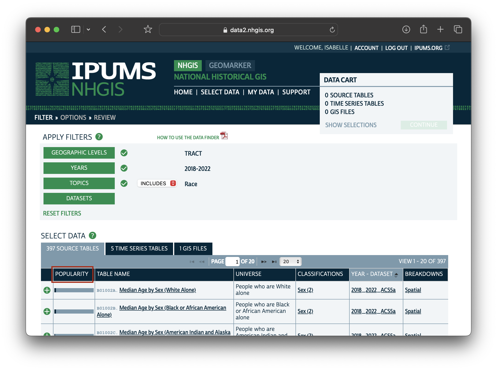
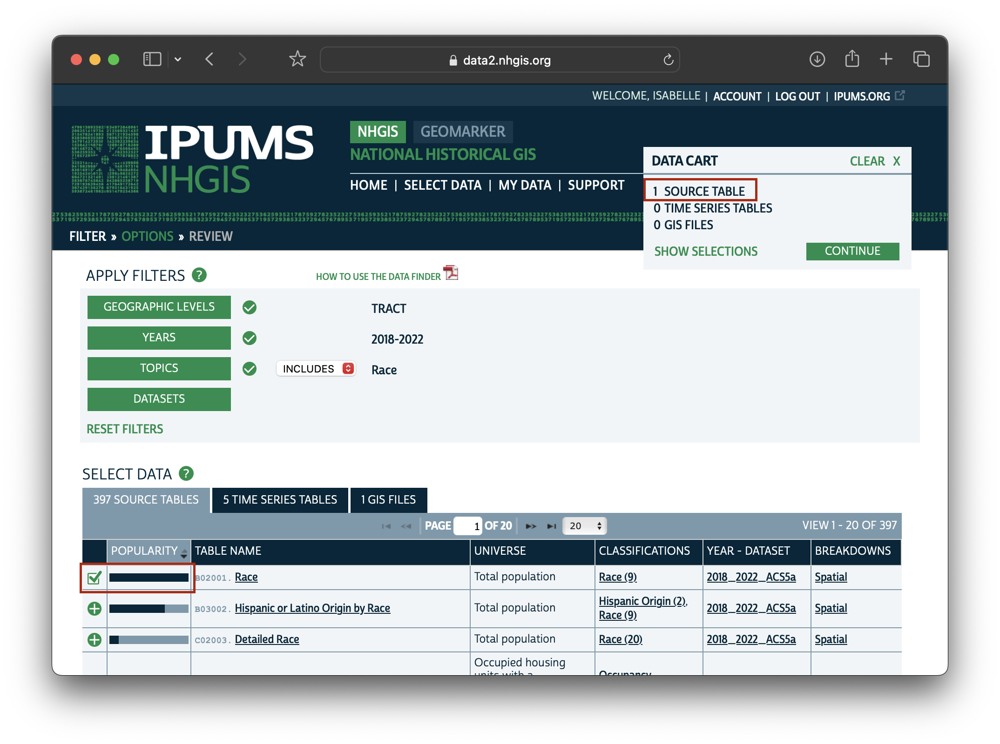
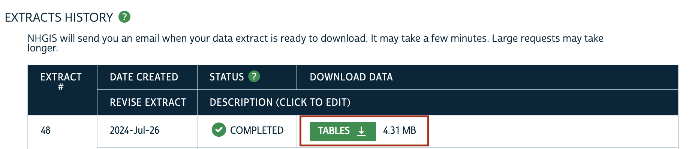

In order to  map non-white population per census tract, you must first perform some steps to prepare the data. In this tutorial, we will practice:
* Downloading high-quality data
* Cleaning the data to prepare it for mapping

## Downloading the data

You can achieve these steps using a number of software environments, including R and Python. In this tutorial we will download the data manually from NHGIS.org, and show how to clean the data using 3 different spreadsheet tools: Excel, LibreOffice, and Google Sheets.

1. Visit [NHGIS.org](https://www.nhgis.org). Create a free academic use account, if you haven't already, and log in.

2. From the [NHGIS.org](https://www.nhgis.org) home screen, choose `START HERE: Get Data` in the middle of the page, or `SELECT DATA` in the navigation bar menu at the top of the page.

3. Click `TOPICS`.

4. Scroll down and choose `Race` from the `RACE, ETHNICITY, AND ORIGINS` tab. Check off this item using the check-box furthest to the left.

5. Click `SUBMIT`.

7. Under `YEARS` select whichever American Community Survey 5-year range is most applicable to your project. 

8. Under `GEOGRAPHIC LEVELS` choose `CENSUS TRACT`

  <h3>Why are we using census tracts?</h3>
  
Censuses are collected at the individual level. When you fill out a census form, you fill it out for yourself, or for your household. Survey results for each household are generally not released to the public, as a way of protecting people's privacy. Instead, individual results are <strong>aggregated</strong> to specific units of geography. These units have been pre-drawn by the United States Census Bureau. You can learn more about the hierarchical census geographies on <a href="https://www.census.gov/programs-surveys/geography/guidance/hierarchy.html">census.gov</a>.

  
Census tracts are a popular unit for geospatial analysis, because counties, the level above, can be too vague to show spatial specificity, whereas more granual geographies, such as block groups or blocks can have a higher likelihood for sampling errors.

9. In the `SELECT DATA` table, click the table heading `POPULARITY`. This will sort the resulting datasets from most to least commonly downloaded.

10. Select the first result, "Race" by clicking the green check-box to the left of the result. You will see the source table reflected in your your `DATA CART: 1 SOURCE TABLE`.

11. From your `DATA CART` choose `CONTINUE` and `CONTINUE` and `SUBMIT` to begin the download. If you are not logged in you will be prompted to do so now.

12. Wait a moment or so for your extract to finish processing, and then download it by selecting `TABLES`.

## Preparing the data for mapping

