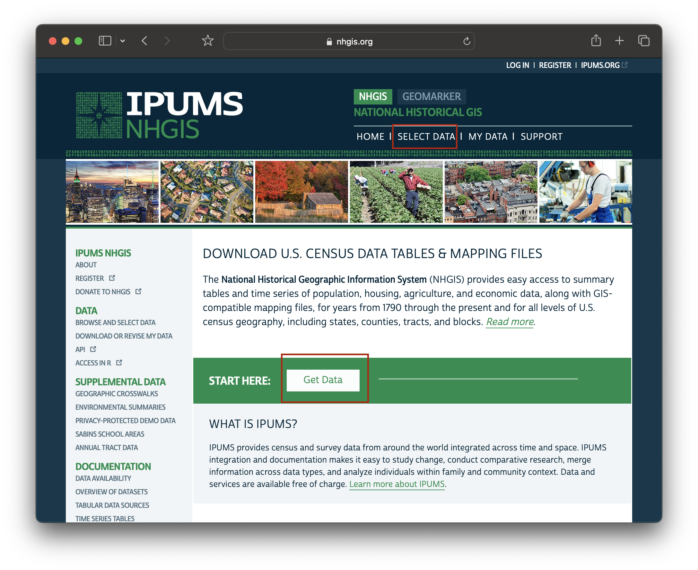
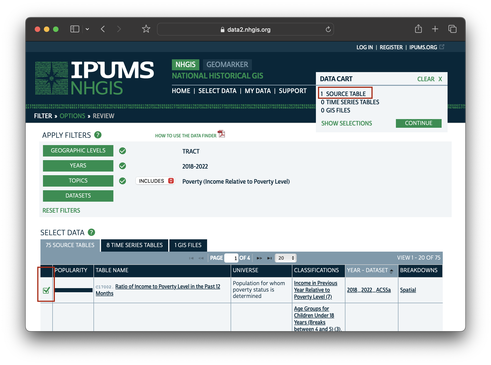
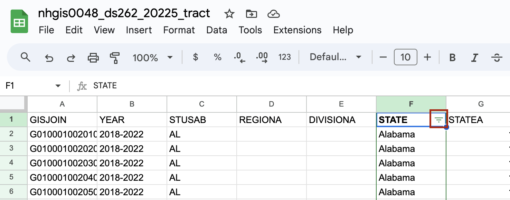

In order to  map poverty rate per census tract, you must first perform some steps to prepare the data. In this tutorial, we will practice:
* Downloading high-quality data
* Cleaning the data to prepare it for mapping

## Downloading the data

1. Visit [NHGIS.org](https://www.nhgis.org). Create a free academic use account, if you haven't already, and log in.

2. From the [NHGIS.org](https://www.nhgis.org) home screen, choose `START HERE: Get Data` in the middle of the page, or `SELECT DATA` in the navigation bar menu at the top of the page.

3. Click `TOPICS`.

4. Scroll down and choose `Poverty (Income Relative to Poverty Level)` from the `INCOME` heading. Check off this item using the check-box furthest to the left.

5. Click `SUBMIT`.

7. Under `YEARS` select whichever American Community Survey 5-year range is most applicable to your project. 

8. Under `GEOGRAPHIC LEVELS` choose `CENSUS TRACT`

  <h3>Why are we using census tracts?</h3>
  
Censuses are collected at the individual level. When you fill out a census form, you fill it out for yourself, or for your household. Survey results for each household are generally not released to the public, as a way of protecting people's privacy. Instead, individual results are <strong>aggregated</strong> to specific units of geography. These units have been pre-drawn by the United States Census Bureau. You can learn more about the hierarchical census geographies on <a href="https://www.census.gov/programs-surveys/geography/guidance/hierarchy.html">census.gov</a>.

  
Census tracts are a popular unit for geospatial analysis, because counties, the level above, can be too vague to show spatial specificity, whereas more granual geographies, such as block groups or blocks can have a higher likelihood for sampling errors.

9. Select the first result, "Ratio of Income to Poverty Level in the Past 12 Months" by clicking the green check-box to the left of the result. You will see the source table reflected in your your `DATA CART: 1 SOURCE TABLE`.

10. From your `DATA CART` choose `CONTINUE` and `CONTINUE` and `SUBMIT` to begin the download. If you are not logged in you will be prompted to do so now.

11. Wait a moment or so for your extract to finish processing, and then download it by selecting `TABLES`.

## Preparing the data for mapping

### Editing the scale of the data

We have downloaded rows for every census tract in the entire United States. This is not ideal because we are planning to upload this data to visualization software. Reducing our data at the outset will save us time and space.

The data cleaning portion of this tutorial is written for three spreadsheet software options: Microsoft Excel, an open (free) desktop spredsheet tool called [LibreOffice](https://www.libreoffice.org/download/download-libreoffice/), or Google Sheets.

 Excel instructions 

1. Open the `.CSV` in Microsoft Excel. If you are prompted to remove leading zeroes, choose `Don't Convert`.

2. Highlight the column titled `STATE`.

3. From the menu ribbon choose `Sort and Filter`.

4. Choose `Filter`. Click the drop-down arrow at the top of the column titled `STATE`.

5. Uncheck `Select All`.

6. Check off `New York` and close the filter window by clicking the small red x in the upper left-hand corner.

7. `CTRL + A` on a Windows, `Command + A` on a Mac, or from the menu `Edit` → `Select All` to highlight all the records. 

8. Copy the records. `CTRL + C`; `Command + C`; `Edit`→ `Copy`.

9. Open a new sheet `File` → `New`.

10. Paste the records into the new sheet. Save this sheet with your other datasets as `new-york-poverty-rate.csv`

  <h4>Do not use .XLSX</h4>
  

Make sure to always save your spreadsheet data for mapping in .CSV format. .CSV is an open-data format, and has a higher likelihood of being interoperable with most GIS software.

LibreOffice instructions

1. Open the dataset in LibreOffice.

2. Click the `AutoFilter` button in the menu ribbon.

3. This will add drop-down arrows to the tops of the column headers. Choose the drop-down arrow next to the column titled `STATE`.

4. Uncheck `All`. Scroll down and check off `New York`.

5. `CTRL + A` on a Windows, `Command + A` on a Mac, or from the menu `Edit` then `Select All` to highlight all the records. 

6. Copy the records. `CTRL + C`; `Command + C`; `Edit`, `Copy`.

7. Open a new sheet `File` → `New` → `Spreadsheet`.

8. Paste the records into the new sheet. Save this sheet with your other datasets as `new-york-poverty-rate.csv`

Google Sheets instructions

1. Type `sheets.new` into a browser to open a new Google sheet.

2. Choose `File`→ `Open`→ `Upload`→ `Browse` to bring in the census data `.csv`.

3. For the `STATE` column, click or hover over the column header until a drop-down arrow appears.

4. Click the drop-down arrow to open a column menu.

5. Choose `Create a Filter`.

6. Now, next to the header name for the column, there will be a button with three horizontal lines. 

7. Click the button next to the header name with the horizontal lines to open a filtering wizard.

8. Under `Filter by Values`, next to `Select All`, click the text that says `Clear`.

9. Scroll down to where it says `New York` and click `New York`. Select `OK`.

10. Select all by clicking the cell directly under the formula bar.
. 

11. Copy the values.

12. Create a new sheet.

13. Paste the values into the new sheet.

  <h3>Scaling data more granularly by using the table</h3>
  
We have reduced our records to only represent census tracts in New York State. If we wanted to further scale down our data, we could filter the records by a particular county. For instance, we could include only the counties associated with New York City.

### Creating an average poverty rate column

1. From the downloaded folder, open the codebook. The file should read something like `nhgis00xx_ds262_20225_tract_codebook.txt`.

2. This data is structured as numerous columns each showing a population count for a different poverty level segment.

- `AMZME002` is the number of people with income under 0.50 of the poverty level.
- `AMZME003` is the number of people with income between 0.50 and 0.99 of the poverty level.
- `AMZME001` is the total population for whom poverty status is determined.

<h4>Poverty Rate Equation</h4>
Poverty Rate= AMZME002 + AMZME003 / AMZME001 x 100

1. Create a new column called `POVERTY_RATE`.

2. In the second cell of the new column, enter the equation 
 
`= IFERROR((AR2 + AS2)/AQ2 * 100, 0)`
 
*'IFERROR' catches null values in the source census data. We ask the function to return 0 instead of an error message if the function can't carry out.*

3. Fill down to complete the column by double-clicking the plus sign on the cell with the formula.

3. `File` → `Save`. Make sure to save as a `.CSV`.

You now have a dataset you can use to map poverty rate. Use the `GEOID` column to join this data with a census tract shapefile, and use the newly computed `POVERTY_RATE` field to power the visualization.

Follow the next tutorial in [the workshop](https://mapping.share.library.harvard.edu/resources/workshops/workshop-4/) to learn how to create a map from this data.