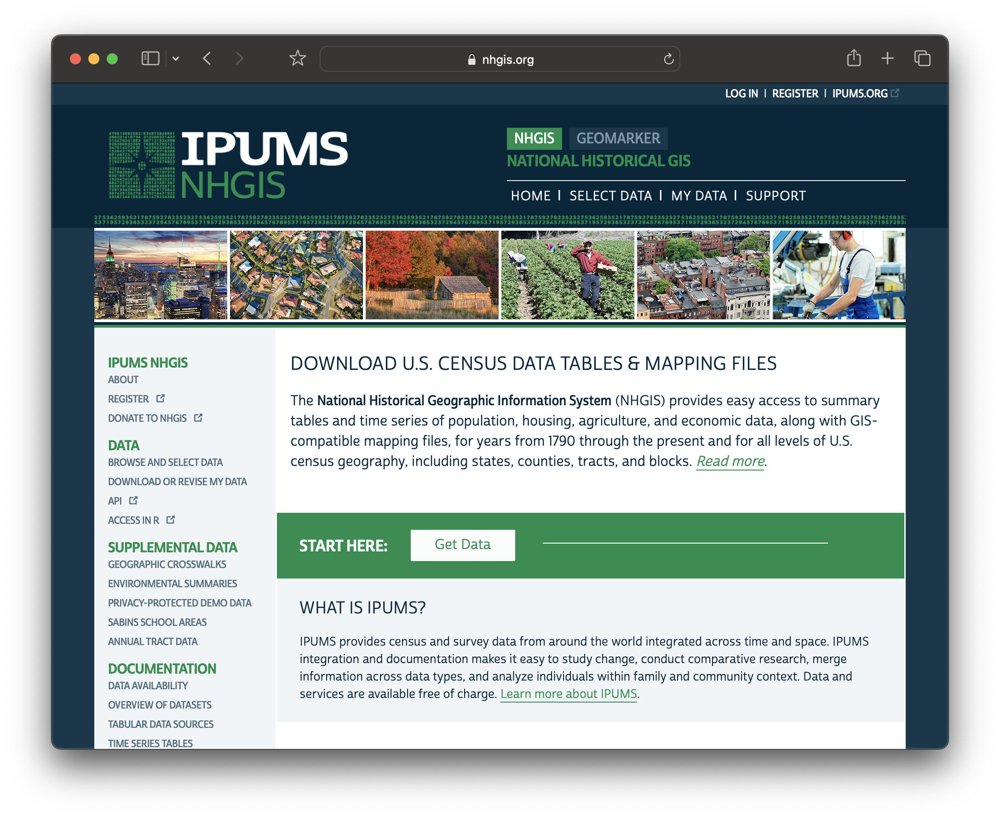

## NHGIS.org

We will be using NHGIS.org via the Minnesota Population Center to obtain census data in this workshop. NHGIS prepares census data for academic research and use with GIS.

1. Visit [NHGIS.org](NHGIS.org).

2. In the upper-right hand corner, select `REGISTER`.

3. Fill out the form. For research purpose, you can say that you are in a GIS workshop.

    <h3>NHGIS Redistribution warning</h3>
  For the redistribution section, NHGIS is largely making sure nobody repurposes the entire database for some kind of profit. You can absolutely use cited, subsetted downloads from this site in your research publications.

 4. Verify your account through the email you registered with.

## Felt.com

    <h3>What is Felt and why are we using it?</h3>

<a href="https://felt.com/">Felt.com</a> is a freemium web mapping website that lets you do a lot with their online tool. We are using Felt for this workshop because it offers a neat feature which allows you to upload spreadsheets of census data without any geometry files, and automatically links the data to GIS shapes (counties, tracts, etc) inside your web map.
 

Since this is a quick-start mapping workshop and we want to get you up and running with demographic data in a short two-hour session, this feature makes working with census data a little more accessible.

Normally, the way we map census data in the biz is by performing table joins. This is a preprocessing step where you use desktop GIS software to link up census spreadsheets with GIS shape files. Here are some resources to learn more about how to do that:

<ul>
<li><a href="https://mapping.share.library.harvard.edu/tutorials/census-data-primer/perform-a-table-join/">Harvard Map Collection's Intro to Table Joins (for QGIS)</a></li>
<li><a href="https://mapping.share.library.harvard.edu/tutorials/census-data-primer/">Harvard Map Collection's follow-along tutorial for downloading and working with NHGIS data (for QGIS)</a></li>
<li><a href="https://guides.library.uwm.edu/c.php?g=567847&p=3914007">American Geographical Society Library's follow-along tutorial for downloading and working with NHGIS data (for ArcGIS Pro)</a></li>
</ul>

Today, we don't need to worry about any of that table joining, because we are going to use <a href="https://felt.com/">Felt.com</a>, which will do it for us. Please note, however, that Felt is not a completely free tool. 

Today we will use Harvard Library's Felt educational license, which is available to workshop participants, and students at Harvard learning GIS. If you're following along at home, you can make a few free maps with a Felt public account, which will be enough to complete this workshop.

### If you are a Harvard student or taking the workshop in person

1. Make an account on [Felt.com](https://felt.com/).

1. Add your email to [this list](https://docs.google.com/forms/d/e/1FAIpQLSeTkBRUne9IyjZRcfzXKuezPrHWlCfe9efWteQYsU8lkdJgzA/viewform?usp=sf_link) and the instructor will add you to our workspace.

### If you are following along at home

1. 1. Make an account on [Felt.com](https://felt.com/).

