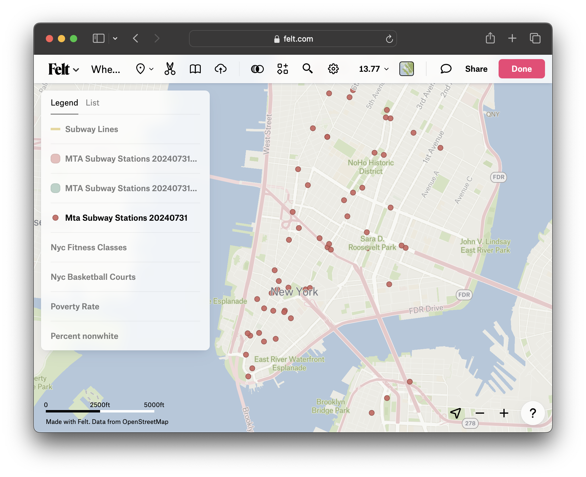

We are working with a lot of different layers! We can look at the maps and visually assess the information, but a better way to start understanding our data is using some GIS spatial analysis methods.

## Buffer

First, let's explore the relationship between the fitness classes and basketball courts to public transportation. We're going to create a ten-minute walking buffer around all subway stops to try to identify locations which are not within a 10-minute walk to transit.

We'll start with the subway stops.

1. Click `Transform` in the top menu. Select `Buffer`.

2. Under `Settings` →  `Distance`, change the buffer radius from `1 mi` to `.5 mi`.

3. Select `Apply`. This will take a moment or two to perform the transformation.

## Dissolve

When we performed the buffer, the GIS tool created unique .5 mile buffers around *each* individual subway station point. This is a lot of redundant data, because many of the buffer circles overlap. To turn these hundreds of polygon features into one buffer layer, we can use the `Dissolve` tool. 

1. Click `Transform` in the top menu. Select `Dissolve`.

2. Under `Combine adjacent polygons` make sure you have the new buffer layer selected, `Mta Subway Stations (Buffered)`.

3. Choose `Apply`. This will take a moment or two to perform the transformation.

4. When the process completes, you can delete the intermediate buffer layer, `Mta Subway Stations (Buffered)`. You can also turn off or delete the MTA stations layer, the original subway points. Removing these layers will give us some space on our map to make assessments. 

## Observe and discuss

Spend five minutes exploring this data. Visit Felt's [handbook for Spatial Analysis](https://gisfundamentals.felt.com/Module-5-Data-exploration-and-spatial-analysis-c549ac684dfb43799f9419fbf13ddabd) and read through some of the other options there are for working with these layers. Are there any you would like to try? Turn layers on and off and experiment with map symbology. Be ready to share out observations and suggestions for potential next steps, based on your reading.

