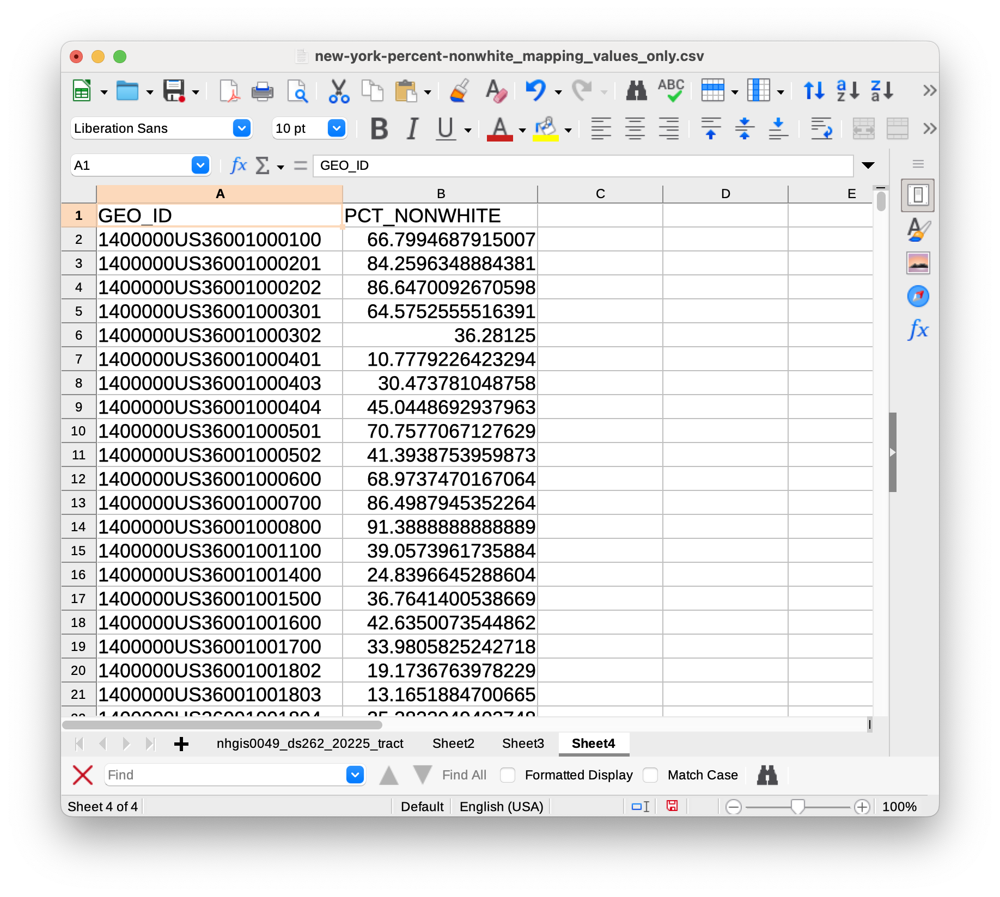
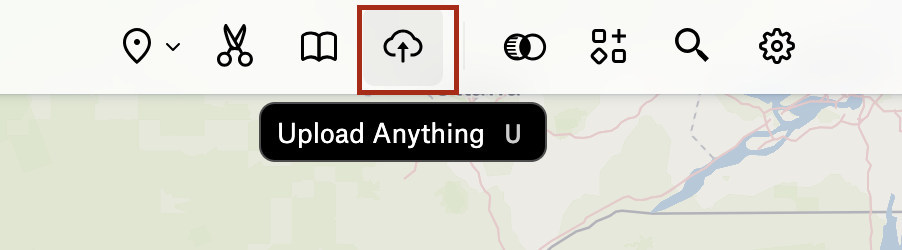

To successfully upload a United States census data spreadsheet to Felt and have it display as polygons, check that these elements are present:

* Your dataset is organized by geography, meaning, each *row* in the dataset represents one census geography (census tract, county, block group, etc.)
* Your dataset has a column you'd like to map. If the column contains numerical statistical values, ensure the column is formatted as a **number** type.
* Your dataset has a column containing the [census geography GEOID]((https://www.census.gov/programs-surveys/geography/guidance/geo-identifiers.html)) code. 

*This table is formatted so that it will display as polygons in Felt. The GEOID column will join with the pre-upload census tract shapes, which come as a default with Felt.*

## Upload instructions

Because tables often contain many references to geography, Felt can get a little confused if there are many different types of geography references in the table you are trying to upload. For instance, if your table looks something like this...

| **GEOID** |  **County**  | **Pct_Nonwhite** | 
| --- | --- | --- | 
| 1400000US36001000100 | Albany County | 66.7994687915007 |
|1400000US36001000201 | Bronx County | 84.2596348884381 |
| 1400000US36001000401 | Kings County | 10.7779226423294 |

... Felt may not know which column to treat as the geography column. There is a possibility it could import your dataset as a point layer representing the **county centroids**.

GIS software sometimes let you specify upon upload which field to treat as geography. At the time this guide was written, this is not yet a feature in Felt, so it's best to pre-prepare your census data spreadsheets so that they *only* include the columns you know you want to map. 

### Steps

#### Upload

1. Remove all columns from the table besides the `GEOID` and the field you want to map. You can also leave in any information you want to show up in a pop-up window, for instance the fields you used to derive your mapped columns. This might help you explore the data in more detail later.

2. In a Felt map, from the top-menu, select `Upload Anything`.

3. Choose `Upload file`. 

4. Select the spreadsheet you have prepared.

5. To the prompt "How do you want to add this data?" Choose `Data Layer` and `Create`.

6. Wait for the data to upload. There is a progress bar in the `Legend`.

7. When the data finishes uploading, you will know it was successful if you can see polygon features on the map. 

#### Symbolize

1. Right now the polygons are all showing up the same. To use graduated symbology, click the layer in the `Legend`.

2. This will bring up a sidebar on the right. The first item in the sidebar will be the title of the layer, which is created from the filename. If you are happy with this title, proceed to the next step, but if you'd like to change it, you can click on the title text in the sidebar.

3. Under `Style` → `General` → `Type`, change `Simple` to `Color Range`.

4. Under `Color by`, ensure Felt is identifying the correct variable to map, if not change the name of the field using the dropdown.

5. Under `Polygons` → `Fill` you can change which color ramp to use.

6. Click `General` → `Steps`. This will open a menu that lets you control how your data are grouped into categories. Click the value next to `Method` and explore how you want to bin your data.

If you choose `Jenks` or `Equal Interval`, for instance, you can define how many binning categories to use. If you choose `Manual`, you can set the ranges yourself.

#### Configure popups

1. Under `Popups` → `Contents`, click `Table`.

2. You can remove attributes from showing up in the popup window, or change the field alias for how field names display.

#### Add a histogram

1. To add a histogram to your `Legend`, from the menu bar, select `Components`.

2. In the configuration menu that pops up on the right, ensure the correct `Attribute` is selected. These histograms are interactive; you can use them to change which polygons are displayed on the map.

