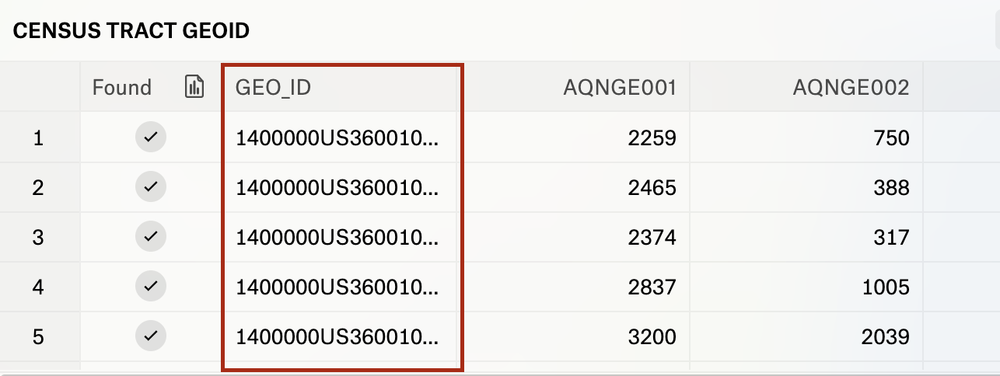
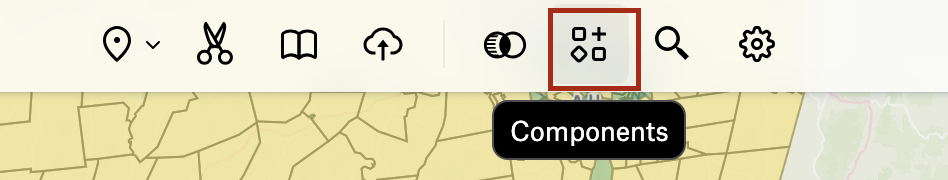

The goal of this tutorial is to start with a spreadsheet of census information, and upload the information so that it displays as **polygons** on the map. As mentioned in the software [requirements](https://mapping.share.library.harvard.edu/resources/workshops/workshop-4/registration/) section of this workhop, we are choosing Felt as a venue to get started working with census data because it faciliates the process of table joins for us.

<h2>Jump ahead</h2>
  
If you already have a background on the structure of GIS data, and want to learn how to use census data in Felt, you can jump to the bottom of this page labeled <a href="https://mapping.share.library.harvard.edu/resources/workshops/workshop-4/upload-census-to-felt/#steps">"Steps"</a>

<h2>Table joins</h2>
  
Table joins are a common skill you will want to learn if you plan to use GIS. They usually require some data cleaning, which can occupy workshop time. This is why, today, we are choosing an online tool which performs this for us. If you want to practice table joins, follow the <a href="https://mapping.share.library.harvard.edu/tutorials/census-data-primer/perform-a-table-join/">table joins tutorial</a>, or inquire about our Data Cleaning for GIS workshop. 

Table joins work in Felt because Felt has already pre-uploaded vector geometry files of different census geometries. Felt includes these data layers because mapping census data is a common GIS task. An example would be a default layer of all of the county shapes in the United States. Another example would be a default layer of the shape of every census tract in the United States. To remind yourself of the different options for census geographies, you can refer to the [census geography hierarchy documentation](https://www.census.gov/programs-surveys/geography/guidance/hierarchy.html) on census.gov.

For any of these data layers, for example, census tracts, each census polygon will have a unique ID associated with it. These ID codes are sometimes called `GEOIDs` or census `FIPS codes`. When we are uploading a spreadsheet with data we want to map, it is important to make sure the spreadsheet has a column with a corresponding unique ID. The column does not have to be called "GEOID", but it does have to contain the same unique strings indicating which census geography any given table row pertains to.

## To upload census data to Felt, make sure

* Your dataset is organized by geography, meaning, each *row* in the dataset represents one census geography (either a county, a census tract, a block group, and so forth, depending on which geographic unit you've chosen to aggregate by).
* Your dataset has a column containing the [census geography GEOID]((https://www.census.gov/programs-surveys/geography/guidance/geo-identifiers.html)) code. 
* Your dataset has a column you'd like to map. If the column contains numerical statistical values, ensure the column is formatted as a **number** type.

*This table is formatted so that it will display as polygons in Felt. The GEOID column will join with the pre-uploaded census tract shapes, which come as a default with Felt.*

## Upload instructions

It's important to make sure Felt knows which column to use for geography. There are lots of different ways to turn a tabular spreadsheet into a map. For instance, you can
* Transform a table of x,y coordinates into points
* Locate the `centroid` of a place name and represent it as one singular dot on the map

We don't want to choose either of those options. We want to map our data as *polygons*, because having the polygon shapes will allow us to shade each unique region with a different color to visualize population density. To play around with different graduated color schemes, check out the mapping website [Color Brewer](https://colorbrewer2.org/#type=sequential&scheme=BuGn&n=3).

| **GEOID** |  **County**  | **Pct_Nonwhite** | 
| --- | --- | --- | 
| 1400000US36001000100 | Albany County | 66.7994687915007 |
|1400000US36001000201 | Bronx County | 84.2596348884381 |
| 1400000US36001000401 | Kings County | 10.7779226423294 |

Notice how in the table above, there is both a column for `GEOID` (the field we would use to join our data to matching polygons), *and* a column listing which county each census tract is contained by. If we uploaded a dataset like this to Felt, there is a chance Felt could trying to use the `County` field to treat as the spreadsheet geography, and instead of joining the `GEOID` field, it would place the data as dots on the map representing county centroids.

To avoid this and ensure your census spreadsheet data will join up with census polygons, it's best to do some pre-processing cleaning of your spreadsheet, and remove any redundant geography columns you don't need for your map.

### Steps

#### Upload

1. Remove all columns from the table besides the `GEOID` and the field you want to map. You can also leave in any information you want to show up in a pop-up window, for instance the fields you used to derive your mapped columns. This might help you explore the data in more detail later.

2. In a Felt map, from the top-menu, select `Upload Anything`.

3. Choose `Upload file`. 

4. Select the spreadsheet you have prepared.

5. To the prompt "How do you want to add this data?" Choose `Data Layer` and `Create`.

6. Wait for the data to upload. There is a progress bar in the `Legend`.

7. When the data finishes uploading, you will know it was successful if you can see polygon features on the map. 

#### Symbolize

1. Right now the polygons are all showing up the same. To use graduated symbology, click the layer in the `Legend`.

2. This will bring up a sidebar on the right. The first item in the sidebar will be the title of the layer, which is created from the filename. If you are happy with this title, proceed to the next step, but if you'd like to change it, you can click on the title text in the sidebar.

3. Under `Style` → `General` → `Type`, change `Simple` to `Color Range`.

4. Under `Color by`, ensure Felt is identifying the correct variable to map, if not change the name of the field using the dropdown.

5. Under `Polygons` → `Fill` you can change which color ramp to use.

6. Click `General` → `Steps`. This will open a menu that lets you control how your data are grouped into categories. Click the value next to `Method` and explore how you want to bin your data.

If you choose `Jenks` or `Equal Interval`, for instance, you can define how many binning categories to use. If you choose `Manual`, you can set the ranges yourself.

#### Configure popups

1. Under `Popups` → `Contents`, click `Table`.

2. You can remove attributes from showing up in the popup window, or change the field alias for how field names display.

#### Add a histogram

1. To add a histogram to your `Legend`, from the menu bar, select `Components`.

2. In the configuration menu that pops up on the right, ensure the correct `Attribute` is selected. These histograms are interactive; you can use them to change which polygons are displayed on the map.

