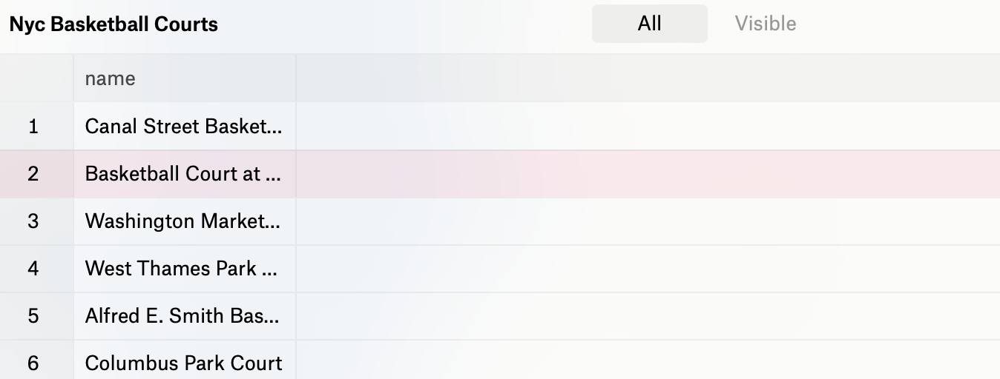
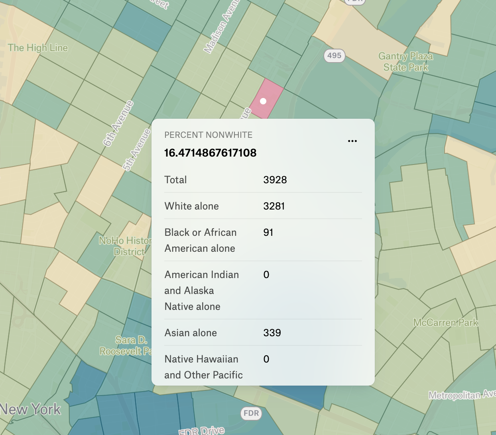
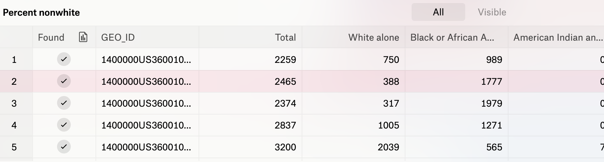
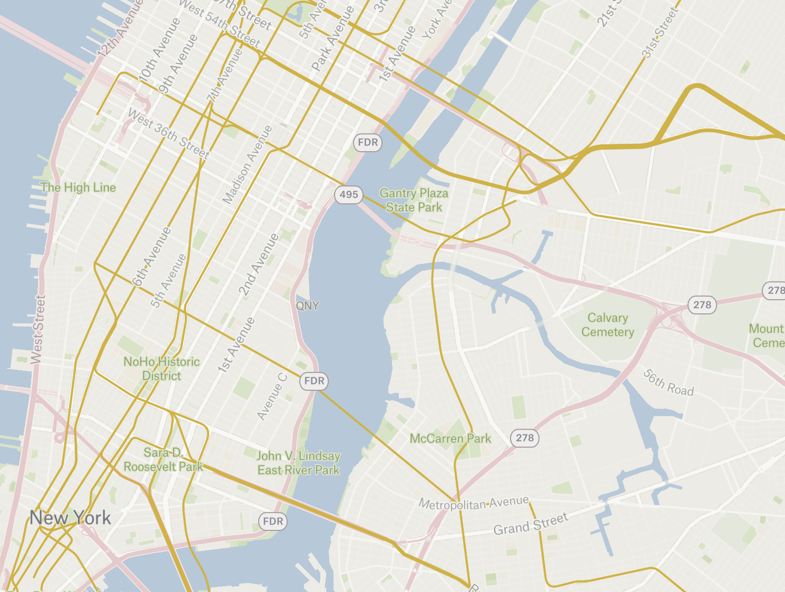
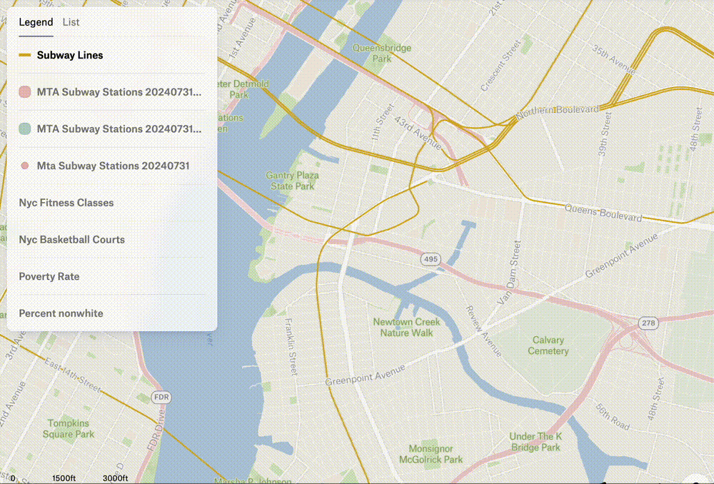
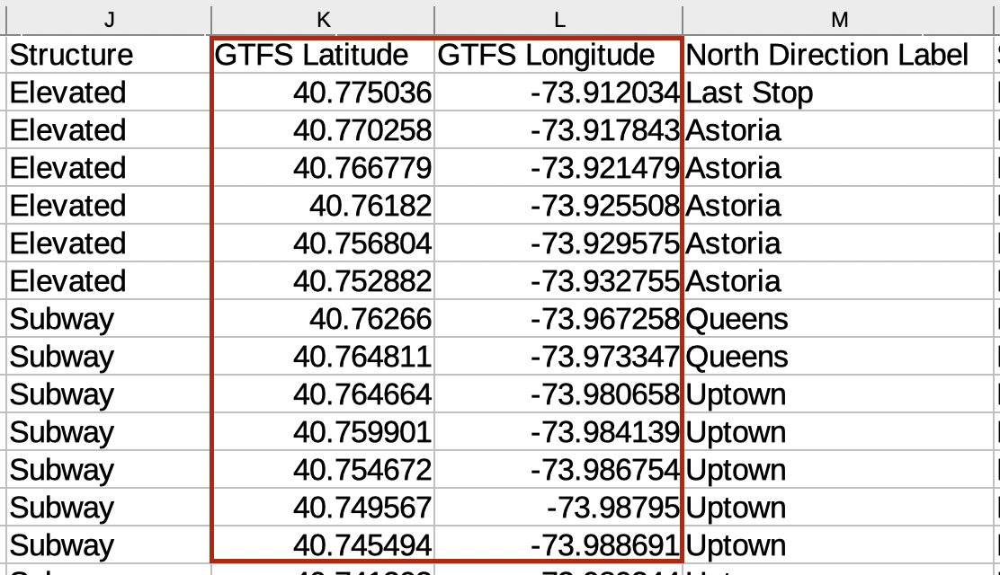

In this tutorial, we will:

- Work with point or coordinate data saved in **spatial data** format (`.geoJSON`)
- Work with point or coordinate data saved in **non-spatial data** format (`.XLSX` or `.CSV`)
- Solidify our understanding of how vector GIS data is structured

## Working with geoJSONs

1. If you haven't already, download the files from [Libby_Wu_Source_Project_Data](https://osf.io/nuwqs/files/osfstorage).

This data is already in geospatial format, `.geoJSON`. There are a few different format options for encoding point, line, and polygon GIS features, which we call "vector" features (as opposed to "raster", which we will work withh later). 

### Vector GIS file formats
- `.geoJSON`
- `.gpkg` (geopackage)
- `.shp` (shapefile)

Choosing to save your data in any of these formats will make sure you are encoding your data as spatial data, and most GIS tools will let you import datasets stored in these three formats.

<h3>Basketball court data in .geoJSON format</h3>

GeoJSON is a text-based format, and consists of iterable key-value pairs. Here is our basketball court point GIS dataset encoded in geoJSON format (scroll to see more). 

<pre style="padding-left:30px;background-color:black;color:white;height: 500px;overflow: scroll;">
<code>
{
  "type": "FeatureCollection",
  "features": [
    {
      "type": "Feature",
      "properties": {
        "name": "Canal Street Basketball Court"
      },
      "geometry": {
        "type": "Point",
        "coordinates": [
          -74.011534,
          40.725602
        ]
      }
    },
    {
      "type": "Feature",
      "properties": {
        "name": "Basketball Court at Harrison St"
      },
      "geometry": {
        "type": "Point",
        "coordinates": [
          -74.012947,
          40.718782
        ]
      }
    },
    {
      "type": "Feature",
      "properties": {
        "name": "Washington Market Park Basketball Court"
      },
      "geometry": {
        "type": "Point",
        "coordinates": [
          -74.012089,
          40.717021
        ]
      }
    },
    {
      "type": "Feature",
      "properties": {
        "name": "West Thames Park Basketball Court"
      },
      "geometry": {
        "type": "Point",
        "coordinates": [
          -74.015496,
          40.709308
        ]
      }
    },
    {
      "type": "Feature",
      "properties": {
        "name": "Alfred E. Smith Basketball Court\n"
      },
      "geometry": {
        "type": "Point",
        "coordinates": [
          -73.9967,
          40.71034
        ]
      }
    },
    {
      "type": "Feature",
      "properties": {
        "name": "Columbus Park Court"
      },
      "geometry": {
        "type": "Point",
        "coordinates": [
          -73.999794,
          40.714372
        ]
      }
    },
    {
      "type": "Feature",
      "properties": {
        "name": "Basketball City @ Pier 36"
      },
      "geometry": {
        "type": "Point",
        "coordinates": [
          -73.98491,
          40.709815
        ]
      }
    },
    {
      "type": "Feature",
      "properties": {
        "name": "Basketball Court"
      },
      "geometry": {
        "type": "Point",
        "coordinates": [
          -73.986592,
          40.711379
        ]
      }
    },
    {
      "type": "Feature",
      "properties": {
        "name": "Grand Basketball Court"
      },
      "geometry": {
        "type": "Point",
        "coordinates": [
          -73.9789,
          40.7139
        ]
      }
    },
    {
      "type": "Feature",
      "properties": {
        "name": "Hamilton Fish Basketball Court"
      },
      "geometry": {
        "type": "Point",
        "coordinates": [
          -73.980889,
          40.719377
        ]
      }
    },
    {
      "type": "Feature",
      "properties": {
        "name": "Nathan Straus Basketball Courts"
      },
      "geometry": {
        "type": "Point",
        "coordinates": [
          -73.984089,
          40.719347
        ]
      }
    },
    {
      "type": "Feature",
      "properties": {
        "name": "Sara D. Roosevelt Park"
      },
      "geometry": {
        "type": "Point",
        "coordinates": [
          -73.99356,
          40.717821
        ]
      }
    },
    {
      "type": "Feature",
      "properties": {
        "name": "Tompkins Square Park Basketball Courts"
      },
      "geometry": {
        "type": "Point",
        "coordinates": [
          -73.981502,
          40.726533
        ]
      }
    },
    {
      "type": "Feature",
      "properties": {
        "name": "Stuy Town Basketball Courts"
      },
      "geometry": {
        "type": "Point",
        "coordinates": [
          -73.979481,
          40.732434
        ]
      }
    },
    {
      "type": "Feature",
      "properties": {
        "name": "PCV Playground 3 - Basketball Court"
      },
      "geometry": {
        "type": "Point",
        "coordinates": [
          -73.978624,
          40.735316
        ]
      }
    },
    {
      "type": "Feature",
      "properties": {
        "name": "328 2nd Avenue Basketball Court"
      },
      "geometry": {
        "type": "Point",
        "coordinates": [
          -73.98215,
          40.73555
        ]
      }
    },
    {
      "type": "Feature",
      "properties": {
        "name": "West 4th Street Courts (\"The Cage\")"
      },
      "geometry": {
        "type": "Point",
        "coordinates": [
          -74.001041,
          40.731127
        ]
      }
    },
    {
      "type": "Feature",
      "properties": {
        "name": "Grand Canal Court"
      },
      "geometry": {
        "type": "Point",
        "coordinates": [
          -74.00183,
          40.726075
        ]
      }
    },
    {
      "type": "Feature",
      "properties": {
        "name": "William F. Passannante Ballfield"
      },
      "geometry": {
        "type": "Point",
        "coordinates": [
          -74.002274,
          40.728542
        ]
      }
    },
    {
      "type": "Feature",
      "properties": {
        "name": "Lower East Side Playground Courts"
      },
      "geometry": {
        "type": "Point",
        "coordinates": [
          -73.982836,
          40.729326
        ]
      }
    },
    {
      "type": "Feature",
      "properties": {
        "name": "Dry Dock Basketball Court"
      },
      "geometry": {
        "type": "Point",
        "coordinates": [
          -73.975701,
          40.725521
        ]
      }
    },
    {
      "type": "Feature",
      "properties": {
        "name": "John V. Lindsay East River Park Courts"
      },
      "geometry": {
        "type": "Point",
        "coordinates": [
          -73.972359,
          40.724868
        ]
      }
    },
    {
      "type": "Feature",
      "properties": {
        "name": "Baruch Courts"
      },
      "geometry": {
        "type": "Point",
        "coordinates": [
          -73.977276,
          40.717097
        ]
      }
    },
    {
      "type": "Feature",
      "properties": {
        "name": "Henry M. Jackson Playground Courts"
      },
      "geometry": {
        "type": "Point",
        "coordinates": [
          -73.981159,
          40.714064
        ]
      }
    },
    {
      "type": "Feature",
      "properties": {
        "name": "Cherry Clinton Playground Courts"
      },
      "geometry": {
        "type": "Point",
        "coordinates": [
          -73.988483,
          40.712308
        ]
      }
    },
    {
      "type": "Feature",
      "properties": {
        "name": "Lillian D. Wald Playground Courts"
      },
      "geometry": {
        "type": "Point",
        "coordinates": [
          -73.984466,
          40.711992
        ]
      }
    },
    {
      "type": "Feature",
      "properties": {
        "name": "Sidney Hillman Playground Courts"
      },
      "geometry": {
        "type": "Point",
        "coordinates": [
          -73.979703,
          40.715114
        ]
      }
    },
    {
      "type": "Feature",
      "properties": {
        "name": "Seward Park Courts"
      },
      "geometry": {
        "type": "Point",
        "coordinates": [
          -73.988931,
          40.715025
        ]
      }
    },
    {
      "type": "Feature",
      "properties": {
        "name": "Tanahey Playground Courts"
      },
      "geometry": {
        "type": "Point",
        "coordinates": [
          -73.995355,
          40.710117
        ]
      }
    },
    {
      "type": "Feature",
      "properties": {
        "name": "McKinley Playground Courts"
      },
      "geometry": {
        "type": "Point",
        "coordinates": [
          -73.985796,
          40.724058
        ]
      }
    },
    {
      "type": "Feature",
      "properties": {
        "name": "The Community Center at Stuyvesant High School"
      },
      "geometry": {
        "type": "Point",
        "coordinates": [
          -74.013726,
          40.717962
        ]
      }
    }
  ]
}

</code>
</pre>

You'll notice that besides the "geometry" for each point feature, which includes coordinates, this dataset only has one property, which is the name of the court.

2. From [Felt](https://felt.com/), click the `Upload Anything` button.

3. From your downloads folder, choose `nyc-basketball-courts.geojson`.

4. Click `Create` as a Data Layer.

You should see the points uploaded in NYC.

5. Click on any point to see the attributes, or "properties" displayed.

6. If you click the name of the layer, `Nyc Basketball Courts` in the `Legend` a side menu will open on the right-hand side of the page. Here, you can change the size and color of the points. You can also change the symbolization `Type` under `General` from `Simple` to `Heatmap`. Under `Points`, adjust the `Size` and `Intensity` to change how the heatmap looks. 

7. In the same menu on the right-hand side of the page, select the `View Table` button, and explore the data table.

Each row in the table is one feature, or one point on the map. Each column is one piece of information collected about that place. In this dataset, there is only one attribute or property, the `name` of the basketball court. If there were more attributes, there would be more columns. 

  <h4>Vector data structure</h4>
  
Remember! Every row in a GIS table represents one geographical feature, in this case, one basketball court.

    
We happen to be working with a point dataset right now - the location of basketball courts - but the same principle applies to the structure of all GIS vector data: points, polygons, and lines.

    
    
Recall that when we were working with census tracts (polygons), in the corresponding data table, each census tract was represented by one row.

    
    <h4>Line dataset example (subways)</h4>
    
This is a map showing a vector <strong>line</strong> dataset of subways in NYC.

    
    
Notice how clicking on different segments of the subway line results in different attribute pop-ups. That is because, with lines as the organizing geometry in this dataset, each line segment is represented by one row in the data table.

    

8. Upload the other .geoJSON, `nyc-fitness-classes.geojson` using the same steps. Open the data table by clicking on the data layer in the `Legend`, and clicking the `View Table` icon in the menu on the right-hand side of the page.

9. Notice how for the Fitness Classes dataset, there are two properties, or attribute columns, `Name` and fitness class `Category`. Each row or fitness class will have both a `Name` and a `Category`. Confirm this by clicking one of the fitness class points on the map and inspecting the pop-up. You can also change the symbolization from `Simple` to `Categories` under `General` → `Type`.
 
 

 

10. Start experiementing with the symbology on the following four layers, and note any spatial observations: `Nyc Basketball Courts`, `Nyc Fitness Classes`, `Percent Nonwhite`, `Poverty Rate`.

## Searching for GIS data and working with spreadsheets of coordinates

1. In a new browser tab, search for "MTA subway stations GIS data". Within a few results, you should see [MTA Subway Stations on data.ny.gov](https://data.ny.gov/Transportation/MTA-Subway-Stations/39hk-dx4f/about_data). Click on that link.

2. Scroll the page and get a sense of how the data is listed and structured, including the codebook. At the top of the page, select `Export`. Under export format, in the dropdown, note that downloads support `.geoJSON`, `shapefile` and `.CSV`. While we could download this data in spatial formats, we are going to choose `.CSV`, to demo how point tabular data is structured. Select `.CSV` and `Download`.

3. Open the spreadsheet in Excel, LibreOffice, or some spreasheet software. Take note of the way the data is structured, and find the `Latitude` and `Longitude` fields with coordinates.

<h3>Latitudes and Longitudes</h3>

Most GIS software will accept spreadsheets with coordinates formatted like this.

If you are working with spreadsheet data you'd like to import into a GIS tool such as Felt, ArcGIS, or QGIS, make sure the Latitude and Longitude columns are split into two separate columns.

Use <a href="https://stackoverflow.com/questions/4536996/positive-negative-latitude-and-longitude-values-vs-cardinal-directions">the negative symbol</a> to denote South and West, but <strong>remove</strong> all other special characters such as degree symbols, or the characters 'N', 'S', 'E', 'W'.

These workshop tutorial materials are written for the browser mapping tool <a href="https://felt.com/">Felt</a>, but if you'd like to practice bringing spreadsheet data into a desktop software, you can <a href="https://mapping.share.library.harvard.edu/tutorials/qgis/add-spreadsheet/">Add .XLSX or .CSV to QGIS.</a>

4. Click the `Upload Anything` button in Felt, and upload this spreadsheet. Note that Felt interprets the `Latitude` and `Longitude` fields, and places the records as point coordinates on the map. If you wanted to save this dataset as spatial data, you could click the three dots icon next to the subway data layer in the `Legend`.  

5. Select `Export` and then choose `To Geopackage`. This will save the data in `.gpkg`, which is a commonly used open source format for storing point, line, and polygon data.

We now have a web map containing many interesting layers:
* population and demographic data
* locations of fitness classes and basketball courts
* transit locations

By eyeballing the maps, we can start to make some inferences. In the next tutorial, we will use some of Felt's spatial analysis tools to start to leverage spatial science and improve our ability to interpret this data.

<iframe src="https://docs.google.com/forms/d/e/1FAIpQLSdhtWzeLzaXCXuGFetQcTQSDGGAFCrmby7g8Fc1C7VVUHD_pQ/viewform?embedded=true" width="640" height="504" frameborder="0" marginheight="0" marginwidth="0">Loading…</iframe>

