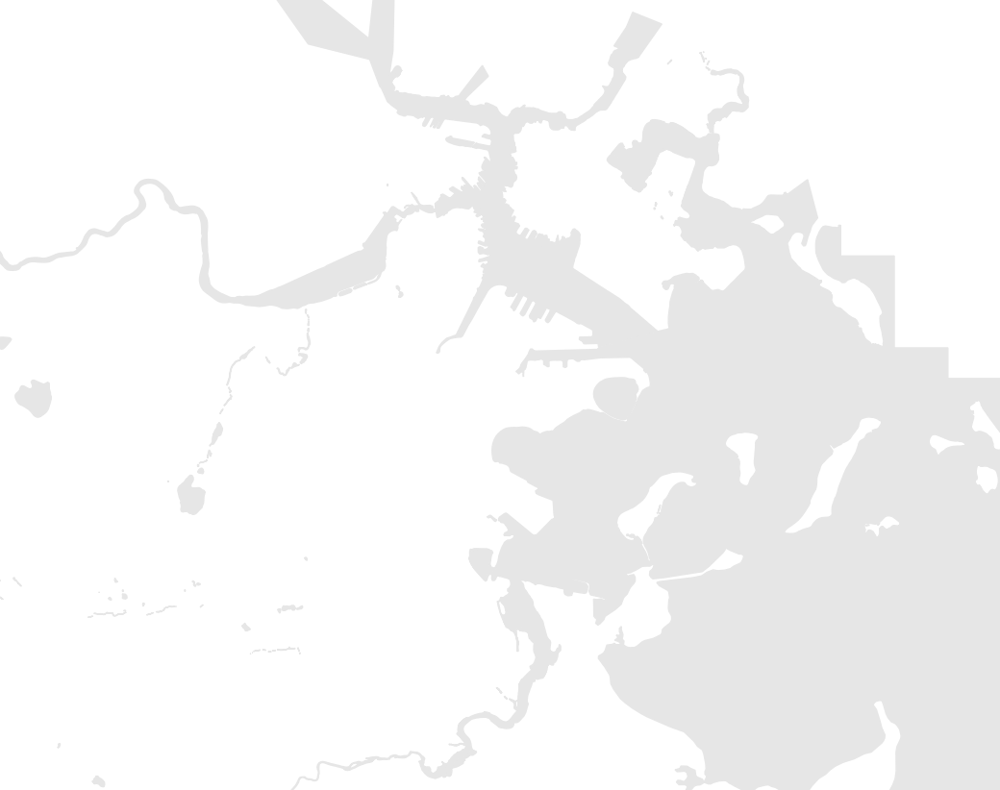

## Other Reference Map Tips

### Add hydrography
> Provides additional visual cues to where the map depicts.

1. In a web browser, search "Boston hydrography gis data download".
2. Download the correct layer [(polygons)](https://data.boston.gov/dataset/hydrography-polygon/resource/8b9a664b-dbf7-47e5-b033-5865fd8d4b11) as a shapefile or geojson and add it to your QGIS document.
3. Double-click or right-click the layer in the QGIS layer list to open the `Layer Properties`.
4. Select `Symbology` from the side menu.
5. Click `Simple Fill`.
6. Click the color blocks next to `Fill color` and `Stroke color` and change the HTML notation to `E6E6E6`.

