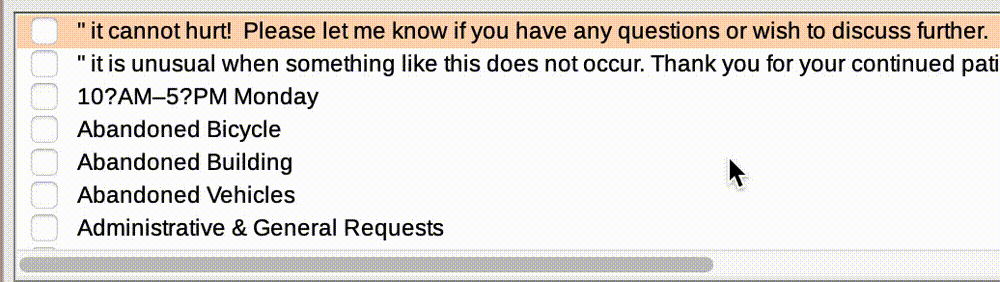

1. In a web browser search "Boston 311 data".
2. Navigate to the [311 SERVICE REQUESTS webpage](https://data.boston.gov/dataset/311-service-requests).
3. Click `CRM VALUE CODEX` and observe the data documentation telling you which values are encoded into the table. 
4. Click "311 SERVICE REQUESTS - 2024" and observe the spreadsheet. 
5. Discuss observations as a group.
6. Download a pre-processed version of the data from DATA LINK. This spreadsheet contains only 311 service requests reporting **potholes**.

- Search for 3-1-1 data
- Look @ metadata
- Download processed version
- Open in QGIS + inspect

Set coordinate reference system.