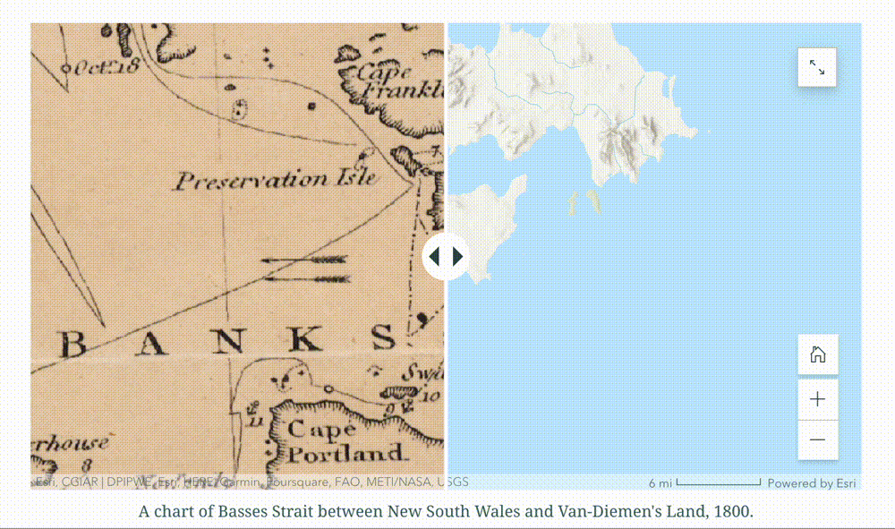

Do you want to be able to use a historic map for comparison in one of your ArcGIS Online projects, such as StoryMaps?

This guide will go over your options.

## Options

- If your georeferenced historical map is already hosted online somewhere and you have a tile layer link, you can [Add a Layer from the Web](https://doc.arcgis.com/en/arcgis-online/reference/add-layers.htm#ESRI_SECTION1_A82A515232CB4672838FEB9FCF8E76D8).

- If you are working within the ArcGIS Pro desktop software, you can publish your georeferenced historical map from the desktop software to the online interface.

- If, however, you don’t have a web layer link for your map and you aren’t already working in the ArcGIS Pro software, this tutorial is for you.

## Step 1: Find a GeoTIFF

You can create a geoTIFF out of any scanned image file by georeferencing. [ADD LINK]. There are also many library repositories, which already have geoTIFFs ready to download. Try:

- The [Harvard Geospatial Library](https://hgl.harvard.edu/?f%5Bdct_provenance_s%5D%5B%5D=Harvard&f%5Blayer_geom_type_s%5D%5B%5D=Raster&q=&search_field=all_fields) or the [Leventhal Map Collection](https://collections.leventhalmap.org/search?f%5Bgeoreferenced_bsi%5D%5B%5D=yes&q=).

## Step 2: Enable the ArcGIS Imagery Extension

1. Make sure you have [created an ArcGIS Online account using your Harvard key](https://gis.harvard.edu/arcgis-online).

2. [Request access](https://projects.iq.harvard.edu/cga-pin/request) to the ArcGIS Imagery tool (it is not free, but Harvard key holders have access). When picking the item to request choose the last item, “ArcGIS Image for ArcGIS Online”.

3. You’ll get an email when it’s been completed. To inquire about the status of your request, you can contact Jeff Blossom at jblossom@cga.harvard.edu. 

## Step 3: Upload the GeoTIFF

Once your account has the extension added on, you can upload your geoTIFF. From **My Content** select **New Item**, and choose **Imagery Layer**. Follow the prompts. 

## Step 4: Configure your web project

You should then be able to use your historical map in any ArcGIS Online web map or ArcGIS Online web map products like StoryMaps. Here is a guide on [how to add a swipe block to your StoryMap](https://storymaps.arcgis.com/stories/4afb9aefc2ff43fd81db3f74ddbf05d0).

**Important!** Make sure the tile layer, the web map, and the StoryMap are all set to **public**. All three items (found in My Content) must be publicly shared in order for the final StoryMap to be viewable.