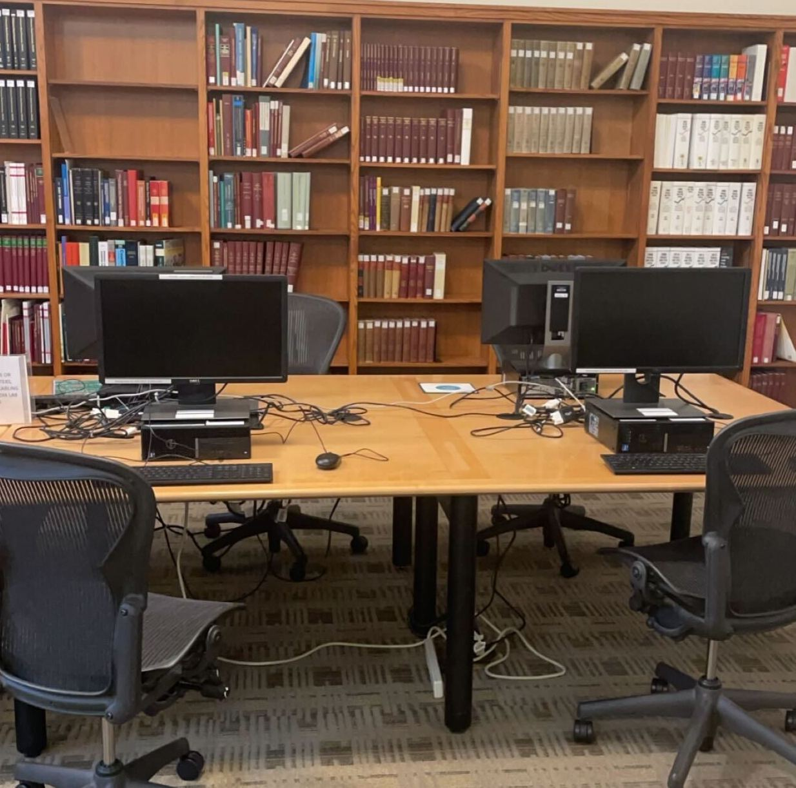
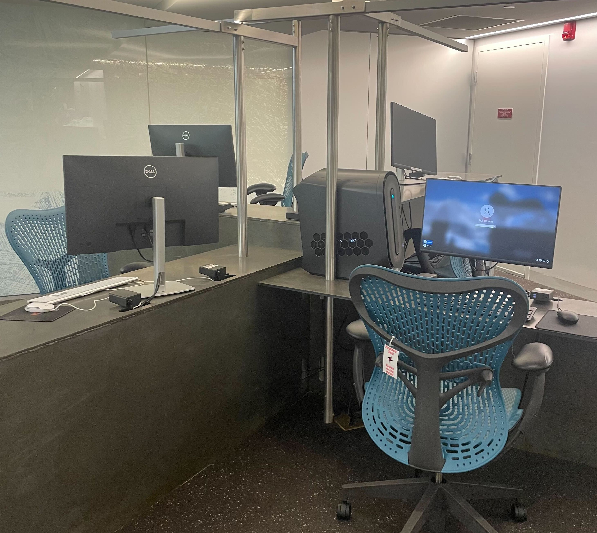
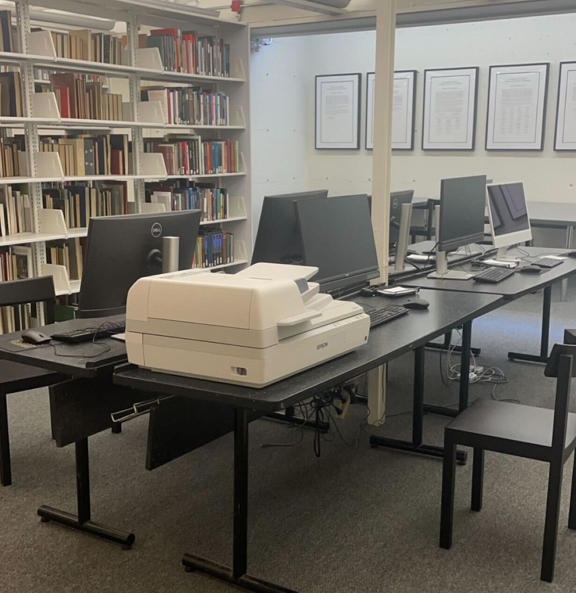
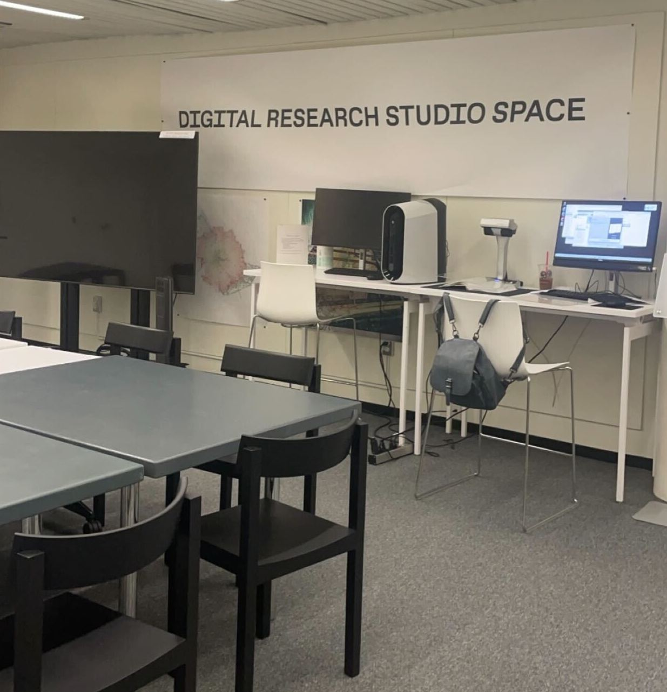
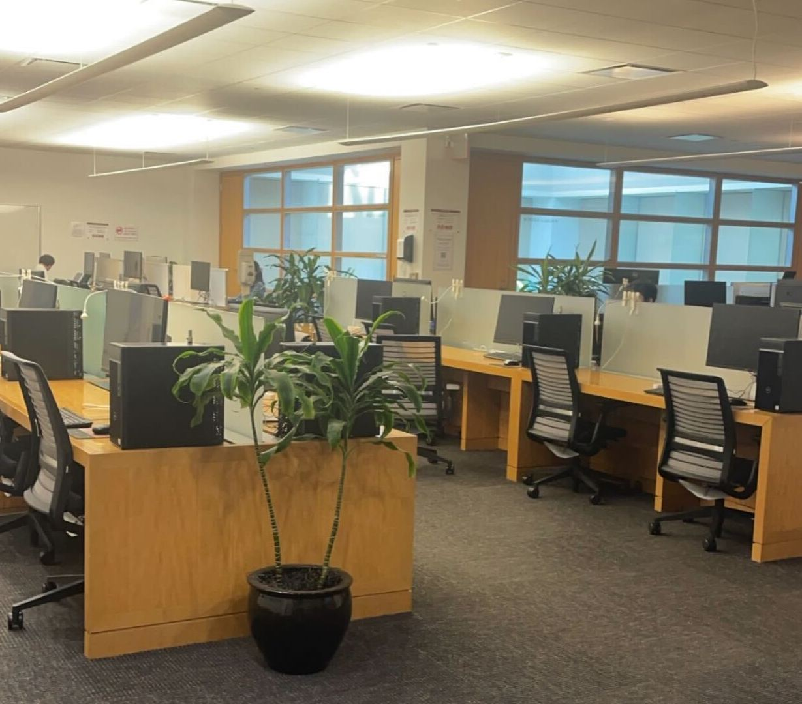
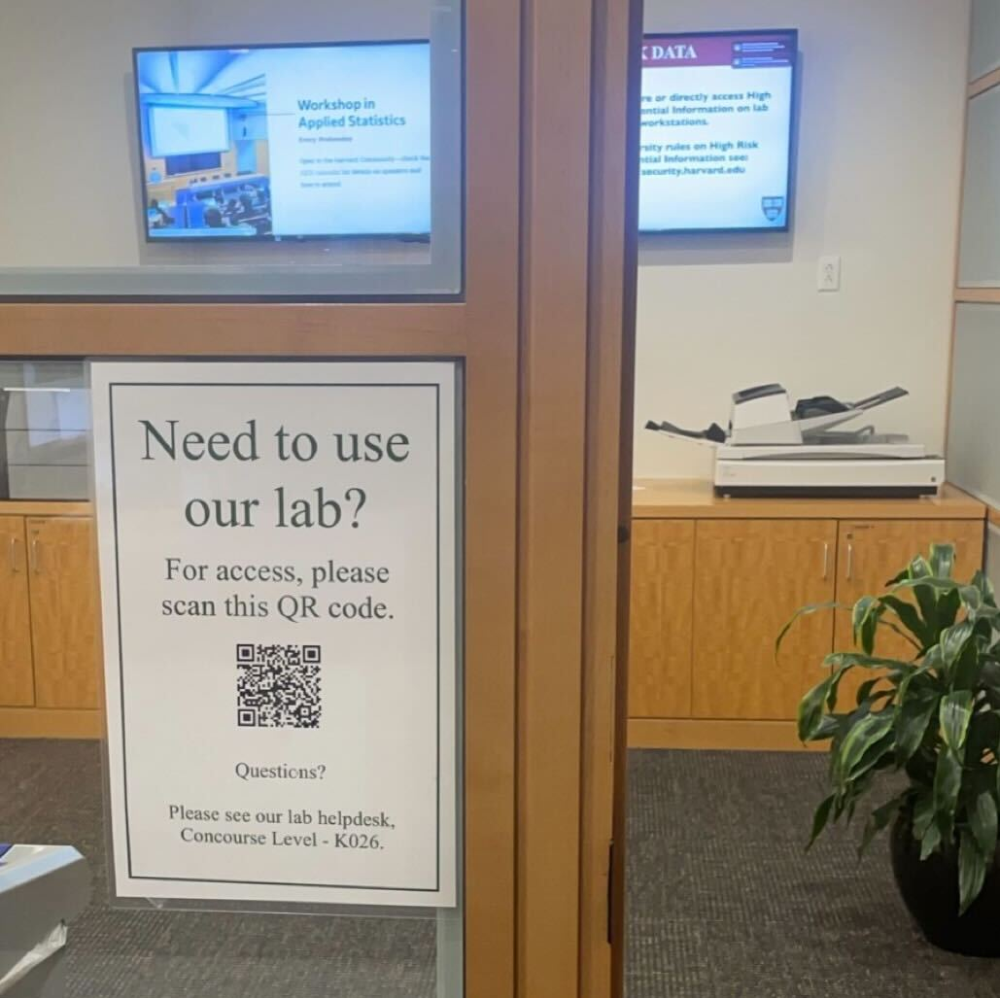

## On your own computer

If you have a PC and a Harvard Key, you can download and install ArcGIS Pro on your own computer using [these instructions](https://gis.harvard.edu/arcgis-pro) from the Harvard Center for Geographic Analysis (CGA).

If you do not have a PC, consider using the open-source equivalent GIS desktop software, QGIS, which is OS-independent.
- [QGIS download instructions](https://mapping.share.library.harvard.edu/tutorials/census-data-primer/download-software/)
- QGIS is available on all of the workstations in Lamont 310 ([directions](https://maps.app.goo.gl/Hzb4UFgFNbetQ3xa6)). 

## Do I Need ArcGIS Pro?

Prioritizing gaining competency with core GIS methods over familiarity with any singular software will ensure that your spatial skills are always relevant and transferrable, even as programs deprecate or become obsolete.

Despite being able to accomplish most of the same methods in QGIS as you can with ArcGIS Pro, here are some reasons why you might want to choose ArcGIS Pro:

- Many industries use ArcGIS Pro or the ESRI suite, so gaining familiarity might make you more competitve in your given field
- Maybe you are in a class that is using ArcGIS Pro to teach GIS methodologies
- Maybe you have used ArcGIS Pro before, and want to keep working in that environment

## Computers with ArcGIS Pro

Please find this list of places on campus where you can access ArcGIS Pro.

### At the library

<h3>Lamont Media Lab</h3>

The Lamont Media Lab is on the basement floor of Lamont Library (<a href='https://maps.app.goo.gl/Hzb4UFgFNbetQ3xa6'>directions</a>).

 

The following two general PCs in the Lamont Media Lab have ArcGIS Pro:

<ul>
<li>HCL-PUB1</li>
<li>HCL-PUB2</li>
</ul>

<h3>Widener Atkins Reading Room</h3>

The Widener Atkins Reading Room is on the second floor of Widener Library (<a href='https://maps.app.goo.gl/ZzNYNeJBnUhBq3Nk7'>directions</a>). 

There are PCs in the Atkins Reading Room that have ArcGIS Pro. 

<h3>Cabot Science Library</h3>

The Cabot Science Library is located in the Science Center (<a href='https://maps.app.goo.gl/ZotpFXbxFDd97dHS6'>directions</a>). There are PCs on the ground floor which have ArcGIS Pro. 

One PC in the basement level of Cabot Science Library has ArcGIS, while the Macs do not. 

<h3>Graduate School of Design (GSD) Frances Loeb Library</h3>

There are many PCs at the Frances Loeb Library for the Graduate School of Design (GSD) (<a href='https://maps.app.goo.gl/nFRGGMQ52JEk3um67'>directions</a>) which have ArcGIS Pro. They are located in the basement level. 

In the <strong>Digital Research Studio Space</strong> also located in the basement of the GSD library, there is a machine with increased computing power that also has ArcGIS Pro. 

For questions about using these spaces, please contact the Graduate School of Design GIS librarian, <a href="https://library.harvard.edu/staff/bruce-boucek">Bruce Boucek</a>. 

### Institute for Quantitative Social Science Lab

The Institute for Quanitative Social Science (IQSS) has a [computer lab](https://www.iq.harvard.edu/computer-labs) located in the CGIS Knafel building ([directions](https://maps.app.goo.gl/SaiKxpSP8FrexV3x7)), which each have ArcGIS Pro, along with many other software and computing services.

Please be advised that if you are a first-timer to the IQSS labs, you will need to [fill out a form](https://harvard.az1.qualtrics.com/jfe/form/SV_2ivxTdteFPmzfwi?Q_CHL=qr)before you are able to access the lab computers. This form is manually approved. It should not take a long time for the IQSS staff to approve you, but please consider this before you make a visit.

### Loaner laptops through Harvard University Information Technology (HUIT)

#### Request a laptop

Harvard University Information Technology (HUIT) will loan you a laptop for a capped-period of two weeks. You can initiate this process by [filling out this form](https://harvard.service-now.com/ithelp?id=sc_cat_item&sys_id=fc5cab849710ad509af6d804a253af0a), or by visiting the HUIT help desk in the Science Center ([directions](https://maps.app.goo.gl/ZotpFXbxFDd97dHS6)). 

#### Download ArcGIS Pro
HUIT laptop loanees will receive PCs with admin privileges, and can then access ArcGIS Pro by following the download instructions listed from the Harvard Center for Geographic Analysis [ArcGIS Pro for Harvard Key holders](https://gis.harvard.edu/arcgis-pro). 

#### Specifications

A list of eligible affiliates is available from the [HUIT request form](https://harvard.service-now.com/ithelp?id=sc_cat_item&sys_id=fc5cab849710ad509af6d804a253af0a). Please allow up to three business days for your request to process.

## GIS Technical Support

The Harvard Map Collection, located in the basement of Pusey library ([directions](https://maps.app.goo.gl/gBQgTUvYNfTuGAG76)) offers free, customized GIS instructional consultations regardless of which software you choose. Visit the [Harvard Map Collection website](https://library.harvard.edu/libraries/harvard-map-collection) to request an appointment. 

Our librarians advise on everything from help with the myriad available software, specifics of your project, and places to search for GIS data. 

## ArcGIS Pro Tutorials

If you are looking specifically for ArcGIS Pro tutorials, the Center for Geographic Analysis (CGA) manages the Harvard University Key Licenses for this software, and maintains a robust set of tutorials, FAQs, MOOCs, and in-person workshops specifically geared towards ArcGIS Pro. To get started, check out the [CGA Frequently Asked Questions](https://gis.harvard.edu/faq), which includes many how-to style tutorials for ArcGIS.

