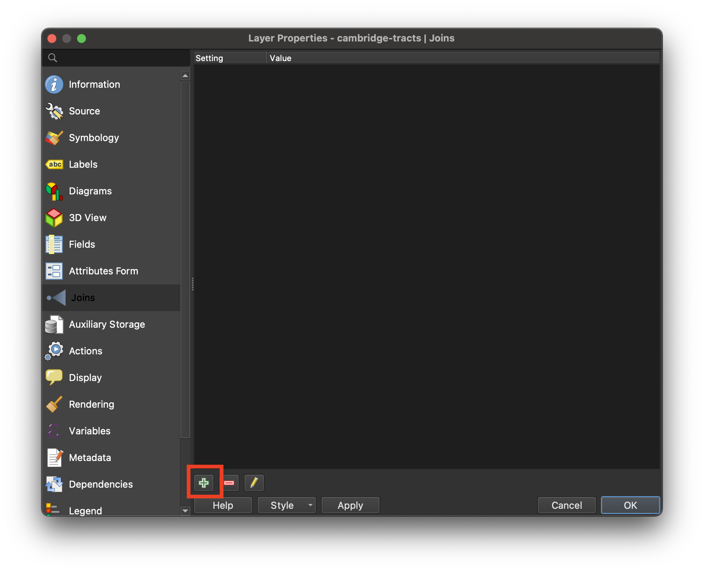

Need help turning your spreadsheet data into a map? In this tutorial you will learn how to join **tables** to **GIS shapefiles** to create a new, mappable dataset with both geographic boundaries and statistical or attribute information.

## Why do we join?

Often, spreadsheets contain useful information we want to map. GIS software, however, does not know how to translate a spreadsheet without any *inherent spatial information* (such as point coordinates) into a visual map. 

Take, for instance, [this spreadsheet](https://www.mass.gov/info-details/archive-of-covid-19-cases-in-massachusetts) of weekly COVID rates for each town in Massachusetts for the week of January 26, 2022. 

Despite the role of geography in this data --the data is arranged by town-- if we were to bring this spreadsheet into a GIS program, the program would not know (without being told by us) which column to interpret as the "geography" to display visually. The formats `.csv` or `.xlsx` are not inherently spatial data formats. 

On the other hand, take this Massachusetts municipalities dataset which we downloaded from the state government's open data portal and opened up in a desktop mapping software. The data comes available as a `shapefile`, which is an inherently geospatial format.

Because this data is spatial, GIS software can recognize it, and automatically make a map out of it. 

The image above shows how mapping software *displays* GIS data, but what does the "data" actually look like? Let's look at the data's underlying `attribute table`.

Here, we can see that for each row, which represents a single GIS `feature` (in this case, a town), there are some basic facts (each column) about that town. Included here are town name, town ID, population count, etc.

Besides this basic information and the geospatial polygon shapes of the towns, this dataset is not entirely useful for mapping, when it comes to showing any meaningful statistics.

 

Most of the time, the information we *want* to map, such as our example COVID rates, are not made available as shapefiles. People publish data in spreadsheets, and in order to make a map, we have to join the spreadsheets together with GIS shapefiles, using a GIS software like [QGIS](https://harvardmapcollection.github.io/tutorials/qgis/download/).

_Map of weekly Massachusetts COVID data spreadsheet from January 26, 2022, after being joined to a [Massachusetts municipalities shapefile](https://www.mass.gov/info-details/massgis-data-municipalities) from MassGIS._

## How do joins work?

To perform a join, you must have a column in each dataset which contains the same literal values. Factors such as case sensitivity matter. The values must be exactly the same in both tables for the join to work.

When we joined the COVID spreadsheet to the Massachusetts municipalities shapefile, we used a column common to both datasets: `town name`. Column headers did not have to match, but the values inside the columns' cells do.

### Sample data
  - [Census tracts in Cambridge, MA (obtained from nhgis.org)](https://downgit.github.io/#/home?url=https://github.com/HarvardMapCollection/tutorials/blob/main/sample-data/cambridge-tracts.geojson).
  - [Tenure statistics .CSV (obtained from nhgis.org)](https://downgit.github.io/#/home?url=https://github.com/HarvardMapCollection/tutorials/blob/main/sample-data/tenure-2019.csv)
Refer to the tenure [codebook](https://github.com/HarvardMapCollection/tutorials/blob/main/sample-data/tenure-2019-codebook.txt) to make sense of the statistical files' structure.

## Join steps

1. Add the census tract shapes data to the QGIS document.

2. Add the statistical tenure data to the map.

3. Right-click the tracts layer in the layer list and select `Properties`.

4. In the menu, select `Joins`.

5. In the bottom of the wizard interface, select the green plus sign `Add new join` icon.

6. Set the parameters as follows:
> - **Join layer:** tenure-2019
> - **Join field:** GEOFIPS
> - **Target field:** GEOID

7. Select the checkbox next to `Joined Fields`.

8. Scroll all the way to the bottom and check off only: `SE_A10060_001`, `SE_A10060_002`, and `SE_A10060_003`.

9. Select `OK`.

10. Select `Apply`.

11. Select `OK`.

12. Right-click the Cambridge tracts layer in the layer list and select `Open Attribute Table`.

13. Confirm the join worked by scrolling to the far-right of the attribute table and checking that fields `SE_A10060_001`, `SE_A10060_002`, and `SE_A10060_003` are populated with numerical data.

 <strong>Important!</strong> Joins in the QGIS document are ephemeral and will not save unless exported. Right-click the census tracts layer, select Export → Save Features As and save the new joined dataset to preserve the join.

<h2>Give your feedback to improve our tutorials</h2>
<iframe src="https://docs.google.com/forms/d/e/1FAIpQLSfzy7TYqM9rRKI5TEUJVqCcIRVlPSHCktR3L_QxADrJLIPcag/viewform?usp=sf_link" width="640" height="422" frameborder="0" marginheight="0" marginwidth="0">Loading…</iframe>

