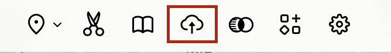

## Topics covered by this guide

 - Select a map to georeference from the Harvard Libraries' digital collections
 - Georeference with free browser tool, [AllMaps](https://allmaps.org/)
 - Add the georeferenced map to a GIS project in QGIS

## Select a map to georeference from the Harvard Libraries' digital collections

1. If you visit the Harvard Library catalog, [HOLLIS](https://hollis.harvard.edu/primo-explore/search?query=any,contains,map%20cambridge&tab=books&search_scope=default_scope&vid=HVD2&facet=library,include,map&lang=en_US&offset=0), you can:

- Change the initial search drop-down from `Catalog & Articles` to `Library Catalog` to show only items held by the library, and exclude journal articles.
- Scroll down to the `Location` filter on the right, and filter by `Harvard Map Collection`

You'll notice that some of the maps from the Harvard Map Collection have been scanned and added to the catalog record, so that you can view the map in high-resolution online from a link in the catalog that says `ONLINE ACCESS`.

2. Select `ONLINE ACCESS`. 

3. In the top-right corner of the Harvard Library image viewer, select the metadata Tooltip by clicking the `i` icon.

4. Scroll to the bottom of the popup window and under `Links → Manifest`, copy the manifest URL.

<h3>Example IIIF Manifest</h3>
<ul>
<li><a href="https://iiif.lib.harvard.edu/manifests/ids:12216977">https://iiif.lib.harvard.edu/manifests/ids:12216977</a></li>
<li>If the map you are interested has not been scanned, you are working with a multi-page book, or otherwise need help finding the manifest URL, contact us at <strong>maps@harvard.edu</strong>.</li>
</ul>

5. Navigate to the [AllMaps.org Editor](https://editor.allmaps.org/#/)

AllMaps is a free, open-source software for georeferencing maps in the browser.

6. Paste the map's IIIF manifest URL into the input box and select `Load`. 

## Learn how to georeference with free browser tool, AllMaps

Use the `georeference` tab to assign control points between the map on the left, and the baselayer on the right. Start with at least three control points, evenly distributed at equidistant spots around the map. You can add a few more, for more specificity. Click the `results` tab to check the results. 

## View the results

1. Select the `Results` tab.
2. Select `View current image`.
3. Use the two buttons at the bottom of the screen to adjust the opacity.

## Get a link to use the map layer in other GIS software

1. Return back to the `Results` page. 
> Use the back button in your browser, if necessary, to return to the `Results` page.

2. Highlight the `XYZ tile URL` and copy it to your clipboard. This is a link you can use to bring the georeferenced map in as a layer to many GIS tools such as ArcGIS Pro or Online, including StoryMaps, QGIS, or Felt.

## Add the layer to a Felt map

1. From a Felt map, select the `Upload anything` button.

2. Choose `From URL`.

3. Paste in the `XYZ tile URL` from AllMaps.

4. Select `Add to map`. 

> Allow a moment or two for the map to render.

5. In the `Legend`, click where it says `{Y}`. A window should open on the right-hand side of the map. In the window, you can change the title of the map in the legend by clicking `{Y}` and editing the name. There should also be a slider to adjust the map `{Opacity}`.

## Add the layer to a QGIS project

Once you have finished georeferencing your map in AllMaps, click the `Results` tab. AllMaps is now hosting your georeferenced map as a GIS web layer you can use in any project. All you will need is the layer link. You can find it on the `Results` page:

1. Open QGIS. If you need to download the free desktop software, learn how to do so [here](https://harvardmapcollection.github.io/tutorials/qgis/download/).

2. Open a new project.

3. In the `Browser` window, under `XYZ Tiles` drag `OpenStreetMap` into the map canvas window.

4. In the `Browser` window, right-click `XYZ Tiles` and select `New Connection`.

5. Name your map, and paste in tile URL you copied from the AllMaps `Results` panel. Select `OK`. 

6. In the `Browser` window, under `XYZ Tiles`, double-click the new connection item you just created to add it to the map. 

7. Zoom in to your area of interest using the zoom controls in the banner menu across the top of the program. As you zoom in, your georeferenced map should appear. 
> Tip: it may take a second for the quality of the tiles to resolve.

8. To adjust opacity of your map, right-click the map layer in the `Layer list` and select `Properties`.

9. Under the `Legend` tab in the `Properties` menu, highlight `Opacity Slider` and use the right-pointing arrow to move the widget from `Available widgets` to `Used Widgets`. 

10. Select `OK`. There should now be an opacity control under the map layer item in the `Layer list`.

