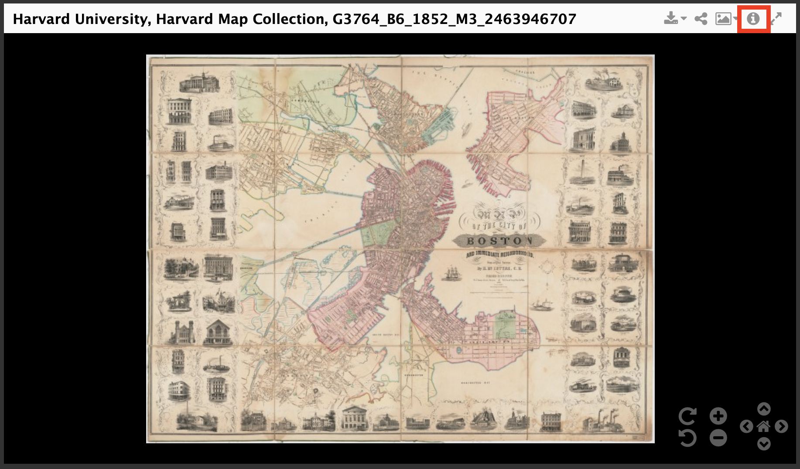
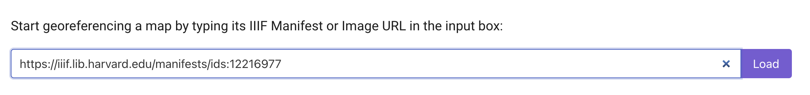
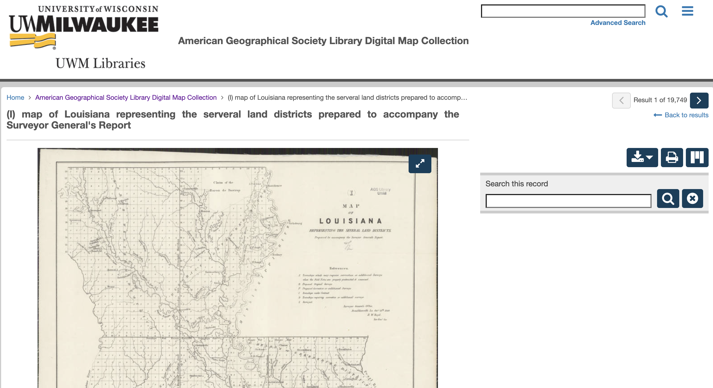
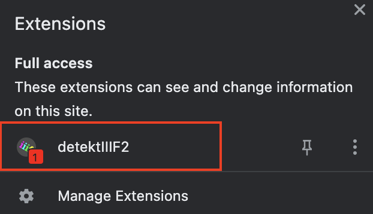
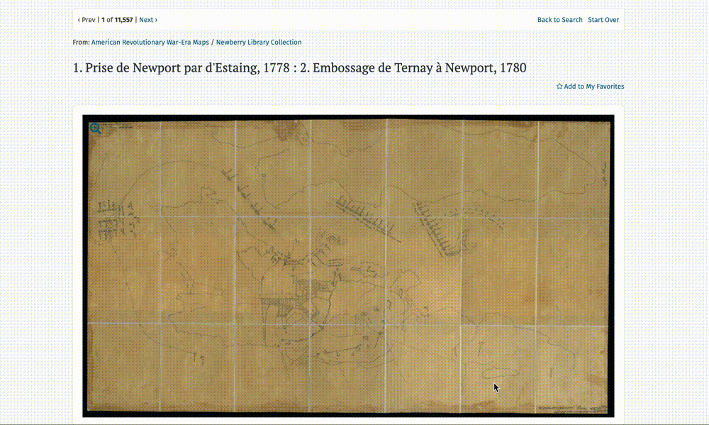
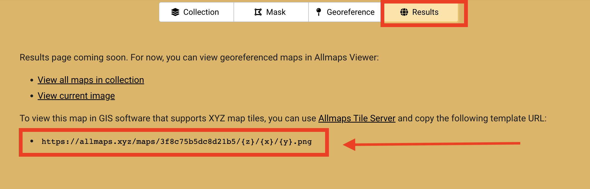
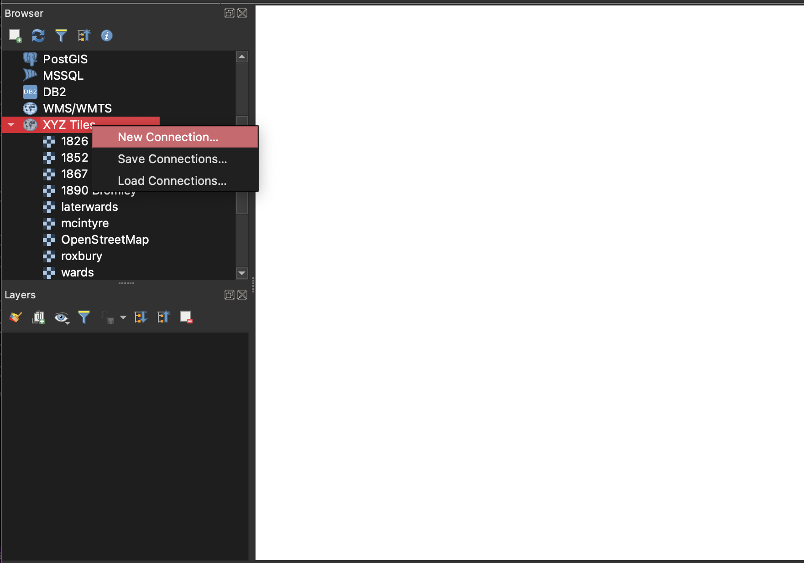
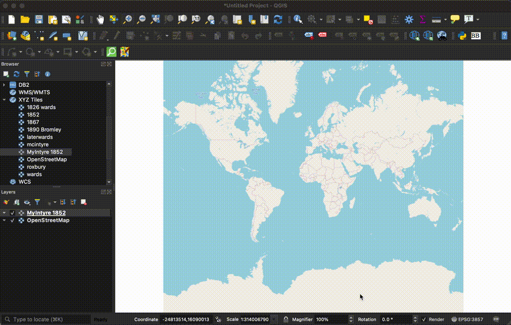
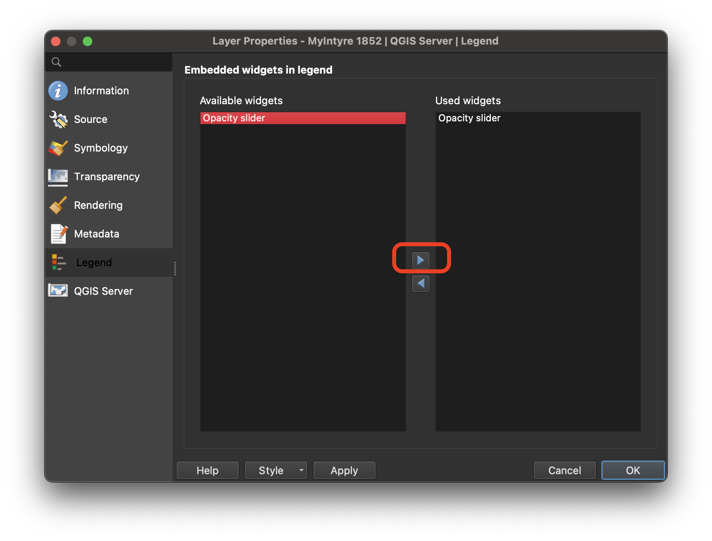

## Topics covered by this guide

 - Select a map to georeference from the Harvard Libraries' digital collections
 - Repeat the process for maps in any library digital collection
 - Learn how to georeference with free browser tool, [AllMaps](https://allmaps.org/)
 - How to use the georeferenced map with the rest of your project

## Select a map to georeference from the Harvard Libraries' digital collections
1. Find the map you would like to work with in the [Harvard Libraries Digital Collections](https://library.harvard.edu/digital-collections)

Filter results by selecting <code>Type: Map</code> or <code>Repository: Map Coll (Pusey)</code>

2. In the top-right corner of the image viewer, select the metadata Tooltip by clicking the `i` icon.

3. Scroll to the bottom of the popup window and under `Links → Manifest`, copy the manifest URL.

<h3>Example IIIF Manifest</h3>
<ul>
<li><a href="https://iiif.lib.harvard.edu/manifests/ids:12216977">https://iiif.lib.harvard.edu/manifests/ids:12216977</a></li>
<li>If the map you are interested has not been scanned, you are working with a multi-page book, or otherwise need help finding the manifest URL, contact us at <strong>maps@harvard.edu</strong>.</li>
</ul>

4. Navigate to the [AllMaps.org Editor](https://editor.allmaps.org/#/)

AllMaps is a free, open-source software for georeferencing maps in the browser.

5. Paste the map's IIIF manifest URL into the input box and select `Load`. 

## Repeat the process for maps in any library digital collection

It is necessary to copy one of these links, called a `IIIF manifest` in order to georeference the map using AllMaps. Most libraries host their digital maps using IIIF, but they don't always put the manifest link in the same place.

For example, in this guide from the Library of Congress, librarians instruct you to scroll to the bottom of the page to find the link.

*[Get Started Guides: Library of Congress](https://iiif.io/guides/guides/loc.gov/)*

If you only plan to use maps from the Harvard Map Collection in your project, you can skip this section and head to [learn how to georeference with free browser tool, Allmaps](#learn-how-to-georeference-with-free-browser-tool-allmaps).

If you plan to georeference maps from many different library collections, it might be worthwhile installing the chrome extension, [detektIIIF2](https://chrome.google.com/webstore/detail/detektiiif2/aaodcobgcadinjipaocibamdfcffpcpp). This extension will generate the correct link for georeferencing, regardless of which library's collections you are using.

### Using detekTIIIF2

1. Install [the extension](https://chrome.google.com/webstore/detail/detektiiif2/aaodcobgcadinjipaocibamdfcffpcpp). 

2. Visit a map in a digital collections. There are [over 19,000 maps digitized in the  American Geographical Society Library (AGSL) digital collections](https://collections.lib.uwm.edu/digital/collection/agdm/search/searchterm/?CISOBOX1=).

*Map of Louisiana in the [AGSL digital collections](https://collections.lib.uwm.edu/digital/collection/agdm/id/21336/rec/1).*

3. With the [detektIIIF2 Chrome extension](https://chrome.google.com/webstore/detail/detektiiif2/aaodcobgcadinjipaocibamdfcffpcpp) enabled, click on the extension from your Chrome extensions list.

4. Here, you can copy the manifest URL to your clipboard, which you can paste into the [AllMaps editor]().

5. If a manifest URL isn't immediately detected, trying expanding the map viewer. For example, in the [Leventhal Map and Education Center digital collections](https://collections.leventhalmap.org/search?utf8=%E2%9C%93&q=) -- which feature nearly 12,000 digitized maps, many of Boston, Cambridge, and New England -- you must expand the map viewer to full-screen for the detektIIIF extension to work.

Once the viewer is expanded, when you click the `detektIIIF` icon and pan over to the `IMAGES` tab, you'll find a link you can copy into the AllMaps editor.

## Learn how to georeference with free browser tool, AllMaps

Use the `mask` tab to crop out marginalia, if necessary, and the `georeference` tab to assign control points between the map on the left, and the baselayer on the right. Start with at least three control points, evenly distributed at equidistant spots around the map. You can add a few more, for more specificity. Click the `results` tab to check the results. 

Right now, AllMaps works best for larger-scale maps, or maps that show a smaller area, in more detail. If you need more robust transformations for small-scale maps, you might try one of our <a href="https://mapping.share.library.harvard.edu/tags/georeferencing/">other georeferencing guides</a>. <a href="http://www.geo.hunter.cuny.edu/~jochen/gtech361/lectures/lecture02/concepts/04%20Understanding%20map%20scale.html#:~:text=You%20will%20commonly%20see%20references,large%20area%20in%20less%20detail.">Learn the difference between small and large scale maps.</a>

## How to use the georeferenced map with the rest of your project

Once you have finished georeferencing your map in AllMaps, click the `Results` tab. AllMaps is now hosting your georeferenced map as a GIS web layer you can use in any project. All you will need is the layer link. You can find it on the `Results` page:

### Ideas for using the map in your project
- Configure the map as a layer in your ArcGIS Online project.
    - [Apps you can use to swipe and compare](https://www.esri.com/arcgis-blog/products/arcgis-online/mapping/swipe-compare-apps/)
    - [Storymap swipe and spyglass](https://storymaps-classic.arcgis.com/en/app-list/swipe-spyglass/)
- Use the map in your own custom JavaScript application built with mapping tools like [Leaflet](https://leafletjs.com/reference.html) or [OpenLayers](https://openlayers.org/).
- Add the map as a layer to a desktop GIS program, such as ArcGIS Pro, or QGIS. 

### Add the layer to a QGIS project

1. Open QGIS. If you need to download the free desktop software, learn how to do so [here](https://harvardmapcollection.github.io/tutorials/qgis/download/).

2. Open a new project.

3. In the `Browser` window, under `XYZ Tiles` drag `OpenStreetMap` into the map canvas window.

4. In the `Browser` window, right-click `XYZ Tiles` and select `New Connection`.

5. Name your map, and paste in tile URL you copied from the AllMaps `Results` panel. Select `OK`. 

6. In the `Browser` window, under `XYZ Tiles`, double-click the new connection item you just created to add it to the map. 

7. Zoom in to your area of interest using the zoom controls in the banner menu across the top of the program. As you zoom in, your georeferenced map should appear. 
> Tip: it may take a second for the quality of the tiles to resolve.

8. To adjust opacity of your map, right-click the map layer in the `Layer list` and select `Properties`.

9. Under the `Legend` tab in the `Properties` menu, highlight `Opacity Slider` and use the right-pointing arrow to move the widget from `Available widgets` to `Used Widgets`. 

10. Select `OK`. There should now be an opacity control under the map layer item in the `Layer list`.

