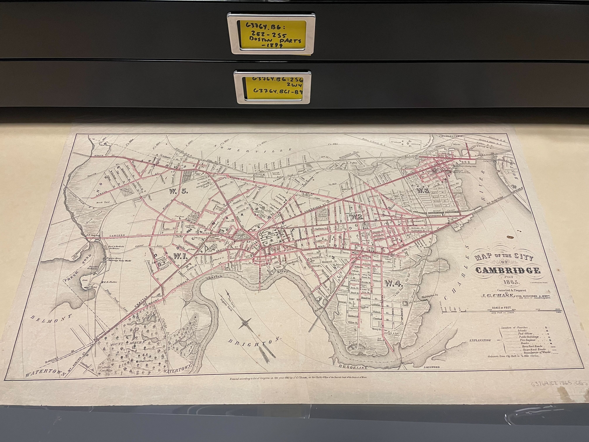
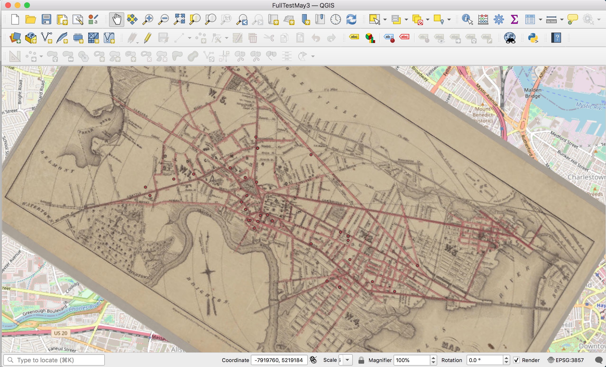

There are many ways to georeference, but if you're learning by following the [How to Georeference in QGIS](https://mapping.share.library.harvard.edu/tutorials/georeferencing/qgis/) tutorial, all you will need is an image file of a map, downloaded to your computer. 

This tutorial will cover how to use HOLLIS to find a map to practice georeferencing with.

## Finding maps in HOLLIS

1. If you visit the Harvard Library catalog, [HOLLIS](https://hollis.harvard.edu/primo-explore/search?query=any,contains,map%20cambridge&tab=books&search_scope=default_scope&vid=HVD2&facet=library,include,map&lang=en_US&offset=0), you can:

- Change the initial search drop-down from `Catalog & Articles` to `Library Catalog` to show only items held by the library, and exclude journal articles.
- Scroll down to the `Location` filter on the right, and filter by `Harvard Map Collection`

## Discerning whether catalog listings of maps contain digital scans

You'll notice that some of the catalog listings for maps from the Harvard Map Collection exist merely as informational records; they are meant to alert you to the existence of the map held in the library, and give you avenues for requesting to come see the item in person. 

Other maps have been "digitized" or scanned, and the digital file has been appended to the informational catalog record. These items are marked with a link reading `ONLINE ACCESS`, and by clicking this link, you can view the map in high-resolution, or download a copy.

2. Find a map you are interested in georeferencing that has the option `ONLINE ACCESS`, and click the `ONLINE ACCESS` link.

## Downloading a copy of the map

3. In the top-right corner of the Harvard Library image viewer, select the download icon.

4. Select `X-Large` download option. This will download a high-quality `.JPG` file to your computer, which should be adequate for learning to georeference, depending on the scale and quality of the map you are using. 

5. You are ready to move on to the next step: [Georeferencing in QGIS](https://mapping.share.library.harvard.edu/tutorials/georeferencing/qgis/)!

<h2>Notes</h2>
<ul>
<li>If you need a higher resolution version of the map, you can either (1) scan yourself a research copy by visiting the map in person and utilizing the Map Collection's self-service, high-resolution scanner, or (2) requesting the archival library copy from deep storage. Please note this latter option usually does take some time. </li>
<li>If you are looking for the IIIF manifest for scanned maps, please note that you can find this link via the download button, or by opening the metadata Tooltip. </li>
</ul>

## Further reading: visualizing this process

In the Map Collection, there are flat filing cabinets with many drawers...

Here is one of these drawers open to find a folder full of maps of Cambridge, MA. Pictured here is a map from 1865 in one of the Harvard Map Collection’s flat filing cabinet drawers.

Here is this map found in HOLLIS. You can tell that it has been scanned, since it says: `ONLINE ACCESS`.

When you open the `ONLINE ACCESS` viewer, you can either view the map in full resolution, or download a copy. Below is an embed of the viewer. You can zoom in, pan around, or click the buttons in the top-right:
<iframe width="100%" height="700" src="https://iiif.lib.harvard.edu/manifests/view/ids:2568928" title="Map of the city of Cambridge for 1865" ></iframe>
<figcaption class="append"><a href="https://curiosity.lib.harvard.edu/scanned-maps/catalog/44-990094789400203941">Map of the city of Cambridge for 1865, Harvard Map Collection.</a></figcaption>

You would then use the buttons in the top-right to download a scanned copy of the map, and then perform a process called "georeferencing," where you use digital GIS software to match up geographic locations from the scan of the old map to correlates in "real" geography. 

Finally, below is the Cambridge map georeferenced and overlaid upon a modern map of Cambridge. The researcher can now use this as a data "layer" to see how street networks, for example, or any other landmark relates to modern geography.

