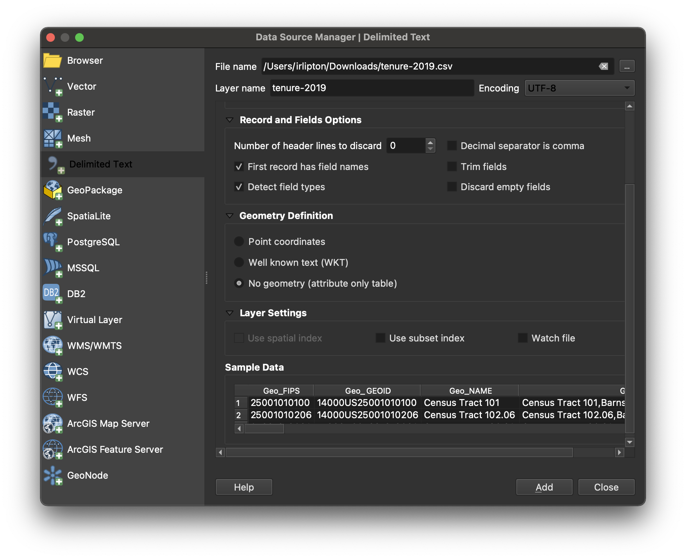

This tutorial will cover how to add tabular data to a QGIS project.

GIS software prefer tabular data to be in <code>.csv</code> format, rather than <code>.xlsx</code>. Before attempting to bring any spreadsheets into either QGIS or ArcGIS Pro, please be sure to <a href="https://support.microsoft.com/en-us/office/save-a-workbook-to-text-format-txt-or-csv-3e9a9d6c-70da-4255-aa28-fcacf1f081e6">save as .csv</a>.

1. Open [QGIS](https://mapping.share.library.harvard.edu/tutorials/census-data-primer/download-software/).

2. In the main QGIS menu (banner across the top of the computer screen), select `Layer → Add Layer → Add delimited text layer`.

3. Under `File name` select the ellipses dots icon to navigate to the `.csv` you wish to import.

4. Pay attention to `Record and Field options`. You can start by accepting the defaults, but depending on the way your data is structured, you may want to make use of some of these settings.

5. If your table...

| ...has coordinates | ...does not have coordinates |
| --- | --- |
| QGIS will be able to display the rows as points. Select `Point coordinates` and define which field in the spreadsheet is `X` (longitude), and which is `Y` (latitude).| Later on you'll [perform a join](/tutorials/census-data-primer/perform-a-table-join/). For now under `Geometry definition` select `No Geometry (attribute only table)`. |

6. Select `Add`.

7. Select `Close`.

<h2>Give your feedback to improve our tutorials</h2>
<form 
  method="POST" 
  action="GFORM_URL"
>
  <input type="radio" id="yes" name="tutorial-feedback" value="yes">
  <label for="html">This tutorial was helpful</label> 
  <input type="radio" id="no" name="tutorial-feedback" value="no">
  <label for="css">This was not helpful</label> 
   
  <button type="submit">Submit feedback</button>
</form>

