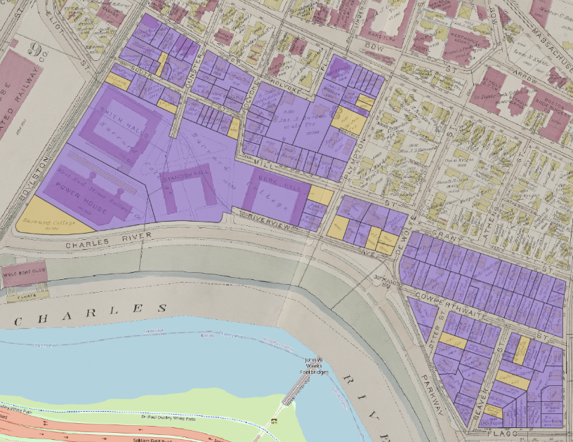
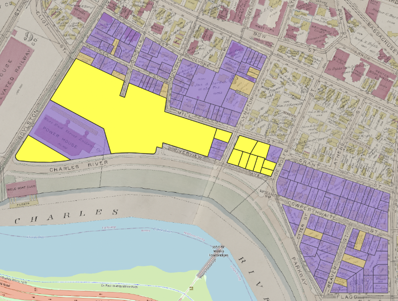
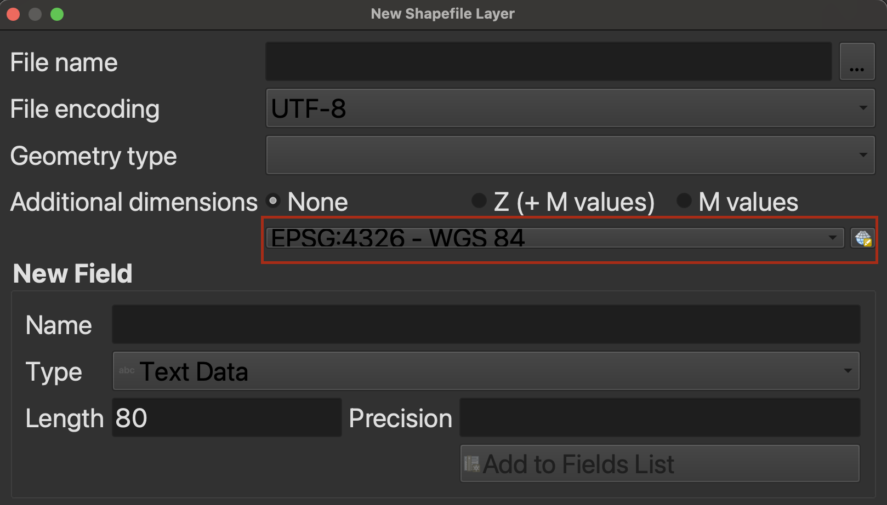
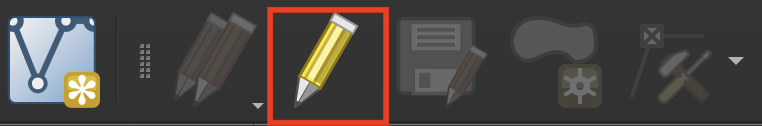
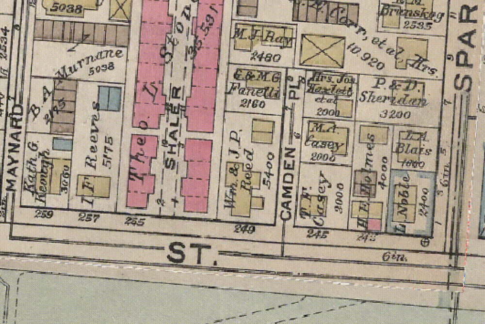

This is an example project modeling step-by-step instructions for generating geospatial data for analysis from historic maps. In June, we [shared out results](https://mapping.share.library.harvard.edu/posts/re-wilding-2024/) from partnering with Joyce Chaplin's course, Re-Wilding Harvard, where students were tasked with creating projects to investigate histories and changing natures of open space around Harvard's campus.

Hannah Adler '25 chose to study the Charles River region of Harvard's campus, on the Cambridge side near Memorial Drive.

> "I was  interested in the Harvard Square adjacent area near the river, because today we think of the river walkways and Memorial Drive, especially when it’s closed as a really valuable open space. I also had seen an image in HOLLIS that conveys a certain set of aesthetic ideals with how people were imagining the riverside could be.

<iframe width="100%" height="700" src="https://iiif.lib.harvard.edu/manifests/view/ids:3043928$1i" title="New Boston and Charles River Basin, 1880
" ></iframe>
<figcaption class="append"><a href="https://iiif.lib.harvard.edu/manifests/view/ids:3043928$1i">New Boston and Charles River Basin, 1880</a></figcaption>

Adler, who had some GIS coursework under her belt from past semesters, visited the Harvard Map Collection, knowing she wanted to incorporate spatial analysis techniques in her project. She sought to understand:

1. What did the development process look like in this area? How rapidly did this region change?
2. What was Harvard's role in developing this area?

Hannah met with GIS Librarian Belle Lipton, and discussed approaches to modeling the data to tease out these questions.

## Finding map sources

Lipton recommended a tool she worked to create at the Boston Public Library, called [Atlascope](https://www.atlascope.org/). This tool incorporates over 100 different atlases from Boston and Cambridge, and assembles them into a GIS viewer so that researchers can easily compare different years and layers. Not only do these maps show the exact changes Adler was investigating, but the map are hosted as GIS layers anyone can use in their own projects.

### 1873

<iframe width="100%" height="700" src="https://atlascope.org/#/view:share$mode:swipe-x$center:-71.11890,42.36865$zoom:16.58$base:massgis-2023-orthos$overlay:ark:/76611/al88ruzla" title="Hannah" ></iframe>
<figcaption class="append">You can swipe and zoom to see how the shape of the river has changed between 1873 and 2024.</figcaption>

### 1903
<iframe width="100%" height="700" src="https://atlascope.org/#/view:share$mode:swipe-x$center:-71.11894,42.36967$zoom:17.76$base:massgis-2023-orthos$overlay:ark:/76611/al8c0zee3" title="Hannah" ></iframe>

### 1916
<iframe width="100%" height="700" src="https://atlascope.org/#/view:share$mode:swipe-x$center:-71.11894,42.36967$zoom:17.76$base:massgis-2023-orthos$overlay:ark:/76611/al8c3wda3" title="Hannah" ></iframe>

### 1930 
<iframe width="100%" height="700" src="https://atlascope.org/#/view:share$mode:swipe-x$center:-71.11894,42.36967$zoom:17.76$base:massgis-2023-orthos$overlay:ark:/76611/al88ugbpx" title="Hannah" ></iframe>

## Vectorizing

After Adler selected the four temporal snapshots she wanted to study (1873, 1903, 1916, and 1930), and located GIS layers for each of the atlas years, the next step was to create polygon data for the parcels on the maps. Tracing the boundaries of each parcel and annotating those boundaries with important information allowed her to measure the scale of changes.

## Attribute Information

<em>Orange indicates parcels that are undeveloped in 1873, meaning they have no structures on them. Purple are developed parcels, or parcels with structures on them.</em>
 

After creating shape data for each parcel, Adler added columns to the GIS table which tracked the following attributes:
- For each parcel, was it developed or not? This was a binary value. If the parcel had a structure on it in 1873, the `developed` field for the parcel was encoded as `true`, and if it did not have a structure, the parcel had a `false` value.
- Who was the land owner in 1873? Adler created a column to encode the names of landowners, information which is found on the maps. 

<em>The maps highlighted in yellow indicate parcels owned by Harvard in 1873.</em>

Adler repeated this process, vectorizing and encoding the same variables for each temporal snapshot she was interested in studying.

### 1873

<table>
  <tr>
    <th>Development</th>
    <th>Harvard-ownership</th>
  </tr>
  <tr>
    <td></td>
    <td></td>
  </tr>
</table>

### 1903

<table>
  <tr>
    <th>Development</th>
    <th>Harvard-ownership</th>
  </tr>
  <tr>
    <td></td>
    <td></td>
  </tr>
</table>

### 1916

<table>
  <tr>
    <th>Development</th>
    <th>Harvard-ownership</th>
  </tr>
  <tr>
    <td></td>
    <td></td>
  </tr>
</table>

### 1930

<table>
  <tr>
    <th>Development</th>
    <th>Harvard-ownership</th>
  </tr>
  <tr>
    <td></td>
    <td></td>
  </tr>
</table>

## Area analysis

Next, Adler was able to leverage GIS tools to generate area calculations tallying up how many square meters exist for each parcel type. Because these vectorized shapes correspond to real locations, GIS tools are able to report the amount of area each shape represents in reality. This works because the datasets are projected into specific coordinate reference systems that link the shape drawings with real places, using specific units of measurement.

Adler used the coordinate reference system `Massachusetts State Plane` or `EPSG: 26986`, which is the same coordinate reference system Massachusetts uses to store GIS data in [MassGIS](https://www.mass.gov/info-details/learn-about-massgis-data), the state's open geodata portal. This generates area calculations in the unit of `square meters`.

Adler exported the area calculations to tabular formats (`.csv`), so she could analyze them further using other software, such as `R`. Her findings are presented in the following table.

While the total area developed (parcels with structures on them) increases only a small amount between 1873 and 1930, the area owned by Harvard increases dramatically during this period. Adler reported that there were many other variables included in the historic atlases one could choose to encode and then apply this same methodology to, whereby one calculates area based on a subsetted attribute filter of the traced parcels.

Try out the project data by downloading it from the [Harvard Geospatial Library (HGL)](https://hgl.harvard.edu/catalog/harvard-rtl-rewilding-charles-river-land-ownership). 

## How to use this approach (a step-by-step guide)

### Set a project coordinate reference system

1. [Download QGIS](https://mapping.share.library.harvard.edu/tutorials/census-data-primer/download-software/).
2. Create a new QGIS project.
3. Add a basemap to the project by going to the `Browser` panel, expanding `XYZ Tiles` and double-clicking `OpenStreetMap`. 
> If you do not see a browser panel, you can go to the program menu at the top of the screen and select `View` → `Panels` and turn on `Browser`.
4. The project coordinate reference system should now reflect that of the basemap we just added. In the bottom-right hand corner of the QGIS window, find the button that says `EPSG: 3857`. Click that button to open the `Project Properties - CRS` window.

You can search for coordinate reference systems by name, place, or [epsg code](https://spatialreference.org/ref/epsg/?search=massachusetts). You will want to choose a projection that is suited for the area you are creating data for, and is measured in units such as meters or feet, if you want to do area calculations. You can find this information in the properties of each coordinate reference system. 

5. Zoom in to the area of interest using the Zoom buttons. 

6. If the map disappears when you move it, or looks as though it is a strange shape, it could be due to the software attempting to reproject the basemap to the shape of a coordinate reference system built for the location you have chosen. Wait for the screen to re-load, or you can zoom to the extent of the basemap by right-clicking `OpenStreetMap` in the layer list, and choosing `Zoom to Layer`. Continue zooming until the area of interest is centered on the map. Any notifications about ballpark transformations you can click through or ignore.

### Import georeferenced maps

Add the georeferenced map you'd like to use to trace data from.
In this example, we used data from [Atlascope](https://www.atlascope.org/).

#### If you want to use an Atlascope layer
1. Toggle on the layer you'd like to use and select `Bibliographic Information`. 
2. Copy the link after `XYZ tiles`, e.g.:

<pre style="padding-left:30px;background-color:black;color:white;">
<code>
https://s3.us-east-2.wasabisys.com/urbanatlases/39999059011864/tiles/{z}/{x}/{y}.png
</code>
</pre>

3. Go to `Layer` > `Add Layer` > `Add XYZ Tile Connection`.
4. Choose `New`, add a `Title`, and paste the URL into the dialog box. Be careful to ensure that there are no spaces at the beginning or end of the pasted URL, or it will not load.
5. Make sure the layer you just created is selected in the dropdown, and choose `OK` to add it to the map.
6. The layer should appear on the map. If not, make sure you are zoomed in enough.

#### If you want to use another georeferenced map

- If you have a `.geoTIFF`, you should be able to drag the file directly into the QGIS document and have it show up in the correct place. 

- If you do not yet have a georeferenced map you'd like to work with, please refer to other guides on this pre-requisite step. A useful place to start is the tutorial [Adding a Historic Map to Felt](https://mapping.share.library.harvard.edu/resources/workshops/workshop-4/archival-maps/), which discusses how to use the Harvard Map Collection catalog to find and georeference a map, and how to preview the georeferenced image in a web map.

### Create New Shapefile Layer

1. Click on `Layer` > `Create Layer` > `New Shapefile Layer`.
2. Select `Polygon` as the geometry type.
3. Important! From the coordinate reference system menu in this interface, ensure you are creating the new shapefile in the coordinate reference system you selected.

4. Add necessary fields for the attributes you want to record (e.g., development status, owner name). These fields will become the column headers in the data table you will create. For every polygon you create, you will also fill out a value for each of these attributes.

> These attributes are also what powers the map symbolization. In the orange and purple map, we were able to ask the software to turn every polygon with the value of `Developed=no` orange, and every polygon with the value of `Developed=yes` purple.

5. Pay attention to field types. If you are recording categories or text data, make sure you select `Text` as the field's data type. If you are recording a number you'd like to be able to symbolize by density, make sure to select `Number` as the field type.

## Step 4: Draw Polygons on the Map

1. Start drawing polygons by clicking on the `Toggle Editing` button, which looks like a pencil.

2. Select the `Create Polygon` button.

3. Start drawing! 

This takes a little bit of practice to get used to. To make it easier, use the snapping tool to make sure your lines and vertices match up, and don't leave any holes between your polyons.

4. In the main QGIS menu choose `Project` then `Snapping Options`. Toggle on the magnet icon on the far left of the wizard. Turn on `Vertex` and `Segment`. Turn on `Topological Editing` and `Snapping on Intersection` so that both buttons are engaged.

5. You can right-click your in-progress data layer in the `Layer` panel, and choose `View Attribute Table`. This will show you each polygon as a row in the table, and you can edit the values there.

6. Any changes you don't want to lose, make sure to `Save` by continuously clicking the `Pencil` or `Toggle Editing` icon.

7. To really learn the true ins and outs of everything you can do with the editing toolbar, including moving or deleting points, check out the [QGIS Editing Documentation](https://docs.qgis.org/3.34/en/docs/user_manual/working_with_vector/editing_geometry_attributes.html).

### Calculate Area of Each Polygon

1. Open the Attribute Table.
2. Go to `Field Calculator`.
3. Create a new field named `Area`.
4. Use the `$area` expression to calculate the area of each polygon.

### Edit Map Symbology

1. Double-click the map layer to open its properties.
2. Go to the `Symbology` tab.
3. Change symbology from `single symbol` to `categorized`.
4. Choose `developed` for Value and select distinct colors for `yes` and `no` (e.g., #cd782e and #8c5fed).

### Identify Parcels Based on Variables of Interest

1. Filter the attribute table to highlight specific parcels.
2. For example, to identify parcels owned by Harvard College, apply the filter `owner_name = "Harvard College"`.

### Export Data Table for Analysis

1. Right-click on the map layer.
2. Select `Export` and choose the file type (`.xlsx` or `.csv`) as needed for your analysis.

