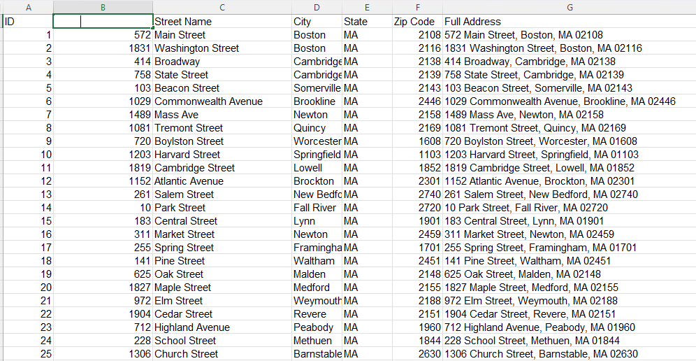
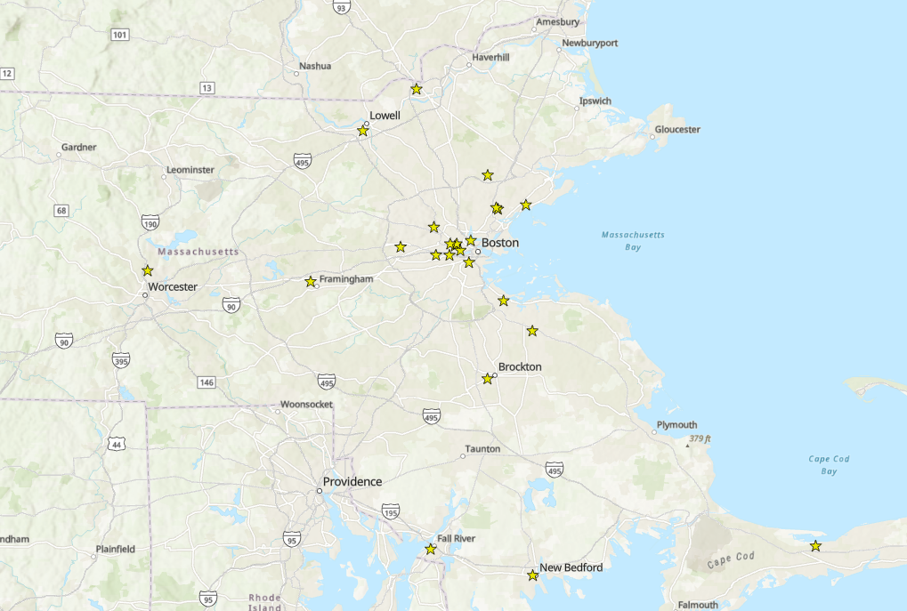

## What is geocoding?

Geocoding is the process of taking a spreadsheet with street addresses and running it through a GIS tool called a "geocoder." The process of geocoding will result in a new spreadsheet with appended columns for latitude and longitude. GIS software can then read this new spreadsheet with latitude and longitude columns and know where to place the data on a map. Therefore, geocoding is a way of going from *information about* location stored into a tabular format, and transforming it into actual *geospatial data* which is legible to GIS software. 

## Sample dataset

*A [sample dataset](https://mapping.share.library.harvard.edu/tutorials/arcgis-qgis/geocoding/sample.csv) of 25 mock addresses is included with this guide. Pictured above is an example of the data format you would want to start with when beginning geocoding.* 

Notice we start with legal addresses divided into columns by street number, street name, city, state, etc. In this example dataset, we are preparing the spreadsheet so that the resulting points on a map are as geographically precise as possible. In cases where you do not have the street addresses, but still have the town or city, you can use those columns to geocode. It will result in geodata with points located at the [centroid](https://support.esri.com/en-us/gis-dictionary/centroid) of a town, state, etc. The more specific columns you include, the more geographically precise the points in your geodata will be.

## Methods for geocoding

### Online geocoders (limited quantity of records)

Deciding which tool to use for geocoding is usually a numbers game. There are a number of free online tools available which work pretty well if you are working with under a certain number of records. 

* [Research guide on free batch geocoder options](https://researchguides.uoregon.edu/geocoding/free-batch)

### Free desktop geocoder (limited quantity of records)

If you are working in [QGIS](https://mapping.share.library.harvard.edu/tutorials/software-access/qgis/) and have only a couple hundred records, one of the most simple and straightforward ways to geocode data is to use the `MMQGIS` plugin for QGIS. This tool has robust functionality for many geocoding tasks. It allows you to choose from different geocoding services, including [Nominatim](https://nominatim.org/), which is free and open source. Many geocoding services charge per credit. The benefit of using a free service like `Nominatim` is that you do not have to pay. 

* [Research guide on how to use MMQGIS plugin in QGIS](https://guides.library.duke.edu/QGIS/Geocode)

### Programming (unlimited records; requires coding)

You will start to run into trouble using the `MMQGIS` plugin with the free `Nominatim` service once the number of records you are trying to geocode exceeds a couple hundred of rows. This basically comes down to the desktop interface freezing before the geoprocessing tool gets a chance to finish running. If you don't want to pay and have many thousands of records, another option is to use the `Nominatim` geocoder in a `Python` or `R` script. That way, you are accessing the free geocoder, but running the program more efficiently on your computer so it can execute more successfully. You can search online for [packages and approaches](https://cran.r-project.org/web/packages/nominatimlite/vignettes/nominatimlite.html) to using `Nominatim`, which is the geocoder that powers Open Street Map (OSM) in your script. 

* [Sample code for R](https://github.com/HarvardMapCollection/modalities-cleaning/blob/main/displaced-scholars/steps/geocode/geocode.R)

### Institutional ArcGIS Online (limited records; requires license)

If your institution has an ArcGIS license, you may have access to geocoding directly within your ArcGIS Online account. This can be convenient, and some find premium geocoding services such as ESRI World Geocoding Service at times to have better functionality than local or free geocoders, but this process can easily eat up your credits quickly. For example, at Harvard, you can geocode by [logging in to your ArcGIS Online account](https://gis.harvard.edu/arcgis-online), but every 1,000 rows you geocode uses 40 credits, and accounts are capped at 250 credits total. You can find more details from the Harvard ESRI license manager, the Center for Geographic Analysis on their [Geocoding FAQ page](https://gis.harvard.edu/geocoding). 

### Institutional local geocoder (unlimited; requires license)

Finally, if you have thousands or even millions of rows you need to geocode, you don't want to use a coding approach, and have access to an institutional license, you can consider downloading a local geocoder for ArcGIS Pro. The rest of this tutorial will focus on how to use a local geocoder with ArcGIS Pro for Harvard affiliates. If you have a Harvard key login, you will be able to follow these steps. 

*Note: This process works only for addresses in the United States; to gain access to international local geocoders, please refer to your license manager. In the case of Harvard, contact information is on the [Geocoding FAQ page](https://gis.harvard.edu/geocoding).*

1. Ensure you have access to the desktop software, ArcGIS Pro. Instructions for how to download ArcGIS Pro or access it in Harvard computer labs are available in the [Access ArcGIS Pro research guide](https://mapping.share.library.harvard.edu/tutorials/software-access/arcgis-pro/). 

2. Log in to ArcGIS Pro with your Harvard key. *Instructions for logging in are also in the Access ArcGIS Pro research guide.*

3. Click `Map` to create a new map project. 

4. In the menu, select `Analysis` and then `Tools`. Search for `geocode`. Select `Geocode Addresses`.

5. Under `Input Table` select the spreadsheet you want to geocode. 

6. Download the [local USA locator](https://drive.google.com/drive/folders/13LT3LtwayZy640hm1FRv4reQo_YBAaav), `USA.loz`. In the `Geocode Addresses` widget in ArcGIS Pro, under `Input Address Locator`, navigate to where you downloaded this file and select it. *Note: this file is big and can take some time to downlad.*

7. Fill out the `Address Field` and `Output` and select `Run`

7. Select `Run`

> Note: Sometimes addresses won’t find a match with this geocoder on the first attempt. If many are unmatched, try this:
Right click the geocoded result and choose `Selection` → `Select All`. Then right click and choose Data > Rematch Addresses. Click the Auto Rematch button: and it will match all addresses it can.

> Note: If you are using geoprocessing tools in ArcGIS Pro, you will need to take additional steps to convert the output formats into open-source data formats. The library recommends taking this last step with any data files you create, to ensure long-term access and interoperability of your files. Follow the steps in [Exporting GeoJSON and GeoPackage from ArcGIS Pro](https://mapping.share.library.harvard.edu/tutorials/arcgis-qgis/export-file-types/)

*Pictured above are the results of geocoding the tutorial [sample addresses](https://mapping.share.library.harvard.edu/tutorials/arcgis-qgis/geocoding/sample.csv) in ArcGIS Pro.*
