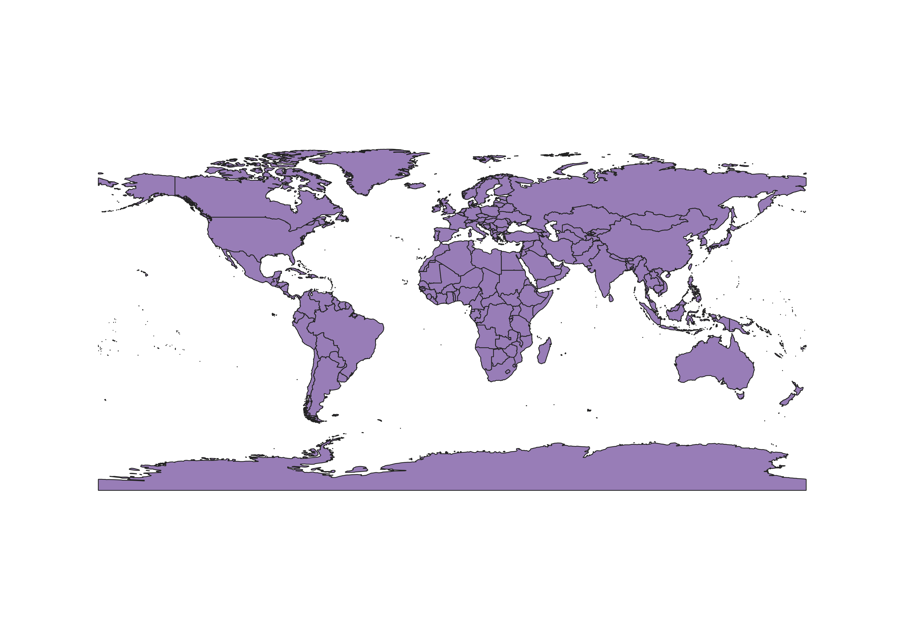
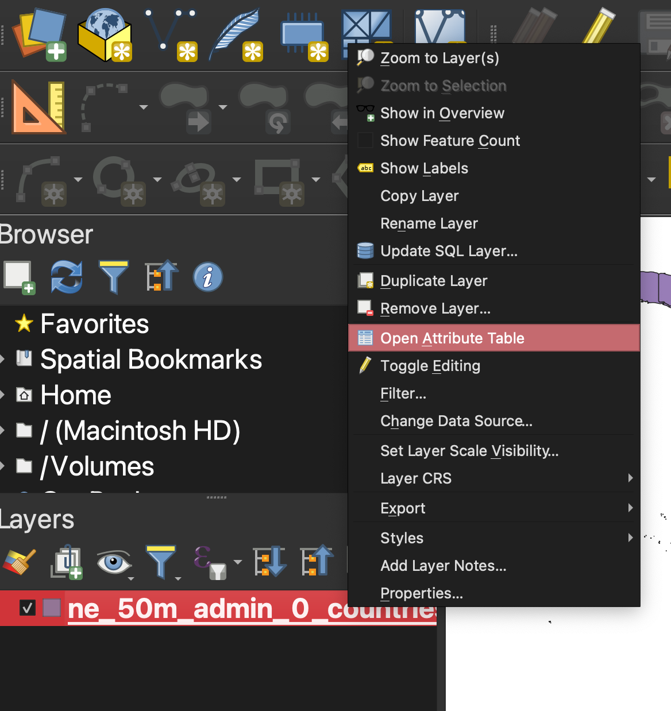
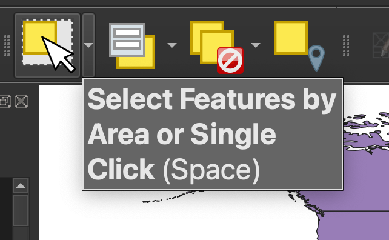
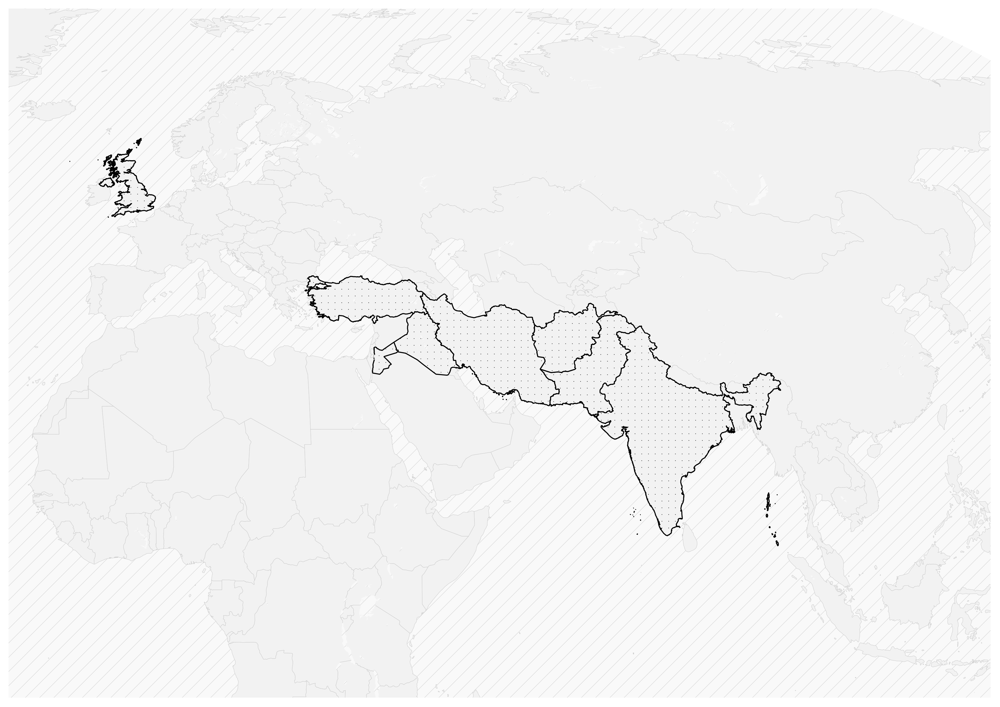
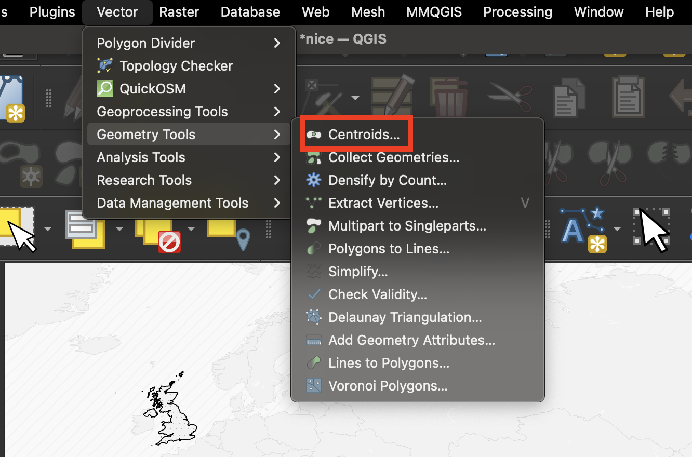
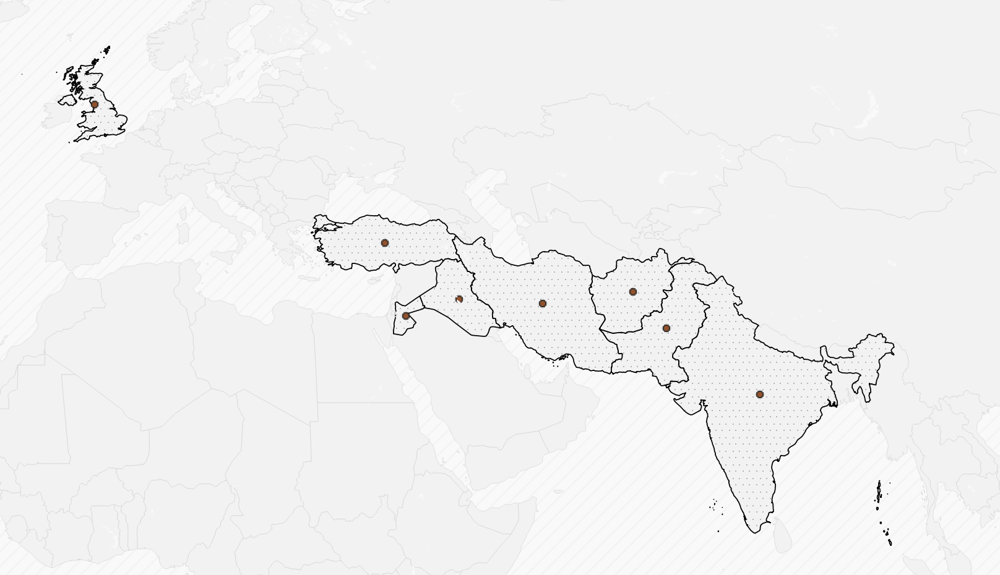
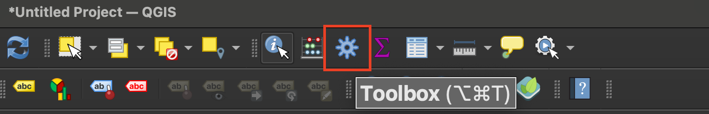
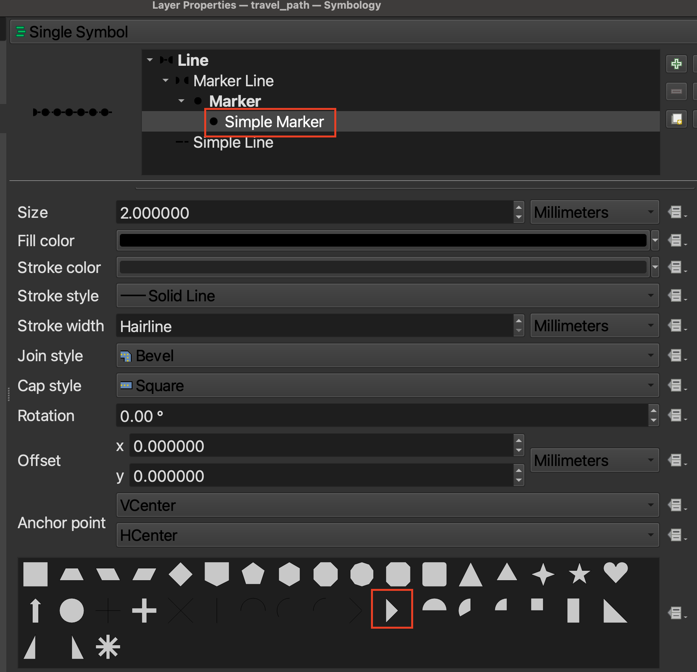
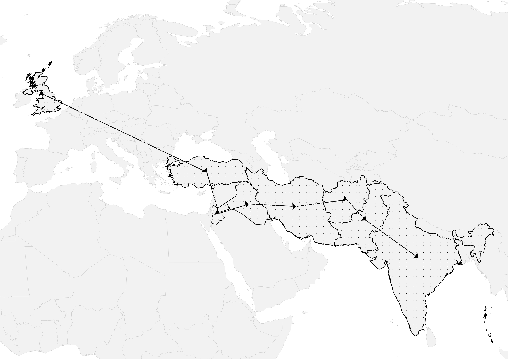

## 1. Ensure you have data for the travel stops stored as points

### If you already have point data...

If you already have a spreadsheet that indicates the stops on the route as points or latitude and longitude coordinate pairs, you'll want to make sure you've successfully added your spreadsheet data to the map ([tutorial](https://mapping.share.library.harvard.edu/tutorials/arcgis-qgis/add-spreadsheet/)). The add a spreadsheet to QGIS tutorial also gives some example spreadsheet data you can use to model how to format the coordinates, if you are creating or cleaning this data yourself. 

> Tip: If you are working with a spreadsheet of locations, make sure you have a column that indicates the order of the stops on the travel route. For instance, in the row for the first stop of the route, under the column header `stops` enter value `1`, in the row for the second stop, enter `2` and so on. 

### Creating centroids

Alternatively, you can start with a polygon `shapefile` of places, and use this file to generate centroids or stops on the journey. For example, in this tutorial we will show how someone traveled from country to country. To do this, we'll start with a file with all of the countries from cartographic data site Natural Earth. ([Download countries](https://www.naturalearthdata.com/downloads/50m-cultural-vectors/)). 

Add the file to QGIS by dragging the extension ending in `.shp` or the entire compressed shapefile folder. 

*Countries shapefile from Natural Earth loaded into QGIS.*

From this file, you can select the countries traveled to by right-clicking the layer in the layer list and selecting `Open Attribute Table`. 

#### Pulling out specific places traveled to

Use the columns in the `Attribute Table` to make sense of which record pertains to which feature on the map. You can select features you want to include on the travel route by highlighting the row corresponding to that country. To the very left of the rows, there is a list 1, 2, 3, 4, etc. numbering the rows. To select a row, click the number to the left of that row. To highlight multiple rows, hold down the `command` key while making your selection. You'll notice that once you have selected a feature, that row/feature will now be highlighted on the map. 

Alternatively, you can also use the map interface to visually select features by using the `Select Features by Area or Single Click` button. This is on the icon banner menu across the top of the QGIS project. Once this is engaged, you can simply click features on the map to add them to your selection, rather than using the attributes in the attribute table to make your selection.

Once you have all of your features selected, save them to a new layer. Right-click the layer in the layer list, and select `Export` → `Save Selected Features As`. Make sure to indicate where on your computer you want to save the `shapefile` or `geopackage`. 

Add that new file to the project. 
Pictured below is a map demonstrating the two layers compiled together: (1) the original data source (all countries), and (2) the selected features (the countries along the travel path). 

*We are styling the map as we work along using tips from the guide Cartographic Conventions for Academic Publishing [coming soon].*

### Creating the centroids or "stops"

Now that we have selected the polygons representing the locations visisted, we can use the `Centroids` tool to create point data. The resulting layer is what we can use to style a travel path represented by a line.

From the main menu across the top of the screen, select `Vector`. Hover over `Geometry Tools` and select `Centroids`.

For the `Input Layer` ensure you are selecting the correct layer -- the layer containing only the features selected as being part of the travel route. 

Under `Centroids` click the ellipsis button and choose where to save the new layer on your computer. Choose `Save to File`. You can now select `Run` to run the tool. 

The centroids should now be visible. 

*Example result of running the centroids tool.*

### Ensuring the route order

Next, you will need to add the order of the stops. Do this by opening the attribute table: Right-click the layer in the `Layer List` and select `Open Attribute Table`.

`Toggle editing mode` by clicking the button in the top left of the attribute table window represented by a pencil icon. While editing mode is toggled on, you should be able to directly edit the values in the table. In the `fid` field, you can assign values (e.g. `1`, `2`, `3`, etc.) to the features in the order you want them to appear in the travel path. 

Save your edits by clicking the pencil icon again to `toggle editing mode`.

Now you are ready to generate the path by using the `Point to Path` tool. Locate the `Toolbox` icon in the QGIS menu bar represented by a blue gear icon.

Search for `Points to path` in the processing tools search bar. Open the widget. As the `Input layer` select the `centroids` with the `fid` edits to reflect the travel path sequence. Under `Order expression` select `fid`.

Click the ellipsis icon to the right of `Paths` and select `Save to file`. Designate where you want to save this on your computer, saving as a `geopackage` or `.gpkg`. Select `Run` to run the tool. You should now see a line representing a travel path.

To symbolize this line, including directionality, you can use the following settings:

Double-click on the new travel path line layer in the `Layer list` to open the layer properties and ensure the `Symbology` sub-menu is selected. 

At the top of the page where it says `Line` and then `Simple Line`, make sure `Line` is engaged, and then click the green plus sign to the right to `Add a symbol layer`. You should now have two items reading `Simple Line`. Click on the bottom one, and click the `Color` bar to `Select a line color`. Under `HTML Notation` type in `#000000` or true black. Change the `Stroke width` to `.4` and the `Stroke style` to `Dash Line`.

Click the top `Single Line` back at the top of the page. We will change this from `Single Line` by finding where it says `Symbol Layer Type` and clicking the currently selected value `Single Line` to reveal more options. Choose `Marker Line.` Engage where it says `Simple Marker` and select an `Arrow` icon.

Select the `Fill color` bar to `Select a fill color` and change the `HTML Notation` to `#000000`. Change the `Size` to `4.0`. Under `Stroke style` choose `No Line` to make the arrow appear more clearly.

Select where it says `Marker Line` at the top of the widget, and change the following settings: Uncheck `With interval` and select `On first vertex`; `On last vertex` and `On inner vertices`. Choose `OK` to observe if the line path is appearing how you want it to. These style guides are suggestions only; you can edit these settings to make sure you are representing the data effectively. 

You can either change the point symbology of the centroids to a smaller black dot (e.g. size `1.5`) _or_`uncheck` the `Centroids` layer entirely in the layer list to have the dots not appear. You may want to leave them in the layer list, though not symbolized, so that you can use the attributes to power labelling later on. Tips for labeling and otherwise laying out the rest of the map (e.g. titles, legends, exporting as an image, etc.) are covered in Cartographic Conventions for Academic Publishing [coming soon].

