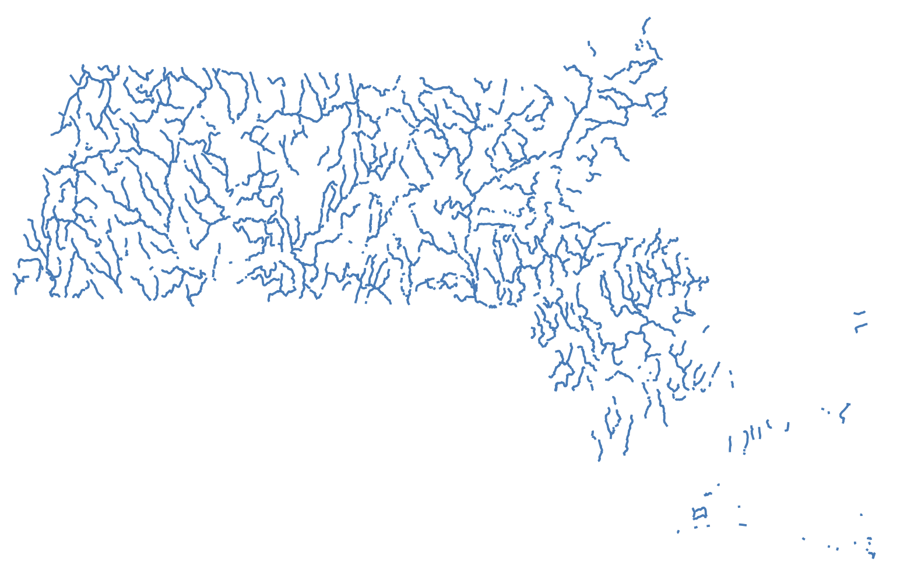

## About this workshop

This course is for those wishing to develop a strong foundational understanding of how GIS works. After completing this course, you will be well-positioned to begin GIS projects of your own.

The step-by-step materials here can be [followed along asynchronously](https://mapping.share.library.harvard.edu/resources/workshops/workshop/introduction/). The in-person version ([register](https://libcal.library.harvard.edu/calendar/main?t=d&q=gis&cid=15049&cal=15049&inc=0)) covers the same materials, but with live demonstrations and hands-on support from the instructor. We can schedule additional workshop sessions on demand, as well as in-class workshops.

  In-person workshop participants, please find <a href="https://harvardmapcollection.github.io/classes/workshops/introduction-to-GIS/">slides and data</a>.

## Some GIS basics

In this tutorial, you will gain familiarity with the following useful GIS competencies.

### What is GIS?

GIS stands for **G**eographic **I**nformation **S**ystems. GIS helps us study *where*. It is a combination of data sources, software, and methods which allow us to do so. When we say **GIS data**, we mean datasets which have some spatial dimension. These datasets are created in special formats which can be used with special software designed to make maps. The datasets, the software, and the methods all fall under the umbrella of "GIS".

### Common GIS data types

To make your own map someday, you'll need to be comfortable with the two main forms of GIS data: **vector** and **raster** data.

**Vector data** consists of **points, lines and polygons**. 

_GIS vector dataset showing [historic old growth trees in Washington State](https://geo.wa.gov/maps/61db62e6e6864b579e0e36c005e94e71/about) loaded into QGIS, a map making software._

Pictured above is a **points** dataset showing historic old growth trees in Washington State.

When you open the data table, every row in the table represents one of the point features. In this example, that means one row = one tree. Every column in the table is a piece of information about that feature, or tree. For example, in this dataset, we can see there is a column for the age of the tree, and recommendations for caring for that type of tree.

_[Historic old growth trees in Washington State](https://geo.wa.gov/maps/61db62e6e6864b579e0e36c005e94e71/about) dataset in QGIS table view._

GIS software allows us to take tables of features like this and display them visually as a map. 

Here is an example of a **line** dataset of all of the major streams in Massachusetts displayed visually as a map.

Examples of **polygon** vector datasets could be ponds or bodies of water, or political or administrative units. Census data showing counties or census tracts would be polygon data. 

Here is an example of a polygon dataset showing towns in Massachusetts. If you opened the table view of this dataset, each row would represent one Massachusetts town. Each column would contain information about the town. In this case, the attributes include the name of the town, and population statistics from each census year.

Hover over the towns to display **attributes** (column information) for each town/feature/polygon.

<iframe title="Example of polygon data showing towns in Massachussetts you can hover over to expose the column information" src="https://harvardmapcollection.github.io/classes/gened1140/fall-2022/assignment/demo/polygon-data/" width="100%" height="500px"></iframe>

When you are making a GIS map, you can download vector data or create your own. Vector data will usually come in **shapefile** format. The file extension is **.shp**. Some example datasets you could download include:
- road networks (line)
- census data (polygon)
- points of interest like schools, or churches (point)

You can also create your own vector datasets using GIS software, by manually drawing or tracing points, lines, or polygons in a mapping interface, and then typing in any attribute or column information you want to pop up or be visualized from each feature.

The Harvard Map Collection will work with you to find the datasets you need to download for your topic of study, or teach you how to create your own if you think there might not be GIS data readily available.

### Working with georeferenced maps (raster data).

Another common type of GIS data is **raster** data. Instead of points, lines, or polygons, raster data is in the format of image pixels.

When you use Google maps satellite view, you are viewing raster data. The satellite imagery exists in pixels, and it is "spatial data", meaning the computer can tell *where* on the earth the imagery pertains to.

At the Map Collection, we use raster data a lot, because we have so many historical maps, which are in an image format such as `.jpeg` or `.tiff`. We can line these images up to correspond with a spatial location. To do this, we need to perform a process called **georeferencing**.

Georeferencing is the process of lining up an image so it overlays onto modern geography. There are many historical maps created before the time of computers which contain useful information. You can work with that information by georeferencing.

_A georeferenced [map](https://bpl.bibliocommons.com/v2/record/S75C2788767) of Jamaica Plain from 1880 reveals "Terrace Street" has since been renamed to "Cranston Street"._

After this tutorial, you will know how to work with different kinds of GIS data. Then, you will be ready to learn how to analyze or visualize information sources that speak to the *where* of your situation.

[Next lesson: 2. Tutorial requirements →](/resources/new-to-gis/workshop/tutorial-requirements/)

