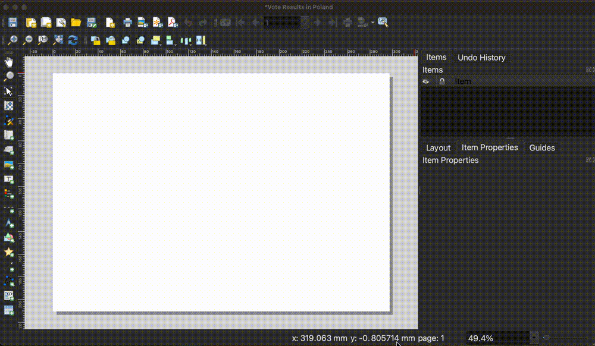
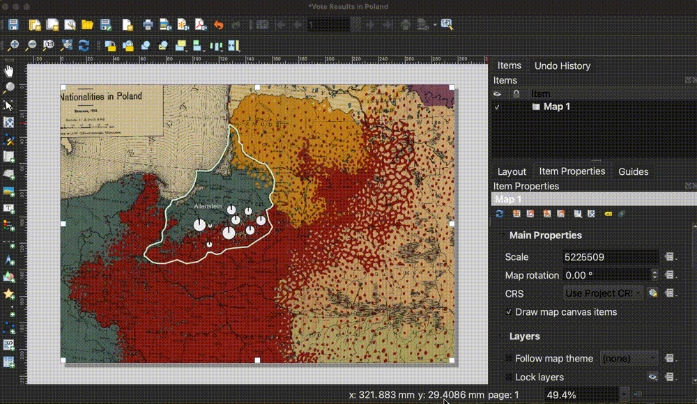
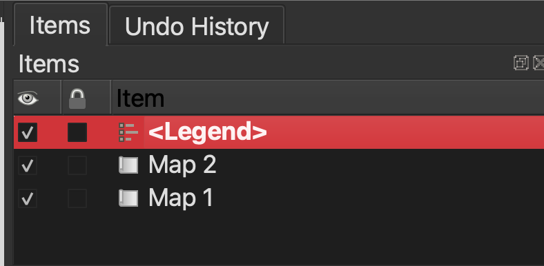
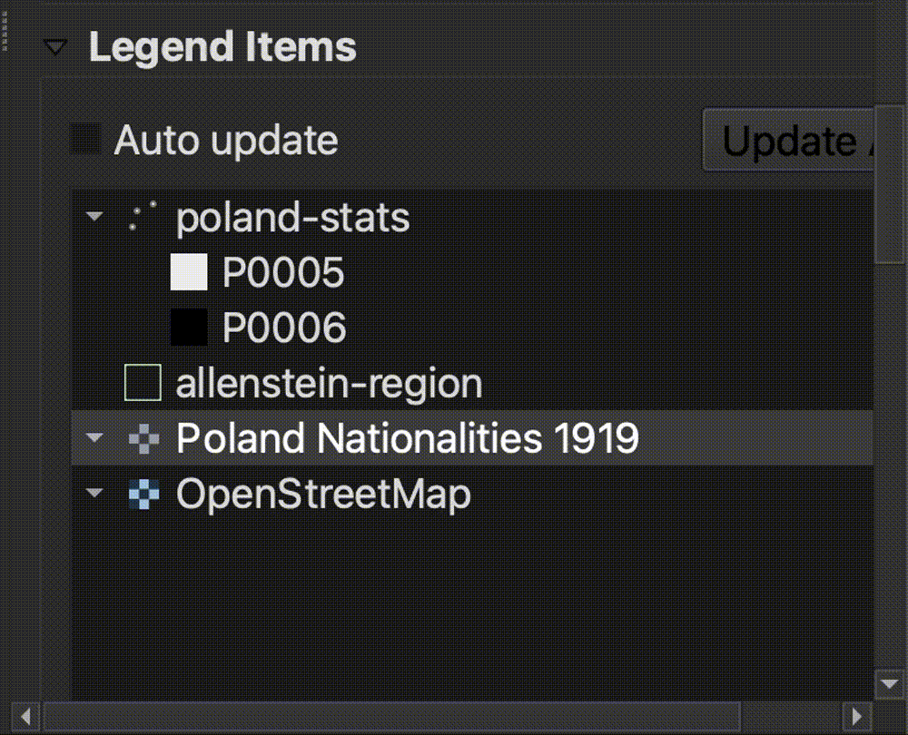
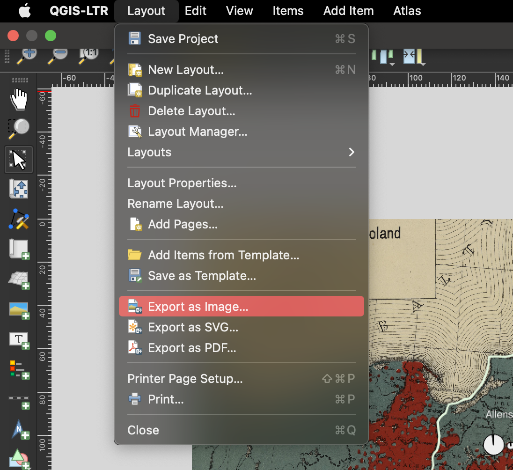

Now we are ready to learn how to style a "finished product" version of the map. So far, we have been using GIS to overlay different GIS layers and see how they compare with one another. We've been exploring the data by looking at the attribute table and playing with the map symbols. We've been trying to understand the data for ourselves. Now, we are going to **learn how to prepare an outward-facing map** to **communicate our findings with others**.

1. In the main QGIS menu, select `Project` and then `New Print Layout`. 

2. You can title the new print layout anything you want. We called ours `Vote Results in Poland`. Select `OK`.

3. This will open the print layout. You can picture this as a 8 x 11" piece of paper. We are going to draw all the map elements we want onto this layout. Start by selecting the `Add Map` button, which is a few icons down on the vertical icon menu to the left of the print layout canvas. After you have engaged the `Add Map` button, hold and drag your cursor to draw the map onto the entirety of the print layout canvas. 

4. If the map is a little off-center, select the `Move Item Content` button and hold and drag the map to re-center.

5. We want our map readers to be able to understand the colors on the historic map. Let's use the `Add Map` button again to draw a map inset in the bottom-right hand corner. Select `Add Map`, but this time, hold and drag a box only in the lower right-hand corner of the print layout canvas.

6. Use the `Move Item Content` to zoom in and position the historic map legend, so all of the nationality values are visible. Use your mouse wheel to zoom in and out, and click and drag to position the map. Toggle the `Move/Select Item` button to drag the white squares around the border so the inset box gets bigger or smaller. The goal is that all of the legend values are visible. Don't worry about the text being blurry; when we export, the map will be much higher-quality.

7. We need to create a legend for the plebiscite vote result data layer. Click on the `Add Legend` button, and draw a box in the lower left-hand section of the map canvas.

8. Let's style the legend. Make sure `Legend` is selected in the `Items` list in the right-hand menu.

9. Scroll down to `Legend Items`.

10. Uncheck auto-update.

11. Right-click `Poland Nationalities 1919` and `OpenStreetMap` and set them both to `Hidden`.

12. Double-click `poland-stats` and change the `Label` to `Vote Results`.

13. Click the blue arrow to go back to the `Legend Items`.

14. Double-click `P0005` and `P0006` and label them `Votes for East Prussia` and `Votes for Poland`, respectively. Use the blue arrow to get back to the other legend items.

15. Double-click `allenstein-region` and reformat the text so it reads `Allenstein Region`.

16. From the Legend Items interface, scroll down to where it says `Background`. Click the checkbox twice, and then click on the color bar.

17. Scroll down to the legend background opacity, and slide it down so that the legend is semi-transparent.

18. Drag the legend down so it is positioned nicely in the bottom left-hand corner of the map.

>You can follow the same editing process to add a title to the map, if you'd like. To do this, start by clicking the `Add Label` menu icon.

19. Let's export the map! In the main QGIS Layout menu, select `Layout`, and then `Export as Image`

20. Ignore the message saying the basemap is too big to be displayed. That's OK, we aren't using that layer in our final map. 

21. Save the map as a .PNG. Accept all of the default export options. When you open the file, it should look something like this!

[Next: 7. Browse maps and data →](/resources/new-to-gis/workshop/browse-maps-and-data/)

[← Previous lesson: 5. Visualize statistics](/resources/new-to-gis/workshop/visualize-statistics/)