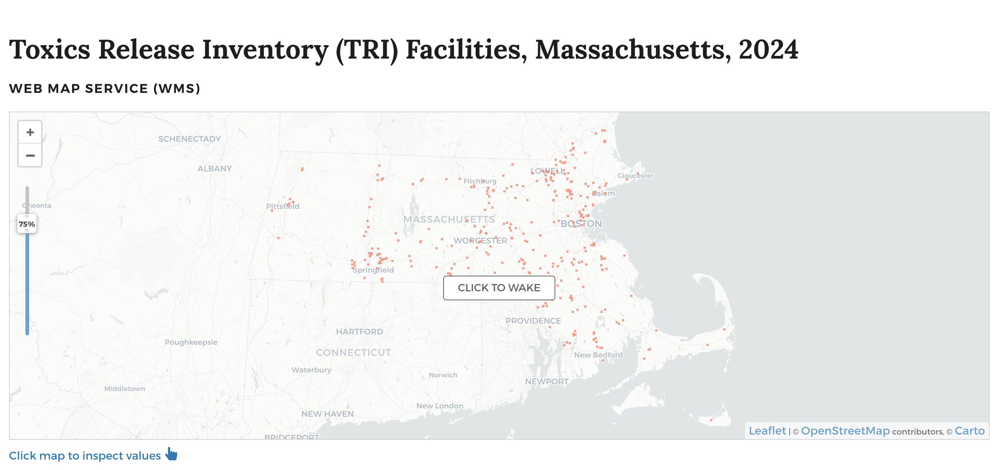

To start to explore how to access and use geospatial data, we will start with an example data scenario. The map below shows census tracts graded by social vulnerability index, layered against the locations of known toxics release facilities in Massachusetts. 

*Map layers displayed in desktop GIS program, QGIS.*

- The Social Vulnerability Index (SVI) is a dataset that garners census variables to identify and rank communities based on their vulnerability to environmental hazards or other emergencies. 
- Comparing the locations of vulnerable populations against environmental hazards such as toxics release facilities can help identify disproportionately burdened communities and prioritize health interventions.

## Where to obtain the data?

Both of these datasets are available from the Harvard Geospatial Library (HGL):
- [Toxics Release Inventory (TRI) Facilities, Massachusetts 2024](https://hgl.harvard.edu/catalog/harvard-rtlmod1-tri-facilities-ma-2024)
- [Social Vulnerability Index (SVI) Overall Score by Census Tract, Massachusetts, 2020](https://hgl.harvard.edu/catalog/harvard-rtlmod1-svi-ma-tracts2020)

  A note that visually overlaying data layers helps us obtain basic descriptive statistics about the spatial patterns of our data. To prove any hypotheses about cause and effect, you will likely need to follow up with subsequent training on spatial analysis, which is outside the scope of this workshop. 

## In-class activity

1. Click on the [Toxics Release Inventory dataset]((https://hgl.harvard.edu/catalog/harvard-rtlmod1-tri-facilities-ma-2024)).

2. Scroll down to the `Description` section of the metadata, and expand the information by selecting `More Description`. 

> 💡 Discussion: Where did this dataset come from?

3. To learn more about the dataset, let's look at the full metadata record. On the right-hand side of the data record in HGL, select the `Metadata` button.

4. Scroll down in the `Metadata` pop-up modal and find the following information:

- `Spatial Reference Information` → `Grid Coordinate System Name`
- `Entity and Attribute Information` → `Attributes` → Read through, e.g. `F9__TRIFD`

> 💡 Discussion: Why is this information important to know before using the dataset?

5. Back at the top of the screen in the map view, on the map click `Click to Wake`. 

6. Click on one of the points on the map. Attribute information about the facility you selected will appear in a table below the map. 

> ❓ Pause for questions.

## Next steps demonstration in QGIS

The instructor will demo next steps in QGIS. Participants are not required to follow along, but can use the tutorial below to do so in-class, or later at home.

1. Download the [Toxics Release Inventory (TRI) Facilities, Massachusetts 2024](https://hgl.harvard.edu/catalog/harvard-rtlmod1-tri-facilities-ma-2024) from HGL or use the copy included in the `demo_materials` folder.

2. Open QGIS. ([Download instructions](https://mapping.share.library.harvard.edu/tutorials/software-access/qgis/))

3. Open a new `Empty Project`. [Add a basemap](https://mapping.share.library.harvard.edu/tutorials/qgis-hub/basemap/). 

4. Add the Toxics Release Inventory (downloaded to your computer) to the QGIS project by either: (1) dragging the file with the `.shp` file extension directly into the QGIS window from your file browser, *or* (2) using the menu navigation `Layer` → `Add Layer` → `Add Vector Layer` and using the `Data Source Manager` to select the file with the `.shp` file extension, then selecting `Add` and `Close`.

5. Zoom to the extent of the data by right-clicking the TRI data layer in the `Layers` panel and selecting `Zoom to Layer`. 

6. Right-click the layer in the `Layers` panel again, and select `Open Attribute Table`. Observe the attributes, including `F18__CHEMI`, which we observed in the metadata refers to "Name of the chemical as listed on the TRI chemical list, or generic name, if the chemical is claimed as a trade secret."

7. Close the attribute table and open the TRI layer properties by either (1) double-clicking on the layer in the `Layers` panel, *or* (2) right-clicking the layer in the `Layers` panel and selecting `Properties`. 

8. Choose the `Symbology` menu. Click `Single Symbol` and select `Categorized`. From the drop-down arrow to the right of `Value`, choose the attribute to symbolize, `F18__CHEMI`. Select `Classify`, and then `OK`. 

