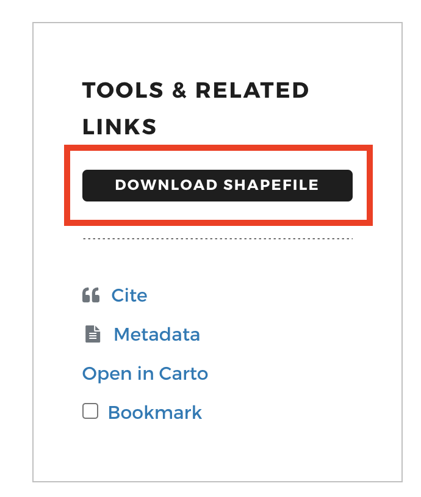
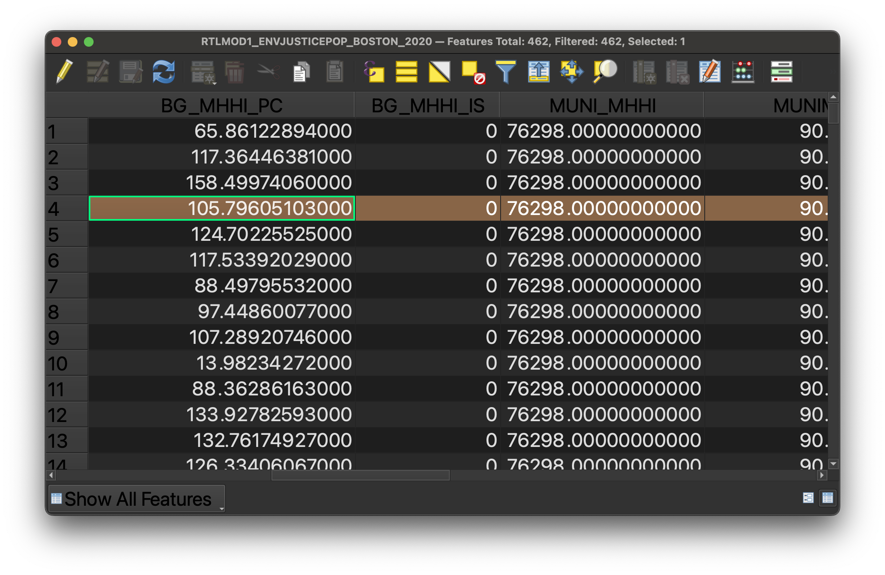
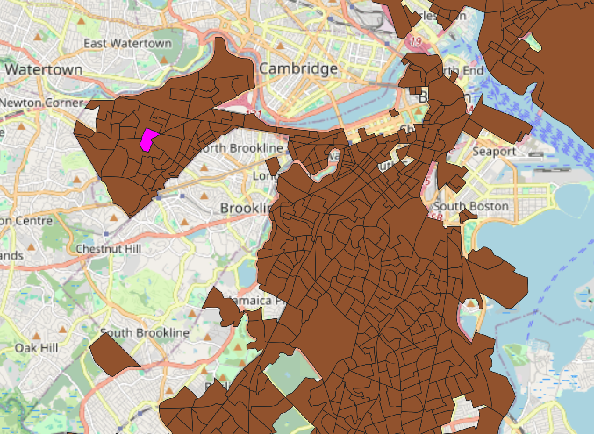

In this activity, we will use the Environmental Justice (EJ) Populations by Census Block Group dataset for the City of Boston to understand how geospatial data is structured.

The EJ Populations dataset serves as a planning and analytical tool to locate neighborhoods that may face disproportionate environmental burdens or have limited access to environmental benefits due to socioeconomic factors.

## In-class activity
1. Visit the EJ population dataset in the Harvard Geospatial Library (HGL): [Environmental Justice Populations by Census Block Group, Boston, Massachusetts, 2020](https://hgl.harvard.edu/catalog/harvard-rtlmod1-envjusticepop-boston-2020).

> 💡 Discussion: Where does this dataset come from?

2. On the right-hand side of the screen under `Tools & Related Services` select `Download Shapefile`. 

3. In your `Downloads` folder in your file browser, find the downloaded zip file titled `RTLMOD1_ENVJUSTICEPOP_BOSTON_2020.zip`. Unzip this file by double-clicking it on a Mac or right-click `Extract` on a PC.

> 💡 Discussion: What do you notice about the files included in the downloads?

## Next steps demonstration in QGIS

The instructor will demo next steps in QGIS. Participants are not required to follow along, but can use the tutorial below to do so in-class, or later at home.

1. Open QGIS. ([Download instructions](https://mapping.share.library.harvard.edu/tutorials/software-access/qgis/))

2. Open a new `Empty Project`. [Add a basemap](https://mapping.share.library.harvard.edu/tutorials/qgis-hub/basemap/). 

4. Add the Environmental Justice Populations by Census Block dataset (downloaded to your computer) to the QGIS project by either: (1) dragging the file with the `.shp` file extension directly into the QGIS window from your file browser, *or* (2) using the menu navigation `Layer` → `Add Layer` → `Add Vector Layer` and using the `Data Source Manager` to select the file with the `.shp` file extension, then selecting `Add` and `Close`.

5. Right-click the data layer in the `Layers` pane in QGIS and select `Open Attribute Table`. 

6. Select any row at random by clicking on the row number to the left of the row. Notice how the feature is highlighted both in the table and on the map. 

*Record selected in the table showing the polygon feature's attributes.*

*The same feature displayed in the QGIS map view.*

7. Look at the attribute table column headers. Let's make sense of what variables are available to us to map. 

  
Tip: To read the column headers better, you can drag and adjust the column width.

8. Let's use the metadata [from HGL](https://hgl.harvard.edu/catalog/harvard-rtlmod1-envjusticepop-boston-2020) to understand the variables better. From the `Description`, click on the `source dataset link` from mass.gov.

9. Expand the `Attributes` dropdown. 

> 💡 Discussion: Compare the attribute descriptions in the metadata against the attribute data in the table. Select potential fields to map.