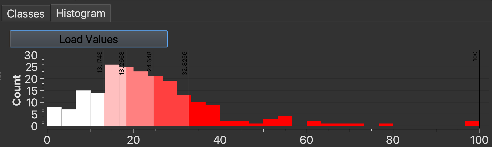

In this tutorial, we are going to demonstrate how to map both nominal and interval data, using Environmental Justice Population and Tree Cover data as examples.

- **Nominal data** refers to categories without any inherent numerical relationship.
- **Interval data** refers to a numerical scale where the distance between numbers is known and consistent.

You can use this understanding to leverage cartographic conventions and software templates designed for each level of measurement.

## Datasets

- We are going to use the `EJ_CRIT_DE` field of the [Environmental Justice Populations by Census Block Group, Boston, Massachusetts, 2020](https://hgl.harvard.edu/catalog/harvard-rtlmod1-envjusticepop-boston-2020) to map `nominal` data. `EJ_CRIT_DE` refers to the EJ criteria description. Each census block group is assigned a category, e.g. `English isolation`; `Minority and income`, etc.
- We are going to use the `Percent_Tr` field of the [Tree Canopy Percentage by Census Tract (CT), Boston, Massachusetts, 2019](https://hgl.harvard.edu/catalog/harvard-rtlmod1-treecanopy-boston-2019) to map `interval` data. `Percent_Tr` refers to the tree canopy per census tract as a percentage of total land cover. These values are represented as percentages, e.g. `23.05%`; `14.25%`, etc.

## Requirements

The instructor will demo next steps in QGIS. Participants are not required to follow along. If you wish to follow-along in class or later at home, you will need:
- QGIS [[Download instructions](https://mapping.share.library.harvard.edu/tutorials/software-access/qgis/)]
- The sample data is available from the [Harvard Geospatial Library (HGL)](https://hgl.harvard.edu/?_gl=1*1mov24z*_ga*OTM1NDk4NTczLjE3NTc5MzQyNTk.*_ga_3CXC97RWEK*czE3NjUyODgyMTMkbzgzJGcxJHQxNzY1Mjg5NDc4JGo2MCRsMCRoMA..), and also pre-packaged for the workshop. [[Workshop data](https://drive.google.com/file/d/1v1eot3JZy_NX9bd9t9hP8CsuC0I2wKTX/view?usp=sharing)]

## Nominal Data

1. Start a new QGIS project and add the Environmental Justice Populations by Census Block dataset (downloaded to your computer) to the QGIS project by either: (1) dragging the file with the `.shp` file extension directly into the QGIS window from your file browser, *or* (2) using the menu navigation `Layer` → `Add Layer` → `Add Vector Layer` and using the `Data Source Manager` to select the file with the `.shp` file extension, then selecting `Add` and `Close`.

2. Open the EJ Population layer properties by either double-clicking the layer in the `Layers` pane, or right-clicking the layer and selecting `Properties`.

3. From the `Properties` window, select `Symbology` from the menu.

4. Click where it says `Single Symbol`, and select `Categorized`. This is the QGIS template for symbolizing `nominal` data.

5. Underneath where it says `Categorized`, there is a field called `Value`. Click arrow to the right of this field, to open a drop-down menu. This lets you select which attribute or variable you want to symbolize.

6. Select `EJ_CRIT_DE`.

7. Click `Classify`. 

  
Tip: QGIS will select colors at random to symbolize the data categories. To have more control over how your map looks, you can use a tool developed by cartographers called <a href="https://colorbrewer2.org/#type=sequential&scheme=BuGn&n=3">Color Brewer</a>. Using Color Brewer, select the <code>Nature of your data</code> = <code>Qualitative</code> (nominal), and the number of classes you'd like (e.g. 7), to generate color schemes well-suited for mapping. The website will provide color codes you can copy-paste into QGIS. Double-click the colorful squares in QGIS to open the individual color properties.

8. In the QGIS `Symbology Properties` menu, select `Apply` and then `OK`.

9. Your map will now be symbolized by Environmental Justice Population criteria category. In the `Layers` pane, engage the toggle drop-down arrow to the left of the EJ Population layer to reveal the map legend.

## Interval Data

1. Add the [Tree Canopy Percentage by Census Tract (CT), Boston, Massachusetts, 2019](https://hgl.harvard.edu/catalog/harvard-rtlmod1-treecanopy-boston-2019) dataset to the same QGIS project by either: (1) dragging the file with the `.shp` file extension directly into the QGIS window from your file browser, *or* (2) using the menu navigation `Layer` → `Add Layer` → `Add Vector Layer` and using the `Data Source Manager` to select the file with the `.shp` file extension, then selecting `Add` and `Close`.

2. Open the tree canopy layer properties by either double-clicking the layer in the `Layers` pane, or right-clicking the layer and selecting `Properties`.

3. From the `Properties` window, select `Symbology` from the menu.

4. Click where it says `Single Symbol`, and select `Graduated`. This is the QGIS template for symbolizing `interval` data.

5. Underneath where it says `Graduated`, there is a field for `Value`. Click arrow to the right of this field, to open a drop-down menu. This lets you select which attribute or variable you want to symbolize.

6. Select `Percent_Tr`.

7. Click `Classify`. You will notice this populates your data classification with a graduated color ramp to represent density of the variable selected. 

> ### Graduated symbology tips
> Here are some considerations for working with graduated symbology:
> - You will need to choose a classification `Modes` e.g. `Equal Count`, `Equal Interval`. To support your understanding, you can refer to mode [documentation](https://pro.arcgis.com/en/pro-app/latest/help/mapping/layer-properties/data-classification-methods.htm).
> - It is typical when exploring your data to try out various classification `Modes`.
> - The `Histogram` tab is a helpful tool for understanding the distribution of your data values. This tool is located next to the `Classes` tab. Click `Load Values` to display the diagram. 
> 
> - Once you have a better sense of your dataset using these exploratory tools, you will be better positioned to identify which classification `Mode` would be suitable for any published or rhetorical maps you make. 
> - The choices you make for classification `Mode` will impact how readers interpret your data. 
> - You will also want to consider color. You can use [Color Brewer](https://colorbrewer2.org/#type=sequential&scheme=BuGn&n=3) to select a color scheme. Let's use green since we are representing tree canopy. 

8. Select `Apply` and then `OK`. 

> 💡 Discussion: Toggle the layers in the `Layers` pane using the checkboxes to compare the two maps. What do you observe?