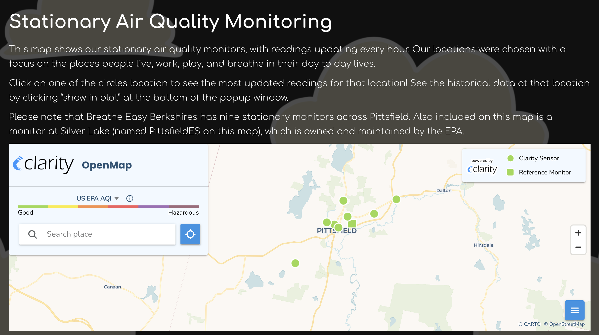
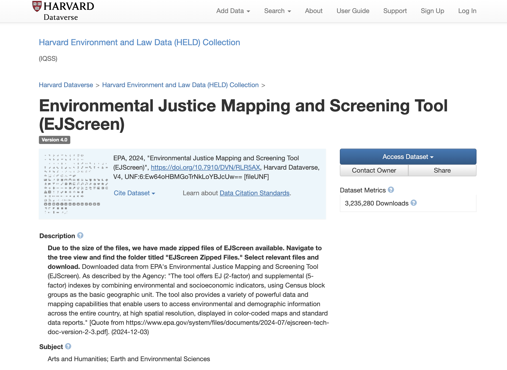

## Workshop objectives and outline
In this course, you will learn:

| **Activity Number** | **Competency** | **Sample Data** |
|---|---|---|
| Introduction [add link] | Cover workshop housekeeping; Introduce QGIS software; Understand GIS relevancy to public health | N/A |

## Workshop requirements
- No prior geospatial knowledge is required for this workshop
- This workshop does not require any specialized software to participate, other than a standard web browser (Chrome, Firefox, etc.)
- Each competency covered will have practical GIS applications live demonstrated by the instructor. Follow-along steps and sample data are included in these course materials. Following along with the data and software on your own computer (in class, or later at home) is **optional**. To do so, download the free, open source desktop GIS software called QGIS. 
    - [Download instructions for QGIS](https://mapping.share.library.harvard.edu/tutorials/software-access/qgis/). 
- The instructor will give a brief overview of the QGIS software at the beginning of class to familiarize the software environment.

## GIS Relevancy Example #1

_[breatheasyberkshires.org](https://breatheeasyberkshires.org/)_

- The [Berkshire Environmental Action Team (BEAT)](https://www.thebeatnews.org/BeatTeam/) is a non-profit engaged in environmental advocacy work.
- They have a program called **Breathe Easy Berkshires** that utilizes GIS data analysis towards their mission.
- They have installed air quality monitors around the town of Pittsfield, MA.

- BEAT uses supplementary data from the EPA about "peaker plants," or power plants that operate only when there is a high demand for electricity on the grid. There is one of these plants in Pittsfield, MA.
- The [EPA dataset](https://www.epa.gov/power-sector/power-plants-and-neighboring-communities-mapping-tool) has information about what times these plants are operating (peak times).
- Spatial analysis helps identify relationships between areas that have worse air quality compared against peak power plant times.
- The outputs of this analysis help BEAT connect with community members and work towards healthier environmental conditions for the residents of Pittsfield.

- This type of work also relies on datasets that have been archived in Harvard's Dataverse, such as [EJScreen](https://dataverse.harvard.edu/dataset.xhtml?persistentId=doi:10.7910/DVN/RLR5AX), and other research data partnerships, such as details on hospitalizations.

## GIS Relevancy Example #2

[C-Heat application](https://www.c-heatproject.org/data-applications)
They use the GIS data application to document fine-scale temperature differences to select the location of the cool block

<iframe width="100%" height="600" src="https://www.youtube.com/embed/kFmiCOLESsk?si=0_-vY2KLoPDuO4dE" title="YouTube video player" frameborder="0" allow="accelerometer; autoplay; clipboard-write; encrypted-media; gyroscope; picture-in-picture; web-share" referrerpolicy="strict-origin-when-cross-origin" allowfullscreen></iframe>

[Cool block film #2](https://www.turnaround-films.com/14-public-chelsea-cool-block)

## Follow-up 
- Make an appointment on the [Harvard Map Collection website](https://library.harvard.edu/libraries/harvard-map-collection)
- Email the instructor, [Belle Lipton](https://library.harvard.edu/staff/belle-lipton) @ belle_lipton@harvard.edu
- Search for datasets in the [Harvard Geospatial Library](https://library.harvard.edu/services-tools/harvard-geospatial-library)
- [Request other datasets](https://ask.library.harvard.edu/maps?_gl=1*1c9t5ge*_ga*OTM1NDk4NTczLjE3NTc5MzQyNTk.*_ga_3CXC97RWEK*czE3NjQwMDI2MDIkbzc3JGcxJHQxNzY0MDAyNzQyJGo2MCRsMCRoMA..)
- Take the workshop survey