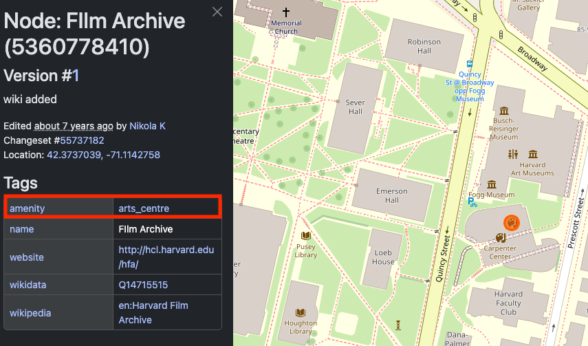

- Understand what OpenStreetMap (OSM) is, and how it can be helpful for finding data

## In class activity

> 1. Visit [OpenStreetMap.org](https://www.openstreetmap.org/), which we can think of as the Wikipedia of GIS. It is free, crowd-contributed geospatial data. 

> 2. Navigate to anywhere in the world you are interested in.

> 3. Zoom super close in so that you can see individual features, such as buildings, roads, or bike lanes. 

> 4. Right-click a feature and select `Query features`. 

> 5. Select one of the features, whether it's a `Building`, `Residential Road`, `Footpath`, or another kind of feature. 

> 6. Inspect the way that the attributes about this kind of feature are encoded. For instance, notice how the Harvard Film Archive in the Carpenter Center is tagged as `amentiy` = `arts_centre`:   

> 6. Try the same exercise for another type of environment. For example, if you picked a city initially, inspect features typical to a desert, or somewhere with lots of bodies of water.

> 7. Later we will explore how to download layers of feature types, for instance, all of the places tagged as `arts_centre` for a certain place. For now, look through the OpenStreetMap wiki page of [Map Features](https://wiki.openstreetmap.org/wiki/Map_features) to get a sense of all the different kinds of feature layers are available to extract. 

--- 

## Demo and explore more

### Sample data
You can download and explore sample datasets related to this activity from the workshop data homepage, hosted on the Open Science Framework (OSF.io)
> 1. Visit the [workshop data homepage](https://osf.io/exnyg). 

> 2. Click the three vertical dots icon and select `Download`.

> 3. The folder that downloads to your computer contains sample data from all the workshop activities. It is a zipped or compressed file. In order to use it, you will have to `double-click` it on Mac or `right-click` → `Extract` or `Uncompress` on a PC. 

4. The sample data for this activity, <strong>Activity 4</strong> is in the folder <code>activity4_crowdsourced</code>. In this folder you will find the following files:

<ul>
<li><code>places_of_worship_polygons_ma.geojson</code></li>
<li><code>places_of_worship_points_ma.geojson</code></li>
</ul>

### Follow-along steps

1. We are going to use the detailed steps outlined in the **How To Export Data from Overpass-turbo.edu** section of the [Accessing OSM data guide](https://mapping.share.library.harvard.edu/tutorials/data-curation/openstreetmap/). 
2. Once we are on [overpass-turbo.eu](https://overpass-turbo.eu) and have opened the `Wizard` to build our query:
- Type in `amenity=place_of_worship in Massachusetts` and select `Run and Build Query`.
> If you get an error, change the `timeout` variable in the query builder text box to 900 seconds.
3. You may need to change the extent of the map to the area of interest (e.g. Massachusetts) to have the results show up.
4. Once data is displayed, you can select `Export` → `Data` → `GeoJSON`. 
5. To use this dataset in ArcGIS Pro, follow the steps in [How to Import GeoJSON Into ArcGIS Pro](https://mapping.share.library.harvard.edu/tutorials/arcgis-hub/import-geojson/).
6. To look at the variables, right-click the layer in the layer list and select `Attribute Table`. Notice which columns are and aren't populated.
7. We are going to symbolize based on the `religion` field. Right-click the layer in the layer list and select `Symbology`. 
8. Change `Primary symbology` from `Single Symbol` to `Unique values` and select `religion` as the field to symbolize.